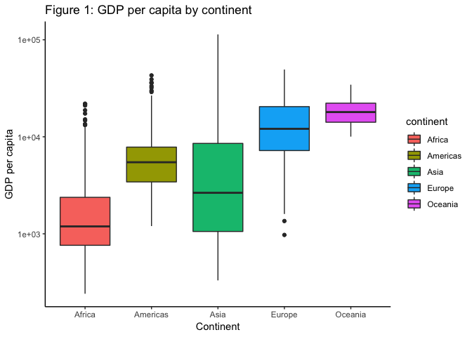
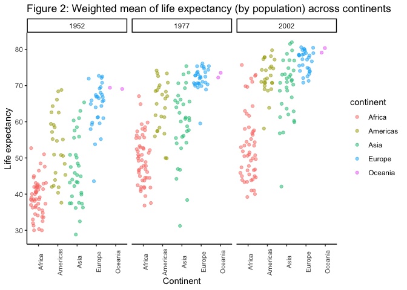
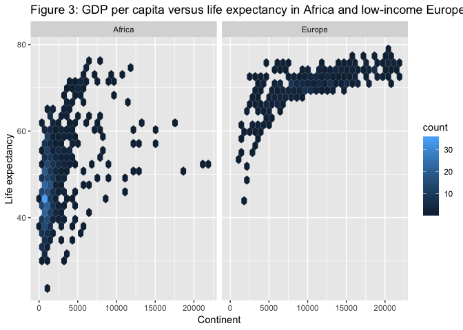

hw03\_exploration
================

Author: Bassam Javed (github: bassamjaved)

# Preamble

This file explores use of dplyr and ggplot to manipulate and plot data
frames. It uses gapminder as the data set.

``` r
library(kableExtra)
library(gapminder)
library(tidyverse)
```

    ## ── Attaching packages ────────────────────────────────────────────────────────── tidyverse 1.2.1 ──

    ## ✔ ggplot2 3.0.0     ✔ purrr   0.2.5
    ## ✔ tibble  1.4.2     ✔ dplyr   0.7.6
    ## ✔ tidyr   0.8.1     ✔ stringr 1.3.1
    ## ✔ readr   1.1.1     ✔ forcats 0.3.0

    ## ── Conflicts ───────────────────────────────────────────────────────────── tidyverse_conflicts() ──
    ## ✖ dplyr::filter() masks stats::filter()
    ## ✖ dplyr::lag()    masks stats::lag()

# 1\) Spread of GDP per capita

**Method:** To find the spread of GDP per capita grouped by continent, I
first generate a table that groups by continent, and then use the
summarize function to find the arguments within it for each continent
separately. For the figure, I pass continent and gdpPercap as x and y
respectively into a boxplot using ggplot.

``` r
gapminder %>% 
  group_by(continent) %>% 
  summarize(min = min(gdpPercap), #Identify each variable in 5-number summary separately to correspond to a boxplot. Summary() function gives 6 number output, so it can't be output directly otherwise the table and plot wouldn't match
            firstQ = summary(gdpPercap)[2], #To call 2nd element of summary() ie first quartile
            median = median(gdpPercap),
            thirdQ = summary(gdpPercap)[4], #To call 4th element of summary() ie third quartile
            max = max(gdpPercap)) %>% 
  knitr::kable(caption = "Table 1: GDP per capita") %>% 
  kable_styling(full_width = FALSE, bootstrap_options = "striped", position = "center")
```

<table class="table table-striped" style="width: auto !important; margin-left: auto; margin-right: auto;">

<caption>

Table 1: GDP per capita

</caption>

<thead>

<tr>

<th style="text-align:left;">

continent

</th>

<th style="text-align:right;">

min

</th>

<th style="text-align:right;">

firstQ

</th>

<th style="text-align:right;">

median

</th>

<th style="text-align:right;">

thirdQ

</th>

<th style="text-align:right;">

max

</th>

</tr>

</thead>

<tbody>

<tr>

<td style="text-align:left;">

Africa

</td>

<td style="text-align:right;">

241.1659

</td>

<td style="text-align:right;">

761.247

</td>

<td style="text-align:right;">

1192.138

</td>

<td style="text-align:right;">

2193.755

</td>

<td style="text-align:right;">

21951.21

</td>

</tr>

<tr>

<td style="text-align:left;">

Americas

</td>

<td style="text-align:right;">

1201.6372

</td>

<td style="text-align:right;">

3427.779

</td>

<td style="text-align:right;">

5465.510

</td>

<td style="text-align:right;">

7136.110

</td>

<td style="text-align:right;">

42951.65

</td>

</tr>

<tr>

<td style="text-align:left;">

Asia

</td>

<td style="text-align:right;">

331.0000

</td>

<td style="text-align:right;">

1056.993

</td>

<td style="text-align:right;">

2646.787

</td>

<td style="text-align:right;">

7902.150

</td>

<td style="text-align:right;">

113523.13

</td>

</tr>

<tr>

<td style="text-align:left;">

Europe

</td>

<td style="text-align:right;">

973.5332

</td>

<td style="text-align:right;">

7213.085

</td>

<td style="text-align:right;">

12081.749

</td>

<td style="text-align:right;">

14469.476

</td>

<td style="text-align:right;">

49357.19

</td>

</tr>

<tr>

<td style="text-align:left;">

Oceania

</td>

<td style="text-align:right;">

10039.5956

</td>

<td style="text-align:right;">

14141.859

</td>

<td style="text-align:right;">

17983.304

</td>

<td style="text-align:right;">

18621.609

</td>

<td style="text-align:right;">

34435.37

</td>

</tr>

</tbody>

</table>

``` r
gapminder %>% ggplot(aes(continent, gdpPercap)) +
  geom_boxplot(aes(fill = continent)) +
  scale_y_log10() +
  theme_classic() +
  labs(title = "Figure 1: GDP per capita by continent", x = "Continent", y = "GDP per capita")
```

<!-- -->

**Comments:** I modified the boxplot with a log scale on the y-axis (GDP
per capita) as the continents vary by an order of magnitude in their
spread (e.g. Africa is closer to 10^3, whereas Oceania is closer to
10^4).

# 2\) Weighted mean of life expectancy weighted by population

**Method:** To find the weighted mean of life expectancy (weighted by
population) across continents, I first select a sample range for
comparison. I use the first year of data (1952) and compare 25 and 50
years after it. To generate a table, I filter by these three years and
group by continent. I then create a new column that contains weighted
means. I assign a new variable ‘A’ to this modified data frame to create
a figure. For the figure, I assign continent and weighted mean as x and
y respectively into a jitter plot using ggplot.

``` r
#Table
A <- gapminder %>% 
      filter(year == 1952 | year == 2002 | year == 1977) %>% 
      group_by(continent, country, year) %>% #Grouping by year in order to facet plot later
      mutate(wm = round(weighted.mean(lifeExp, pop, na.rm = FALSE), digits = 1)) %>% 
      transmute(lifeExp, pop, wm) #transmute removes all columns other than the ones specified

knitr::kable(A, caption = "Table 2: Weighted mean of life expectancy by population") %>% 
  kable_styling(full_width = FALSE, bootstrap_options = "striped", position = "center") %>% 
  scroll_box(width = "800px", height = "500px")
```

<div style="border: 1px solid #ddd; padding: 5px; overflow-y: scroll; height:500px; overflow-x: scroll; width:800px; ">

<table class="table table-striped" style="width: auto !important; margin-left: auto; margin-right: auto;">

<caption>

Table 2: Weighted mean of life expectancy by population

</caption>

<thead>

<tr>

<th style="text-align:left;">

continent

</th>

<th style="text-align:left;">

country

</th>

<th style="text-align:right;">

year

</th>

<th style="text-align:right;">

lifeExp

</th>

<th style="text-align:right;">

pop

</th>

<th style="text-align:right;">

wm

</th>

</tr>

</thead>

<tbody>

<tr>

<td style="text-align:left;">

Asia

</td>

<td style="text-align:left;">

Afghanistan

</td>

<td style="text-align:right;">

1952

</td>

<td style="text-align:right;">

28.80100

</td>

<td style="text-align:right;">

8425333

</td>

<td style="text-align:right;">

28.8

</td>

</tr>

<tr>

<td style="text-align:left;">

Asia

</td>

<td style="text-align:left;">

Afghanistan

</td>

<td style="text-align:right;">

1977

</td>

<td style="text-align:right;">

38.43800

</td>

<td style="text-align:right;">

14880372

</td>

<td style="text-align:right;">

38.4

</td>

</tr>

<tr>

<td style="text-align:left;">

Asia

</td>

<td style="text-align:left;">

Afghanistan

</td>

<td style="text-align:right;">

2002

</td>

<td style="text-align:right;">

42.12900

</td>

<td style="text-align:right;">

25268405

</td>

<td style="text-align:right;">

42.1

</td>

</tr>

<tr>

<td style="text-align:left;">

Europe

</td>

<td style="text-align:left;">

Albania

</td>

<td style="text-align:right;">

1952

</td>

<td style="text-align:right;">

55.23000

</td>

<td style="text-align:right;">

1282697

</td>

<td style="text-align:right;">

55.2

</td>

</tr>

<tr>

<td style="text-align:left;">

Europe

</td>

<td style="text-align:left;">

Albania

</td>

<td style="text-align:right;">

1977

</td>

<td style="text-align:right;">

68.93000

</td>

<td style="text-align:right;">

2509048

</td>

<td style="text-align:right;">

68.9

</td>

</tr>

<tr>

<td style="text-align:left;">

Europe

</td>

<td style="text-align:left;">

Albania

</td>

<td style="text-align:right;">

2002

</td>

<td style="text-align:right;">

75.65100

</td>

<td style="text-align:right;">

3508512

</td>

<td style="text-align:right;">

75.7

</td>

</tr>

<tr>

<td style="text-align:left;">

Africa

</td>

<td style="text-align:left;">

Algeria

</td>

<td style="text-align:right;">

1952

</td>

<td style="text-align:right;">

43.07700

</td>

<td style="text-align:right;">

9279525

</td>

<td style="text-align:right;">

43.1

</td>

</tr>

<tr>

<td style="text-align:left;">

Africa

</td>

<td style="text-align:left;">

Algeria

</td>

<td style="text-align:right;">

1977

</td>

<td style="text-align:right;">

58.01400

</td>

<td style="text-align:right;">

17152804

</td>

<td style="text-align:right;">

58.0

</td>

</tr>

<tr>

<td style="text-align:left;">

Africa

</td>

<td style="text-align:left;">

Algeria

</td>

<td style="text-align:right;">

2002

</td>

<td style="text-align:right;">

70.99400

</td>

<td style="text-align:right;">

31287142

</td>

<td style="text-align:right;">

71.0

</td>

</tr>

<tr>

<td style="text-align:left;">

Africa

</td>

<td style="text-align:left;">

Angola

</td>

<td style="text-align:right;">

1952

</td>

<td style="text-align:right;">

30.01500

</td>

<td style="text-align:right;">

4232095

</td>

<td style="text-align:right;">

30.0

</td>

</tr>

<tr>

<td style="text-align:left;">

Africa

</td>

<td style="text-align:left;">

Angola

</td>

<td style="text-align:right;">

1977

</td>

<td style="text-align:right;">

39.48300

</td>

<td style="text-align:right;">

6162675

</td>

<td style="text-align:right;">

39.5

</td>

</tr>

<tr>

<td style="text-align:left;">

Africa

</td>

<td style="text-align:left;">

Angola

</td>

<td style="text-align:right;">

2002

</td>

<td style="text-align:right;">

41.00300

</td>

<td style="text-align:right;">

10866106

</td>

<td style="text-align:right;">

41.0

</td>

</tr>

<tr>

<td style="text-align:left;">

Americas

</td>

<td style="text-align:left;">

Argentina

</td>

<td style="text-align:right;">

1952

</td>

<td style="text-align:right;">

62.48500

</td>

<td style="text-align:right;">

17876956

</td>

<td style="text-align:right;">

62.5

</td>

</tr>

<tr>

<td style="text-align:left;">

Americas

</td>

<td style="text-align:left;">

Argentina

</td>

<td style="text-align:right;">

1977

</td>

<td style="text-align:right;">

68.48100

</td>

<td style="text-align:right;">

26983828

</td>

<td style="text-align:right;">

68.5

</td>

</tr>

<tr>

<td style="text-align:left;">

Americas

</td>

<td style="text-align:left;">

Argentina

</td>

<td style="text-align:right;">

2002

</td>

<td style="text-align:right;">

74.34000

</td>

<td style="text-align:right;">

38331121

</td>

<td style="text-align:right;">

74.3

</td>

</tr>

<tr>

<td style="text-align:left;">

Oceania

</td>

<td style="text-align:left;">

Australia

</td>

<td style="text-align:right;">

1952

</td>

<td style="text-align:right;">

69.12000

</td>

<td style="text-align:right;">

8691212

</td>

<td style="text-align:right;">

69.1

</td>

</tr>

<tr>

<td style="text-align:left;">

Oceania

</td>

<td style="text-align:left;">

Australia

</td>

<td style="text-align:right;">

1977

</td>

<td style="text-align:right;">

73.49000

</td>

<td style="text-align:right;">

14074100

</td>

<td style="text-align:right;">

73.5

</td>

</tr>

<tr>

<td style="text-align:left;">

Oceania

</td>

<td style="text-align:left;">

Australia

</td>

<td style="text-align:right;">

2002

</td>

<td style="text-align:right;">

80.37000

</td>

<td style="text-align:right;">

19546792

</td>

<td style="text-align:right;">

80.4

</td>

</tr>

<tr>

<td style="text-align:left;">

Europe

</td>

<td style="text-align:left;">

Austria

</td>

<td style="text-align:right;">

1952

</td>

<td style="text-align:right;">

66.80000

</td>

<td style="text-align:right;">

6927772

</td>

<td style="text-align:right;">

66.8

</td>

</tr>

<tr>

<td style="text-align:left;">

Europe

</td>

<td style="text-align:left;">

Austria

</td>

<td style="text-align:right;">

1977

</td>

<td style="text-align:right;">

72.17000

</td>

<td style="text-align:right;">

7568430

</td>

<td style="text-align:right;">

72.2

</td>

</tr>

<tr>

<td style="text-align:left;">

Europe

</td>

<td style="text-align:left;">

Austria

</td>

<td style="text-align:right;">

2002

</td>

<td style="text-align:right;">

78.98000

</td>

<td style="text-align:right;">

8148312

</td>

<td style="text-align:right;">

79.0

</td>

</tr>

<tr>

<td style="text-align:left;">

Asia

</td>

<td style="text-align:left;">

Bahrain

</td>

<td style="text-align:right;">

1952

</td>

<td style="text-align:right;">

50.93900

</td>

<td style="text-align:right;">

120447

</td>

<td style="text-align:right;">

50.9

</td>

</tr>

<tr>

<td style="text-align:left;">

Asia

</td>

<td style="text-align:left;">

Bahrain

</td>

<td style="text-align:right;">

1977

</td>

<td style="text-align:right;">

65.59300

</td>

<td style="text-align:right;">

297410

</td>

<td style="text-align:right;">

65.6

</td>

</tr>

<tr>

<td style="text-align:left;">

Asia

</td>

<td style="text-align:left;">

Bahrain

</td>

<td style="text-align:right;">

2002

</td>

<td style="text-align:right;">

74.79500

</td>

<td style="text-align:right;">

656397

</td>

<td style="text-align:right;">

74.8

</td>

</tr>

<tr>

<td style="text-align:left;">

Asia

</td>

<td style="text-align:left;">

Bangladesh

</td>

<td style="text-align:right;">

1952

</td>

<td style="text-align:right;">

37.48400

</td>

<td style="text-align:right;">

46886859

</td>

<td style="text-align:right;">

37.5

</td>

</tr>

<tr>

<td style="text-align:left;">

Asia

</td>

<td style="text-align:left;">

Bangladesh

</td>

<td style="text-align:right;">

1977

</td>

<td style="text-align:right;">

46.92300

</td>

<td style="text-align:right;">

80428306

</td>

<td style="text-align:right;">

46.9

</td>

</tr>

<tr>

<td style="text-align:left;">

Asia

</td>

<td style="text-align:left;">

Bangladesh

</td>

<td style="text-align:right;">

2002

</td>

<td style="text-align:right;">

62.01300

</td>

<td style="text-align:right;">

135656790

</td>

<td style="text-align:right;">

62.0

</td>

</tr>

<tr>

<td style="text-align:left;">

Europe

</td>

<td style="text-align:left;">

Belgium

</td>

<td style="text-align:right;">

1952

</td>

<td style="text-align:right;">

68.00000

</td>

<td style="text-align:right;">

8730405

</td>

<td style="text-align:right;">

68.0

</td>

</tr>

<tr>

<td style="text-align:left;">

Europe

</td>

<td style="text-align:left;">

Belgium

</td>

<td style="text-align:right;">

1977

</td>

<td style="text-align:right;">

72.80000

</td>

<td style="text-align:right;">

9821800

</td>

<td style="text-align:right;">

72.8

</td>

</tr>

<tr>

<td style="text-align:left;">

Europe

</td>

<td style="text-align:left;">

Belgium

</td>

<td style="text-align:right;">

2002

</td>

<td style="text-align:right;">

78.32000

</td>

<td style="text-align:right;">

10311970

</td>

<td style="text-align:right;">

78.3

</td>

</tr>

<tr>

<td style="text-align:left;">

Africa

</td>

<td style="text-align:left;">

Benin

</td>

<td style="text-align:right;">

1952

</td>

<td style="text-align:right;">

38.22300

</td>

<td style="text-align:right;">

1738315

</td>

<td style="text-align:right;">

38.2

</td>

</tr>

<tr>

<td style="text-align:left;">

Africa

</td>

<td style="text-align:left;">

Benin

</td>

<td style="text-align:right;">

1977

</td>

<td style="text-align:right;">

49.19000

</td>

<td style="text-align:right;">

3168267

</td>

<td style="text-align:right;">

49.2

</td>

</tr>

<tr>

<td style="text-align:left;">

Africa

</td>

<td style="text-align:left;">

Benin

</td>

<td style="text-align:right;">

2002

</td>

<td style="text-align:right;">

54.40600

</td>

<td style="text-align:right;">

7026113

</td>

<td style="text-align:right;">

54.4

</td>

</tr>

<tr>

<td style="text-align:left;">

Americas

</td>

<td style="text-align:left;">

Bolivia

</td>

<td style="text-align:right;">

1952

</td>

<td style="text-align:right;">

40.41400

</td>

<td style="text-align:right;">

2883315

</td>

<td style="text-align:right;">

40.4

</td>

</tr>

<tr>

<td style="text-align:left;">

Americas

</td>

<td style="text-align:left;">

Bolivia

</td>

<td style="text-align:right;">

1977

</td>

<td style="text-align:right;">

50.02300

</td>

<td style="text-align:right;">

5079716

</td>

<td style="text-align:right;">

50.0

</td>

</tr>

<tr>

<td style="text-align:left;">

Americas

</td>

<td style="text-align:left;">

Bolivia

</td>

<td style="text-align:right;">

2002

</td>

<td style="text-align:right;">

63.88300

</td>

<td style="text-align:right;">

8445134

</td>

<td style="text-align:right;">

63.9

</td>

</tr>

<tr>

<td style="text-align:left;">

Europe

</td>

<td style="text-align:left;">

Bosnia and Herzegovina

</td>

<td style="text-align:right;">

1952

</td>

<td style="text-align:right;">

53.82000

</td>

<td style="text-align:right;">

2791000

</td>

<td style="text-align:right;">

53.8

</td>

</tr>

<tr>

<td style="text-align:left;">

Europe

</td>

<td style="text-align:left;">

Bosnia and Herzegovina

</td>

<td style="text-align:right;">

1977

</td>

<td style="text-align:right;">

69.86000

</td>

<td style="text-align:right;">

4086000

</td>

<td style="text-align:right;">

69.9

</td>

</tr>

<tr>

<td style="text-align:left;">

Europe

</td>

<td style="text-align:left;">

Bosnia and Herzegovina

</td>

<td style="text-align:right;">

2002

</td>

<td style="text-align:right;">

74.09000

</td>

<td style="text-align:right;">

4165416

</td>

<td style="text-align:right;">

74.1

</td>

</tr>

<tr>

<td style="text-align:left;">

Africa

</td>

<td style="text-align:left;">

Botswana

</td>

<td style="text-align:right;">

1952

</td>

<td style="text-align:right;">

47.62200

</td>

<td style="text-align:right;">

442308

</td>

<td style="text-align:right;">

47.6

</td>

</tr>

<tr>

<td style="text-align:left;">

Africa

</td>

<td style="text-align:left;">

Botswana

</td>

<td style="text-align:right;">

1977

</td>

<td style="text-align:right;">

59.31900

</td>

<td style="text-align:right;">

781472

</td>

<td style="text-align:right;">

59.3

</td>

</tr>

<tr>

<td style="text-align:left;">

Africa

</td>

<td style="text-align:left;">

Botswana

</td>

<td style="text-align:right;">

2002

</td>

<td style="text-align:right;">

46.63400

</td>

<td style="text-align:right;">

1630347

</td>

<td style="text-align:right;">

46.6

</td>

</tr>

<tr>

<td style="text-align:left;">

Americas

</td>

<td style="text-align:left;">

Brazil

</td>

<td style="text-align:right;">

1952

</td>

<td style="text-align:right;">

50.91700

</td>

<td style="text-align:right;">

56602560

</td>

<td style="text-align:right;">

50.9

</td>

</tr>

<tr>

<td style="text-align:left;">

Americas

</td>

<td style="text-align:left;">

Brazil

</td>

<td style="text-align:right;">

1977

</td>

<td style="text-align:right;">

61.48900

</td>

<td style="text-align:right;">

114313951

</td>

<td style="text-align:right;">

61.5

</td>

</tr>

<tr>

<td style="text-align:left;">

Americas

</td>

<td style="text-align:left;">

Brazil

</td>

<td style="text-align:right;">

2002

</td>

<td style="text-align:right;">

71.00600

</td>

<td style="text-align:right;">

179914212

</td>

<td style="text-align:right;">

71.0

</td>

</tr>

<tr>

<td style="text-align:left;">

Europe

</td>

<td style="text-align:left;">

Bulgaria

</td>

<td style="text-align:right;">

1952

</td>

<td style="text-align:right;">

59.60000

</td>

<td style="text-align:right;">

7274900

</td>

<td style="text-align:right;">

59.6

</td>

</tr>

<tr>

<td style="text-align:left;">

Europe

</td>

<td style="text-align:left;">

Bulgaria

</td>

<td style="text-align:right;">

1977

</td>

<td style="text-align:right;">

70.81000

</td>

<td style="text-align:right;">

8797022

</td>

<td style="text-align:right;">

70.8

</td>

</tr>

<tr>

<td style="text-align:left;">

Europe

</td>

<td style="text-align:left;">

Bulgaria

</td>

<td style="text-align:right;">

2002

</td>

<td style="text-align:right;">

72.14000

</td>

<td style="text-align:right;">

7661799

</td>

<td style="text-align:right;">

72.1

</td>

</tr>

<tr>

<td style="text-align:left;">

Africa

</td>

<td style="text-align:left;">

Burkina Faso

</td>

<td style="text-align:right;">

1952

</td>

<td style="text-align:right;">

31.97500

</td>

<td style="text-align:right;">

4469979

</td>

<td style="text-align:right;">

32.0

</td>

</tr>

<tr>

<td style="text-align:left;">

Africa

</td>

<td style="text-align:left;">

Burkina Faso

</td>

<td style="text-align:right;">

1977

</td>

<td style="text-align:right;">

46.13700

</td>

<td style="text-align:right;">

5889574

</td>

<td style="text-align:right;">

46.1

</td>

</tr>

<tr>

<td style="text-align:left;">

Africa

</td>

<td style="text-align:left;">

Burkina Faso

</td>

<td style="text-align:right;">

2002

</td>

<td style="text-align:right;">

50.65000

</td>

<td style="text-align:right;">

12251209

</td>

<td style="text-align:right;">

50.6

</td>

</tr>

<tr>

<td style="text-align:left;">

Africa

</td>

<td style="text-align:left;">

Burundi

</td>

<td style="text-align:right;">

1952

</td>

<td style="text-align:right;">

39.03100

</td>

<td style="text-align:right;">

2445618

</td>

<td style="text-align:right;">

39.0

</td>

</tr>

<tr>

<td style="text-align:left;">

Africa

</td>

<td style="text-align:left;">

Burundi

</td>

<td style="text-align:right;">

1977

</td>

<td style="text-align:right;">

45.91000

</td>

<td style="text-align:right;">

3834415

</td>

<td style="text-align:right;">

45.9

</td>

</tr>

<tr>

<td style="text-align:left;">

Africa

</td>

<td style="text-align:left;">

Burundi

</td>

<td style="text-align:right;">

2002

</td>

<td style="text-align:right;">

47.36000

</td>

<td style="text-align:right;">

7021078

</td>

<td style="text-align:right;">

47.4

</td>

</tr>

<tr>

<td style="text-align:left;">

Asia

</td>

<td style="text-align:left;">

Cambodia

</td>

<td style="text-align:right;">

1952

</td>

<td style="text-align:right;">

39.41700

</td>

<td style="text-align:right;">

4693836

</td>

<td style="text-align:right;">

39.4

</td>

</tr>

<tr>

<td style="text-align:left;">

Asia

</td>

<td style="text-align:left;">

Cambodia

</td>

<td style="text-align:right;">

1977

</td>

<td style="text-align:right;">

31.22000

</td>

<td style="text-align:right;">

6978607

</td>

<td style="text-align:right;">

31.2

</td>

</tr>

<tr>

<td style="text-align:left;">

Asia

</td>

<td style="text-align:left;">

Cambodia

</td>

<td style="text-align:right;">

2002

</td>

<td style="text-align:right;">

56.75200

</td>

<td style="text-align:right;">

12926707

</td>

<td style="text-align:right;">

56.8

</td>

</tr>

<tr>

<td style="text-align:left;">

Africa

</td>

<td style="text-align:left;">

Cameroon

</td>

<td style="text-align:right;">

1952

</td>

<td style="text-align:right;">

38.52300

</td>

<td style="text-align:right;">

5009067

</td>

<td style="text-align:right;">

38.5

</td>

</tr>

<tr>

<td style="text-align:left;">

Africa

</td>

<td style="text-align:left;">

Cameroon

</td>

<td style="text-align:right;">

1977

</td>

<td style="text-align:right;">

49.35500

</td>

<td style="text-align:right;">

7959865

</td>

<td style="text-align:right;">

49.4

</td>

</tr>

<tr>

<td style="text-align:left;">

Africa

</td>

<td style="text-align:left;">

Cameroon

</td>

<td style="text-align:right;">

2002

</td>

<td style="text-align:right;">

49.85600

</td>

<td style="text-align:right;">

15929988

</td>

<td style="text-align:right;">

49.9

</td>

</tr>

<tr>

<td style="text-align:left;">

Americas

</td>

<td style="text-align:left;">

Canada

</td>

<td style="text-align:right;">

1952

</td>

<td style="text-align:right;">

68.75000

</td>

<td style="text-align:right;">

14785584

</td>

<td style="text-align:right;">

68.8

</td>

</tr>

<tr>

<td style="text-align:left;">

Americas

</td>

<td style="text-align:left;">

Canada

</td>

<td style="text-align:right;">

1977

</td>

<td style="text-align:right;">

74.21000

</td>

<td style="text-align:right;">

23796400

</td>

<td style="text-align:right;">

74.2

</td>

</tr>

<tr>

<td style="text-align:left;">

Americas

</td>

<td style="text-align:left;">

Canada

</td>

<td style="text-align:right;">

2002

</td>

<td style="text-align:right;">

79.77000

</td>

<td style="text-align:right;">

31902268

</td>

<td style="text-align:right;">

79.8

</td>

</tr>

<tr>

<td style="text-align:left;">

Africa

</td>

<td style="text-align:left;">

Central African Republic

</td>

<td style="text-align:right;">

1952

</td>

<td style="text-align:right;">

35.46300

</td>

<td style="text-align:right;">

1291695

</td>

<td style="text-align:right;">

35.5

</td>

</tr>

<tr>

<td style="text-align:left;">

Africa

</td>

<td style="text-align:left;">

Central African Republic

</td>

<td style="text-align:right;">

1977

</td>

<td style="text-align:right;">

46.77500

</td>

<td style="text-align:right;">

2167533

</td>

<td style="text-align:right;">

46.8

</td>

</tr>

<tr>

<td style="text-align:left;">

Africa

</td>

<td style="text-align:left;">

Central African Republic

</td>

<td style="text-align:right;">

2002

</td>

<td style="text-align:right;">

43.30800

</td>

<td style="text-align:right;">

4048013

</td>

<td style="text-align:right;">

43.3

</td>

</tr>

<tr>

<td style="text-align:left;">

Africa

</td>

<td style="text-align:left;">

Chad

</td>

<td style="text-align:right;">

1952

</td>

<td style="text-align:right;">

38.09200

</td>

<td style="text-align:right;">

2682462

</td>

<td style="text-align:right;">

38.1

</td>

</tr>

<tr>

<td style="text-align:left;">

Africa

</td>

<td style="text-align:left;">

Chad

</td>

<td style="text-align:right;">

1977

</td>

<td style="text-align:right;">

47.38300

</td>

<td style="text-align:right;">

4388260

</td>

<td style="text-align:right;">

47.4

</td>

</tr>

<tr>

<td style="text-align:left;">

Africa

</td>

<td style="text-align:left;">

Chad

</td>

<td style="text-align:right;">

2002

</td>

<td style="text-align:right;">

50.52500

</td>

<td style="text-align:right;">

8835739

</td>

<td style="text-align:right;">

50.5

</td>

</tr>

<tr>

<td style="text-align:left;">

Americas

</td>

<td style="text-align:left;">

Chile

</td>

<td style="text-align:right;">

1952

</td>

<td style="text-align:right;">

54.74500

</td>

<td style="text-align:right;">

6377619

</td>

<td style="text-align:right;">

54.7

</td>

</tr>

<tr>

<td style="text-align:left;">

Americas

</td>

<td style="text-align:left;">

Chile

</td>

<td style="text-align:right;">

1977

</td>

<td style="text-align:right;">

67.05200

</td>

<td style="text-align:right;">

10599793

</td>

<td style="text-align:right;">

67.1

</td>

</tr>

<tr>

<td style="text-align:left;">

Americas

</td>

<td style="text-align:left;">

Chile

</td>

<td style="text-align:right;">

2002

</td>

<td style="text-align:right;">

77.86000

</td>

<td style="text-align:right;">

15497046

</td>

<td style="text-align:right;">

77.9

</td>

</tr>

<tr>

<td style="text-align:left;">

Asia

</td>

<td style="text-align:left;">

China

</td>

<td style="text-align:right;">

1952

</td>

<td style="text-align:right;">

44.00000

</td>

<td style="text-align:right;">

556263527

</td>

<td style="text-align:right;">

44.0

</td>

</tr>

<tr>

<td style="text-align:left;">

Asia

</td>

<td style="text-align:left;">

China

</td>

<td style="text-align:right;">

1977

</td>

<td style="text-align:right;">

63.96736

</td>

<td style="text-align:right;">

943455000

</td>

<td style="text-align:right;">

64.0

</td>

</tr>

<tr>

<td style="text-align:left;">

Asia

</td>

<td style="text-align:left;">

China

</td>

<td style="text-align:right;">

2002

</td>

<td style="text-align:right;">

72.02800

</td>

<td style="text-align:right;">

1280400000

</td>

<td style="text-align:right;">

72.0

</td>

</tr>

<tr>

<td style="text-align:left;">

Americas

</td>

<td style="text-align:left;">

Colombia

</td>

<td style="text-align:right;">

1952

</td>

<td style="text-align:right;">

50.64300

</td>

<td style="text-align:right;">

12350771

</td>

<td style="text-align:right;">

50.6

</td>

</tr>

<tr>

<td style="text-align:left;">

Americas

</td>

<td style="text-align:left;">

Colombia

</td>

<td style="text-align:right;">

1977

</td>

<td style="text-align:right;">

63.83700

</td>

<td style="text-align:right;">

25094412

</td>

<td style="text-align:right;">

63.8

</td>

</tr>

<tr>

<td style="text-align:left;">

Americas

</td>

<td style="text-align:left;">

Colombia

</td>

<td style="text-align:right;">

2002

</td>

<td style="text-align:right;">

71.68200

</td>

<td style="text-align:right;">

41008227

</td>

<td style="text-align:right;">

71.7

</td>

</tr>

<tr>

<td style="text-align:left;">

Africa

</td>

<td style="text-align:left;">

Comoros

</td>

<td style="text-align:right;">

1952

</td>

<td style="text-align:right;">

40.71500

</td>

<td style="text-align:right;">

153936

</td>

<td style="text-align:right;">

40.7

</td>

</tr>

<tr>

<td style="text-align:left;">

Africa

</td>

<td style="text-align:left;">

Comoros

</td>

<td style="text-align:right;">

1977

</td>

<td style="text-align:right;">

50.93900

</td>

<td style="text-align:right;">

304739

</td>

<td style="text-align:right;">

50.9

</td>

</tr>

<tr>

<td style="text-align:left;">

Africa

</td>

<td style="text-align:left;">

Comoros

</td>

<td style="text-align:right;">

2002

</td>

<td style="text-align:right;">

62.97400

</td>

<td style="text-align:right;">

614382

</td>

<td style="text-align:right;">

63.0

</td>

</tr>

<tr>

<td style="text-align:left;">

Africa

</td>

<td style="text-align:left;">

Congo, Dem. Rep.

</td>

<td style="text-align:right;">

1952

</td>

<td style="text-align:right;">

39.14300

</td>

<td style="text-align:right;">

14100005

</td>

<td style="text-align:right;">

39.1

</td>

</tr>

<tr>

<td style="text-align:left;">

Africa

</td>

<td style="text-align:left;">

Congo, Dem. Rep.

</td>

<td style="text-align:right;">

1977

</td>

<td style="text-align:right;">

47.80400

</td>

<td style="text-align:right;">

26480870

</td>

<td style="text-align:right;">

47.8

</td>

</tr>

<tr>

<td style="text-align:left;">

Africa

</td>

<td style="text-align:left;">

Congo, Dem. Rep.

</td>

<td style="text-align:right;">

2002

</td>

<td style="text-align:right;">

44.96600

</td>

<td style="text-align:right;">

55379852

</td>

<td style="text-align:right;">

45.0

</td>

</tr>

<tr>

<td style="text-align:left;">

Africa

</td>

<td style="text-align:left;">

Congo, Rep.

</td>

<td style="text-align:right;">

1952

</td>

<td style="text-align:right;">

42.11100

</td>

<td style="text-align:right;">

854885

</td>

<td style="text-align:right;">

42.1

</td>

</tr>

<tr>

<td style="text-align:left;">

Africa

</td>

<td style="text-align:left;">

Congo, Rep.

</td>

<td style="text-align:right;">

1977

</td>

<td style="text-align:right;">

55.62500

</td>

<td style="text-align:right;">

1536769

</td>

<td style="text-align:right;">

55.6

</td>

</tr>

<tr>

<td style="text-align:left;">

Africa

</td>

<td style="text-align:left;">

Congo, Rep.

</td>

<td style="text-align:right;">

2002

</td>

<td style="text-align:right;">

52.97000

</td>

<td style="text-align:right;">

3328795

</td>

<td style="text-align:right;">

53.0

</td>

</tr>

<tr>

<td style="text-align:left;">

Americas

</td>

<td style="text-align:left;">

Costa Rica

</td>

<td style="text-align:right;">

1952

</td>

<td style="text-align:right;">

57.20600

</td>

<td style="text-align:right;">

926317

</td>

<td style="text-align:right;">

57.2

</td>

</tr>

<tr>

<td style="text-align:left;">

Americas

</td>

<td style="text-align:left;">

Costa Rica

</td>

<td style="text-align:right;">

1977

</td>

<td style="text-align:right;">

70.75000

</td>

<td style="text-align:right;">

2108457

</td>

<td style="text-align:right;">

70.8

</td>

</tr>

<tr>

<td style="text-align:left;">

Americas

</td>

<td style="text-align:left;">

Costa Rica

</td>

<td style="text-align:right;">

2002

</td>

<td style="text-align:right;">

78.12300

</td>

<td style="text-align:right;">

3834934

</td>

<td style="text-align:right;">

78.1

</td>

</tr>

<tr>

<td style="text-align:left;">

Africa

</td>

<td style="text-align:left;">

Cote d’Ivoire

</td>

<td style="text-align:right;">

1952

</td>

<td style="text-align:right;">

40.47700

</td>

<td style="text-align:right;">

2977019

</td>

<td style="text-align:right;">

40.5

</td>

</tr>

<tr>

<td style="text-align:left;">

Africa

</td>

<td style="text-align:left;">

Cote d’Ivoire

</td>

<td style="text-align:right;">

1977

</td>

<td style="text-align:right;">

52.37400

</td>

<td style="text-align:right;">

7459574

</td>

<td style="text-align:right;">

52.4

</td>

</tr>

<tr>

<td style="text-align:left;">

Africa

</td>

<td style="text-align:left;">

Cote d’Ivoire

</td>

<td style="text-align:right;">

2002

</td>

<td style="text-align:right;">

46.83200

</td>

<td style="text-align:right;">

16252726

</td>

<td style="text-align:right;">

46.8

</td>

</tr>

<tr>

<td style="text-align:left;">

Europe

</td>

<td style="text-align:left;">

Croatia

</td>

<td style="text-align:right;">

1952

</td>

<td style="text-align:right;">

61.21000

</td>

<td style="text-align:right;">

3882229

</td>

<td style="text-align:right;">

61.2

</td>

</tr>

<tr>

<td style="text-align:left;">

Europe

</td>

<td style="text-align:left;">

Croatia

</td>

<td style="text-align:right;">

1977

</td>

<td style="text-align:right;">

70.64000

</td>

<td style="text-align:right;">

4318673

</td>

<td style="text-align:right;">

70.6

</td>

</tr>

<tr>

<td style="text-align:left;">

Europe

</td>

<td style="text-align:left;">

Croatia

</td>

<td style="text-align:right;">

2002

</td>

<td style="text-align:right;">

74.87600

</td>

<td style="text-align:right;">

4481020

</td>

<td style="text-align:right;">

74.9

</td>

</tr>

<tr>

<td style="text-align:left;">

Americas

</td>

<td style="text-align:left;">

Cuba

</td>

<td style="text-align:right;">

1952

</td>

<td style="text-align:right;">

59.42100

</td>

<td style="text-align:right;">

6007797

</td>

<td style="text-align:right;">

59.4

</td>

</tr>

<tr>

<td style="text-align:left;">

Americas

</td>

<td style="text-align:left;">

Cuba

</td>

<td style="text-align:right;">

1977

</td>

<td style="text-align:right;">

72.64900

</td>

<td style="text-align:right;">

9537988

</td>

<td style="text-align:right;">

72.6

</td>

</tr>

<tr>

<td style="text-align:left;">

Americas

</td>

<td style="text-align:left;">

Cuba

</td>

<td style="text-align:right;">

2002

</td>

<td style="text-align:right;">

77.15800

</td>

<td style="text-align:right;">

11226999

</td>

<td style="text-align:right;">

77.2

</td>

</tr>

<tr>

<td style="text-align:left;">

Europe

</td>

<td style="text-align:left;">

Czech Republic

</td>

<td style="text-align:right;">

1952

</td>

<td style="text-align:right;">

66.87000

</td>

<td style="text-align:right;">

9125183

</td>

<td style="text-align:right;">

66.9

</td>

</tr>

<tr>

<td style="text-align:left;">

Europe

</td>

<td style="text-align:left;">

Czech Republic

</td>

<td style="text-align:right;">

1977

</td>

<td style="text-align:right;">

70.71000

</td>

<td style="text-align:right;">

10161915

</td>

<td style="text-align:right;">

70.7

</td>

</tr>

<tr>

<td style="text-align:left;">

Europe

</td>

<td style="text-align:left;">

Czech Republic

</td>

<td style="text-align:right;">

2002

</td>

<td style="text-align:right;">

75.51000

</td>

<td style="text-align:right;">

10256295

</td>

<td style="text-align:right;">

75.5

</td>

</tr>

<tr>

<td style="text-align:left;">

Europe

</td>

<td style="text-align:left;">

Denmark

</td>

<td style="text-align:right;">

1952

</td>

<td style="text-align:right;">

70.78000

</td>

<td style="text-align:right;">

4334000

</td>

<td style="text-align:right;">

70.8

</td>

</tr>

<tr>

<td style="text-align:left;">

Europe

</td>

<td style="text-align:left;">

Denmark

</td>

<td style="text-align:right;">

1977

</td>

<td style="text-align:right;">

74.69000

</td>

<td style="text-align:right;">

5088419

</td>

<td style="text-align:right;">

74.7

</td>

</tr>

<tr>

<td style="text-align:left;">

Europe

</td>

<td style="text-align:left;">

Denmark

</td>

<td style="text-align:right;">

2002

</td>

<td style="text-align:right;">

77.18000

</td>

<td style="text-align:right;">

5374693

</td>

<td style="text-align:right;">

77.2

</td>

</tr>

<tr>

<td style="text-align:left;">

Africa

</td>

<td style="text-align:left;">

Djibouti

</td>

<td style="text-align:right;">

1952

</td>

<td style="text-align:right;">

34.81200

</td>

<td style="text-align:right;">

63149

</td>

<td style="text-align:right;">

34.8

</td>

</tr>

<tr>

<td style="text-align:left;">

Africa

</td>

<td style="text-align:left;">

Djibouti

</td>

<td style="text-align:right;">

1977

</td>

<td style="text-align:right;">

46.51900

</td>

<td style="text-align:right;">

228694

</td>

<td style="text-align:right;">

46.5

</td>

</tr>

<tr>

<td style="text-align:left;">

Africa

</td>

<td style="text-align:left;">

Djibouti

</td>

<td style="text-align:right;">

2002

</td>

<td style="text-align:right;">

53.37300

</td>

<td style="text-align:right;">

447416

</td>

<td style="text-align:right;">

53.4

</td>

</tr>

<tr>

<td style="text-align:left;">

Americas

</td>

<td style="text-align:left;">

Dominican Republic

</td>

<td style="text-align:right;">

1952

</td>

<td style="text-align:right;">

45.92800

</td>

<td style="text-align:right;">

2491346

</td>

<td style="text-align:right;">

45.9

</td>

</tr>

<tr>

<td style="text-align:left;">

Americas

</td>

<td style="text-align:left;">

Dominican Republic

</td>

<td style="text-align:right;">

1977

</td>

<td style="text-align:right;">

61.78800

</td>

<td style="text-align:right;">

5302800

</td>

<td style="text-align:right;">

61.8

</td>

</tr>

<tr>

<td style="text-align:left;">

Americas

</td>

<td style="text-align:left;">

Dominican Republic

</td>

<td style="text-align:right;">

2002

</td>

<td style="text-align:right;">

70.84700

</td>

<td style="text-align:right;">

8650322

</td>

<td style="text-align:right;">

70.8

</td>

</tr>

<tr>

<td style="text-align:left;">

Americas

</td>

<td style="text-align:left;">

Ecuador

</td>

<td style="text-align:right;">

1952

</td>

<td style="text-align:right;">

48.35700

</td>

<td style="text-align:right;">

3548753

</td>

<td style="text-align:right;">

48.4

</td>

</tr>

<tr>

<td style="text-align:left;">

Americas

</td>

<td style="text-align:left;">

Ecuador

</td>

<td style="text-align:right;">

1977

</td>

<td style="text-align:right;">

61.31000

</td>

<td style="text-align:right;">

7278866

</td>

<td style="text-align:right;">

61.3

</td>

</tr>

<tr>

<td style="text-align:left;">

Americas

</td>

<td style="text-align:left;">

Ecuador

</td>

<td style="text-align:right;">

2002

</td>

<td style="text-align:right;">

74.17300

</td>

<td style="text-align:right;">

12921234

</td>

<td style="text-align:right;">

74.2

</td>

</tr>

<tr>

<td style="text-align:left;">

Africa

</td>

<td style="text-align:left;">

Egypt

</td>

<td style="text-align:right;">

1952

</td>

<td style="text-align:right;">

41.89300

</td>

<td style="text-align:right;">

22223309

</td>

<td style="text-align:right;">

41.9

</td>

</tr>

<tr>

<td style="text-align:left;">

Africa

</td>

<td style="text-align:left;">

Egypt

</td>

<td style="text-align:right;">

1977

</td>

<td style="text-align:right;">

53.31900

</td>

<td style="text-align:right;">

38783863

</td>

<td style="text-align:right;">

53.3

</td>

</tr>

<tr>

<td style="text-align:left;">

Africa

</td>

<td style="text-align:left;">

Egypt

</td>

<td style="text-align:right;">

2002

</td>

<td style="text-align:right;">

69.80600

</td>

<td style="text-align:right;">

73312559

</td>

<td style="text-align:right;">

69.8

</td>

</tr>

<tr>

<td style="text-align:left;">

Americas

</td>

<td style="text-align:left;">

El Salvador

</td>

<td style="text-align:right;">

1952

</td>

<td style="text-align:right;">

45.26200

</td>

<td style="text-align:right;">

2042865

</td>

<td style="text-align:right;">

45.3

</td>

</tr>

<tr>

<td style="text-align:left;">

Americas

</td>

<td style="text-align:left;">

El Salvador

</td>

<td style="text-align:right;">

1977

</td>

<td style="text-align:right;">

56.69600

</td>

<td style="text-align:right;">

4282586

</td>

<td style="text-align:right;">

56.7

</td>

</tr>

<tr>

<td style="text-align:left;">

Americas

</td>

<td style="text-align:left;">

El Salvador

</td>

<td style="text-align:right;">

2002

</td>

<td style="text-align:right;">

70.73400

</td>

<td style="text-align:right;">

6353681

</td>

<td style="text-align:right;">

70.7

</td>

</tr>

<tr>

<td style="text-align:left;">

Africa

</td>

<td style="text-align:left;">

Equatorial Guinea

</td>

<td style="text-align:right;">

1952

</td>

<td style="text-align:right;">

34.48200

</td>

<td style="text-align:right;">

216964

</td>

<td style="text-align:right;">

34.5

</td>

</tr>

<tr>

<td style="text-align:left;">

Africa

</td>

<td style="text-align:left;">

Equatorial Guinea

</td>

<td style="text-align:right;">

1977

</td>

<td style="text-align:right;">

42.02400

</td>

<td style="text-align:right;">

192675

</td>

<td style="text-align:right;">

42.0

</td>

</tr>

<tr>

<td style="text-align:left;">

Africa

</td>

<td style="text-align:left;">

Equatorial Guinea

</td>

<td style="text-align:right;">

2002

</td>

<td style="text-align:right;">

49.34800

</td>

<td style="text-align:right;">

495627

</td>

<td style="text-align:right;">

49.3

</td>

</tr>

<tr>

<td style="text-align:left;">

Africa

</td>

<td style="text-align:left;">

Eritrea

</td>

<td style="text-align:right;">

1952

</td>

<td style="text-align:right;">

35.92800

</td>

<td style="text-align:right;">

1438760

</td>

<td style="text-align:right;">

35.9

</td>

</tr>

<tr>

<td style="text-align:left;">

Africa

</td>

<td style="text-align:left;">

Eritrea

</td>

<td style="text-align:right;">

1977

</td>

<td style="text-align:right;">

44.53500

</td>

<td style="text-align:right;">

2512642

</td>

<td style="text-align:right;">

44.5

</td>

</tr>

<tr>

<td style="text-align:left;">

Africa

</td>

<td style="text-align:left;">

Eritrea

</td>

<td style="text-align:right;">

2002

</td>

<td style="text-align:right;">

55.24000

</td>

<td style="text-align:right;">

4414865

</td>

<td style="text-align:right;">

55.2

</td>

</tr>

<tr>

<td style="text-align:left;">

Africa

</td>

<td style="text-align:left;">

Ethiopia

</td>

<td style="text-align:right;">

1952

</td>

<td style="text-align:right;">

34.07800

</td>

<td style="text-align:right;">

20860941

</td>

<td style="text-align:right;">

34.1

</td>

</tr>

<tr>

<td style="text-align:left;">

Africa

</td>

<td style="text-align:left;">

Ethiopia

</td>

<td style="text-align:right;">

1977

</td>

<td style="text-align:right;">

44.51000

</td>

<td style="text-align:right;">

34617799

</td>

<td style="text-align:right;">

44.5

</td>

</tr>

<tr>

<td style="text-align:left;">

Africa

</td>

<td style="text-align:left;">

Ethiopia

</td>

<td style="text-align:right;">

2002

</td>

<td style="text-align:right;">

50.72500

</td>

<td style="text-align:right;">

67946797

</td>

<td style="text-align:right;">

50.7

</td>

</tr>

<tr>

<td style="text-align:left;">

Europe

</td>

<td style="text-align:left;">

Finland

</td>

<td style="text-align:right;">

1952

</td>

<td style="text-align:right;">

66.55000

</td>

<td style="text-align:right;">

4090500

</td>

<td style="text-align:right;">

66.5

</td>

</tr>

<tr>

<td style="text-align:left;">

Europe

</td>

<td style="text-align:left;">

Finland

</td>

<td style="text-align:right;">

1977

</td>

<td style="text-align:right;">

72.52000

</td>

<td style="text-align:right;">

4738902

</td>

<td style="text-align:right;">

72.5

</td>

</tr>

<tr>

<td style="text-align:left;">

Europe

</td>

<td style="text-align:left;">

Finland

</td>

<td style="text-align:right;">

2002

</td>

<td style="text-align:right;">

78.37000

</td>

<td style="text-align:right;">

5193039

</td>

<td style="text-align:right;">

78.4

</td>

</tr>

<tr>

<td style="text-align:left;">

Europe

</td>

<td style="text-align:left;">

France

</td>

<td style="text-align:right;">

1952

</td>

<td style="text-align:right;">

67.41000

</td>

<td style="text-align:right;">

42459667

</td>

<td style="text-align:right;">

67.4

</td>

</tr>

<tr>

<td style="text-align:left;">

Europe

</td>

<td style="text-align:left;">

France

</td>

<td style="text-align:right;">

1977

</td>

<td style="text-align:right;">

73.83000

</td>

<td style="text-align:right;">

53165019

</td>

<td style="text-align:right;">

73.8

</td>

</tr>

<tr>

<td style="text-align:left;">

Europe

</td>

<td style="text-align:left;">

France

</td>

<td style="text-align:right;">

2002

</td>

<td style="text-align:right;">

79.59000

</td>

<td style="text-align:right;">

59925035

</td>

<td style="text-align:right;">

79.6

</td>

</tr>

<tr>

<td style="text-align:left;">

Africa

</td>

<td style="text-align:left;">

Gabon

</td>

<td style="text-align:right;">

1952

</td>

<td style="text-align:right;">

37.00300

</td>

<td style="text-align:right;">

420702

</td>

<td style="text-align:right;">

37.0

</td>

</tr>

<tr>

<td style="text-align:left;">

Africa

</td>

<td style="text-align:left;">

Gabon

</td>

<td style="text-align:right;">

1977

</td>

<td style="text-align:right;">

52.79000

</td>

<td style="text-align:right;">

706367

</td>

<td style="text-align:right;">

52.8

</td>

</tr>

<tr>

<td style="text-align:left;">

Africa

</td>

<td style="text-align:left;">

Gabon

</td>

<td style="text-align:right;">

2002

</td>

<td style="text-align:right;">

56.76100

</td>

<td style="text-align:right;">

1299304

</td>

<td style="text-align:right;">

56.8

</td>

</tr>

<tr>

<td style="text-align:left;">

Africa

</td>

<td style="text-align:left;">

Gambia

</td>

<td style="text-align:right;">

1952

</td>

<td style="text-align:right;">

30.00000

</td>

<td style="text-align:right;">

284320

</td>

<td style="text-align:right;">

30.0

</td>

</tr>

<tr>

<td style="text-align:left;">

Africa

</td>

<td style="text-align:left;">

Gambia

</td>

<td style="text-align:right;">

1977

</td>

<td style="text-align:right;">

41.84200

</td>

<td style="text-align:right;">

608274

</td>

<td style="text-align:right;">

41.8

</td>

</tr>

<tr>

<td style="text-align:left;">

Africa

</td>

<td style="text-align:left;">

Gambia

</td>

<td style="text-align:right;">

2002

</td>

<td style="text-align:right;">

58.04100

</td>

<td style="text-align:right;">

1457766

</td>

<td style="text-align:right;">

58.0

</td>

</tr>

<tr>

<td style="text-align:left;">

Europe

</td>

<td style="text-align:left;">

Germany

</td>

<td style="text-align:right;">

1952

</td>

<td style="text-align:right;">

67.50000

</td>

<td style="text-align:right;">

69145952

</td>

<td style="text-align:right;">

67.5

</td>

</tr>

<tr>

<td style="text-align:left;">

Europe

</td>

<td style="text-align:left;">

Germany

</td>

<td style="text-align:right;">

1977

</td>

<td style="text-align:right;">

72.50000

</td>

<td style="text-align:right;">

78160773

</td>

<td style="text-align:right;">

72.5

</td>

</tr>

<tr>

<td style="text-align:left;">

Europe

</td>

<td style="text-align:left;">

Germany

</td>

<td style="text-align:right;">

2002

</td>

<td style="text-align:right;">

78.67000

</td>

<td style="text-align:right;">

82350671

</td>

<td style="text-align:right;">

78.7

</td>

</tr>

<tr>

<td style="text-align:left;">

Africa

</td>

<td style="text-align:left;">

Ghana

</td>

<td style="text-align:right;">

1952

</td>

<td style="text-align:right;">

43.14900

</td>

<td style="text-align:right;">

5581001

</td>

<td style="text-align:right;">

43.1

</td>

</tr>

<tr>

<td style="text-align:left;">

Africa

</td>

<td style="text-align:left;">

Ghana

</td>

<td style="text-align:right;">

1977

</td>

<td style="text-align:right;">

51.75600

</td>

<td style="text-align:right;">

10538093

</td>

<td style="text-align:right;">

51.8

</td>

</tr>

<tr>

<td style="text-align:left;">

Africa

</td>

<td style="text-align:left;">

Ghana

</td>

<td style="text-align:right;">

2002

</td>

<td style="text-align:right;">

58.45300

</td>

<td style="text-align:right;">

20550751

</td>

<td style="text-align:right;">

58.5

</td>

</tr>

<tr>

<td style="text-align:left;">

Europe

</td>

<td style="text-align:left;">

Greece

</td>

<td style="text-align:right;">

1952

</td>

<td style="text-align:right;">

65.86000

</td>

<td style="text-align:right;">

7733250

</td>

<td style="text-align:right;">

65.9

</td>

</tr>

<tr>

<td style="text-align:left;">

Europe

</td>

<td style="text-align:left;">

Greece

</td>

<td style="text-align:right;">

1977

</td>

<td style="text-align:right;">

73.68000

</td>

<td style="text-align:right;">

9308479

</td>

<td style="text-align:right;">

73.7

</td>

</tr>

<tr>

<td style="text-align:left;">

Europe

</td>

<td style="text-align:left;">

Greece

</td>

<td style="text-align:right;">

2002

</td>

<td style="text-align:right;">

78.25600

</td>

<td style="text-align:right;">

10603863

</td>

<td style="text-align:right;">

78.3

</td>

</tr>

<tr>

<td style="text-align:left;">

Americas

</td>

<td style="text-align:left;">

Guatemala

</td>

<td style="text-align:right;">

1952

</td>

<td style="text-align:right;">

42.02300

</td>

<td style="text-align:right;">

3146381

</td>

<td style="text-align:right;">

42.0

</td>

</tr>

<tr>

<td style="text-align:left;">

Americas

</td>

<td style="text-align:left;">

Guatemala

</td>

<td style="text-align:right;">

1977

</td>

<td style="text-align:right;">

56.02900

</td>

<td style="text-align:right;">

5703430

</td>

<td style="text-align:right;">

56.0

</td>

</tr>

<tr>

<td style="text-align:left;">

Americas

</td>

<td style="text-align:left;">

Guatemala

</td>

<td style="text-align:right;">

2002

</td>

<td style="text-align:right;">

68.97800

</td>

<td style="text-align:right;">

11178650

</td>

<td style="text-align:right;">

69.0

</td>

</tr>

<tr>

<td style="text-align:left;">

Africa

</td>

<td style="text-align:left;">

Guinea

</td>

<td style="text-align:right;">

1952

</td>

<td style="text-align:right;">

33.60900

</td>

<td style="text-align:right;">

2664249

</td>

<td style="text-align:right;">

33.6

</td>

</tr>

<tr>

<td style="text-align:left;">

Africa

</td>

<td style="text-align:left;">

Guinea

</td>

<td style="text-align:right;">

1977

</td>

<td style="text-align:right;">

40.76200

</td>

<td style="text-align:right;">

4227026

</td>

<td style="text-align:right;">

40.8

</td>

</tr>

<tr>

<td style="text-align:left;">

Africa

</td>

<td style="text-align:left;">

Guinea

</td>

<td style="text-align:right;">

2002

</td>

<td style="text-align:right;">

53.67600

</td>

<td style="text-align:right;">

8807818

</td>

<td style="text-align:right;">

53.7

</td>

</tr>

<tr>

<td style="text-align:left;">

Africa

</td>

<td style="text-align:left;">

Guinea-Bissau

</td>

<td style="text-align:right;">

1952

</td>

<td style="text-align:right;">

32.50000

</td>

<td style="text-align:right;">

580653

</td>

<td style="text-align:right;">

32.5

</td>

</tr>

<tr>

<td style="text-align:left;">

Africa

</td>

<td style="text-align:left;">

Guinea-Bissau

</td>

<td style="text-align:right;">

1977

</td>

<td style="text-align:right;">

37.46500

</td>

<td style="text-align:right;">

745228

</td>

<td style="text-align:right;">

37.5

</td>

</tr>

<tr>

<td style="text-align:left;">

Africa

</td>

<td style="text-align:left;">

Guinea-Bissau

</td>

<td style="text-align:right;">

2002

</td>

<td style="text-align:right;">

45.50400

</td>

<td style="text-align:right;">

1332459

</td>

<td style="text-align:right;">

45.5

</td>

</tr>

<tr>

<td style="text-align:left;">

Americas

</td>

<td style="text-align:left;">

Haiti

</td>

<td style="text-align:right;">

1952

</td>

<td style="text-align:right;">

37.57900

</td>

<td style="text-align:right;">

3201488

</td>

<td style="text-align:right;">

37.6

</td>

</tr>

<tr>

<td style="text-align:left;">

Americas

</td>

<td style="text-align:left;">

Haiti

</td>

<td style="text-align:right;">

1977

</td>

<td style="text-align:right;">

49.92300

</td>

<td style="text-align:right;">

4908554

</td>

<td style="text-align:right;">

49.9

</td>

</tr>

<tr>

<td style="text-align:left;">

Americas

</td>

<td style="text-align:left;">

Haiti

</td>

<td style="text-align:right;">

2002

</td>

<td style="text-align:right;">

58.13700

</td>

<td style="text-align:right;">

7607651

</td>

<td style="text-align:right;">

58.1

</td>

</tr>

<tr>

<td style="text-align:left;">

Americas

</td>

<td style="text-align:left;">

Honduras

</td>

<td style="text-align:right;">

1952

</td>

<td style="text-align:right;">

41.91200

</td>

<td style="text-align:right;">

1517453

</td>

<td style="text-align:right;">

41.9

</td>

</tr>

<tr>

<td style="text-align:left;">

Americas

</td>

<td style="text-align:left;">

Honduras

</td>

<td style="text-align:right;">

1977

</td>

<td style="text-align:right;">

57.40200

</td>

<td style="text-align:right;">

3055235

</td>

<td style="text-align:right;">

57.4

</td>

</tr>

<tr>

<td style="text-align:left;">

Americas

</td>

<td style="text-align:left;">

Honduras

</td>

<td style="text-align:right;">

2002

</td>

<td style="text-align:right;">

68.56500

</td>

<td style="text-align:right;">

6677328

</td>

<td style="text-align:right;">

68.6

</td>

</tr>

<tr>

<td style="text-align:left;">

Asia

</td>

<td style="text-align:left;">

Hong Kong, China

</td>

<td style="text-align:right;">

1952

</td>

<td style="text-align:right;">

60.96000

</td>

<td style="text-align:right;">

2125900

</td>

<td style="text-align:right;">

61.0

</td>

</tr>

<tr>

<td style="text-align:left;">

Asia

</td>

<td style="text-align:left;">

Hong Kong, China

</td>

<td style="text-align:right;">

1977

</td>

<td style="text-align:right;">

73.60000

</td>

<td style="text-align:right;">

4583700

</td>

<td style="text-align:right;">

73.6

</td>

</tr>

<tr>

<td style="text-align:left;">

Asia

</td>

<td style="text-align:left;">

Hong Kong, China

</td>

<td style="text-align:right;">

2002

</td>

<td style="text-align:right;">

81.49500

</td>

<td style="text-align:right;">

6762476

</td>

<td style="text-align:right;">

81.5

</td>

</tr>

<tr>

<td style="text-align:left;">

Europe

</td>

<td style="text-align:left;">

Hungary

</td>

<td style="text-align:right;">

1952

</td>

<td style="text-align:right;">

64.03000

</td>

<td style="text-align:right;">

9504000

</td>

<td style="text-align:right;">

64.0

</td>

</tr>

<tr>

<td style="text-align:left;">

Europe

</td>

<td style="text-align:left;">

Hungary

</td>

<td style="text-align:right;">

1977

</td>

<td style="text-align:right;">

69.95000

</td>

<td style="text-align:right;">

10637171

</td>

<td style="text-align:right;">

70.0

</td>

</tr>

<tr>

<td style="text-align:left;">

Europe

</td>

<td style="text-align:left;">

Hungary

</td>

<td style="text-align:right;">

2002

</td>

<td style="text-align:right;">

72.59000

</td>

<td style="text-align:right;">

10083313

</td>

<td style="text-align:right;">

72.6

</td>

</tr>

<tr>

<td style="text-align:left;">

Europe

</td>

<td style="text-align:left;">

Iceland

</td>

<td style="text-align:right;">

1952

</td>

<td style="text-align:right;">

72.49000

</td>

<td style="text-align:right;">

147962

</td>

<td style="text-align:right;">

72.5

</td>

</tr>

<tr>

<td style="text-align:left;">

Europe

</td>

<td style="text-align:left;">

Iceland

</td>

<td style="text-align:right;">

1977

</td>

<td style="text-align:right;">

76.11000

</td>

<td style="text-align:right;">

221823

</td>

<td style="text-align:right;">

76.1

</td>

</tr>

<tr>

<td style="text-align:left;">

Europe

</td>

<td style="text-align:left;">

Iceland

</td>

<td style="text-align:right;">

2002

</td>

<td style="text-align:right;">

80.50000

</td>

<td style="text-align:right;">

288030

</td>

<td style="text-align:right;">

80.5

</td>

</tr>

<tr>

<td style="text-align:left;">

Asia

</td>

<td style="text-align:left;">

India

</td>

<td style="text-align:right;">

1952

</td>

<td style="text-align:right;">

37.37300

</td>

<td style="text-align:right;">

372000000

</td>

<td style="text-align:right;">

37.4

</td>

</tr>

<tr>

<td style="text-align:left;">

Asia

</td>

<td style="text-align:left;">

India

</td>

<td style="text-align:right;">

1977

</td>

<td style="text-align:right;">

54.20800

</td>

<td style="text-align:right;">

634000000

</td>

<td style="text-align:right;">

54.2

</td>

</tr>

<tr>

<td style="text-align:left;">

Asia

</td>

<td style="text-align:left;">

India

</td>

<td style="text-align:right;">

2002

</td>

<td style="text-align:right;">

62.87900

</td>

<td style="text-align:right;">

1034172547

</td>

<td style="text-align:right;">

62.9

</td>

</tr>

<tr>

<td style="text-align:left;">

Asia

</td>

<td style="text-align:left;">

Indonesia

</td>

<td style="text-align:right;">

1952

</td>

<td style="text-align:right;">

37.46800

</td>

<td style="text-align:right;">

82052000

</td>

<td style="text-align:right;">

37.5

</td>

</tr>

<tr>

<td style="text-align:left;">

Asia

</td>

<td style="text-align:left;">

Indonesia

</td>

<td style="text-align:right;">

1977

</td>

<td style="text-align:right;">

52.70200

</td>

<td style="text-align:right;">

136725000

</td>

<td style="text-align:right;">

52.7

</td>

</tr>

<tr>

<td style="text-align:left;">

Asia

</td>

<td style="text-align:left;">

Indonesia

</td>

<td style="text-align:right;">

2002

</td>

<td style="text-align:right;">

68.58800

</td>

<td style="text-align:right;">

211060000

</td>

<td style="text-align:right;">

68.6

</td>

</tr>

<tr>

<td style="text-align:left;">

Asia

</td>

<td style="text-align:left;">

Iran

</td>

<td style="text-align:right;">

1952

</td>

<td style="text-align:right;">

44.86900

</td>

<td style="text-align:right;">

17272000

</td>

<td style="text-align:right;">

44.9

</td>

</tr>

<tr>

<td style="text-align:left;">

Asia

</td>

<td style="text-align:left;">

Iran

</td>

<td style="text-align:right;">

1977

</td>

<td style="text-align:right;">

57.70200

</td>

<td style="text-align:right;">

35480679

</td>

<td style="text-align:right;">

57.7

</td>

</tr>

<tr>

<td style="text-align:left;">

Asia

</td>

<td style="text-align:left;">

Iran

</td>

<td style="text-align:right;">

2002

</td>

<td style="text-align:right;">

69.45100

</td>

<td style="text-align:right;">

66907826

</td>

<td style="text-align:right;">

69.5

</td>

</tr>

<tr>

<td style="text-align:left;">

Asia

</td>

<td style="text-align:left;">

Iraq

</td>

<td style="text-align:right;">

1952

</td>

<td style="text-align:right;">

45.32000

</td>

<td style="text-align:right;">

5441766

</td>

<td style="text-align:right;">

45.3

</td>

</tr>

<tr>

<td style="text-align:left;">

Asia

</td>

<td style="text-align:left;">

Iraq

</td>

<td style="text-align:right;">

1977

</td>

<td style="text-align:right;">

60.41300

</td>

<td style="text-align:right;">

11882916

</td>

<td style="text-align:right;">

60.4

</td>

</tr>

<tr>

<td style="text-align:left;">

Asia

</td>

<td style="text-align:left;">

Iraq

</td>

<td style="text-align:right;">

2002

</td>

<td style="text-align:right;">

57.04600

</td>

<td style="text-align:right;">

24001816

</td>

<td style="text-align:right;">

57.0

</td>

</tr>

<tr>

<td style="text-align:left;">

Europe

</td>

<td style="text-align:left;">

Ireland

</td>

<td style="text-align:right;">

1952

</td>

<td style="text-align:right;">

66.91000

</td>

<td style="text-align:right;">

2952156

</td>

<td style="text-align:right;">

66.9

</td>

</tr>

<tr>

<td style="text-align:left;">

Europe

</td>

<td style="text-align:left;">

Ireland

</td>

<td style="text-align:right;">

1977

</td>

<td style="text-align:right;">

72.03000

</td>

<td style="text-align:right;">

3271900

</td>

<td style="text-align:right;">

72.0

</td>

</tr>

<tr>

<td style="text-align:left;">

Europe

</td>

<td style="text-align:left;">

Ireland

</td>

<td style="text-align:right;">

2002

</td>

<td style="text-align:right;">

77.78300

</td>

<td style="text-align:right;">

3879155

</td>

<td style="text-align:right;">

77.8

</td>

</tr>

<tr>

<td style="text-align:left;">

Asia

</td>

<td style="text-align:left;">

Israel

</td>

<td style="text-align:right;">

1952

</td>

<td style="text-align:right;">

65.39000

</td>

<td style="text-align:right;">

1620914

</td>

<td style="text-align:right;">

65.4

</td>

</tr>

<tr>

<td style="text-align:left;">

Asia

</td>

<td style="text-align:left;">

Israel

</td>

<td style="text-align:right;">

1977

</td>

<td style="text-align:right;">

73.06000

</td>

<td style="text-align:right;">

3495918

</td>

<td style="text-align:right;">

73.1

</td>

</tr>

<tr>

<td style="text-align:left;">

Asia

</td>

<td style="text-align:left;">

Israel

</td>

<td style="text-align:right;">

2002

</td>

<td style="text-align:right;">

79.69600

</td>

<td style="text-align:right;">

6029529

</td>

<td style="text-align:right;">

79.7

</td>

</tr>

<tr>

<td style="text-align:left;">

Europe

</td>

<td style="text-align:left;">

Italy

</td>

<td style="text-align:right;">

1952

</td>

<td style="text-align:right;">

65.94000

</td>

<td style="text-align:right;">

47666000

</td>

<td style="text-align:right;">

65.9

</td>

</tr>

<tr>

<td style="text-align:left;">

Europe

</td>

<td style="text-align:left;">

Italy

</td>

<td style="text-align:right;">

1977

</td>

<td style="text-align:right;">

73.48000

</td>

<td style="text-align:right;">

56059245

</td>

<td style="text-align:right;">

73.5

</td>

</tr>

<tr>

<td style="text-align:left;">

Europe

</td>

<td style="text-align:left;">

Italy

</td>

<td style="text-align:right;">

2002

</td>

<td style="text-align:right;">

80.24000

</td>

<td style="text-align:right;">

57926999

</td>

<td style="text-align:right;">

80.2

</td>

</tr>

<tr>

<td style="text-align:left;">

Americas

</td>

<td style="text-align:left;">

Jamaica

</td>

<td style="text-align:right;">

1952

</td>

<td style="text-align:right;">

58.53000

</td>

<td style="text-align:right;">

1426095

</td>

<td style="text-align:right;">

58.5

</td>

</tr>

<tr>

<td style="text-align:left;">

Americas

</td>

<td style="text-align:left;">

Jamaica

</td>

<td style="text-align:right;">

1977

</td>

<td style="text-align:right;">

70.11000

</td>

<td style="text-align:right;">

2156814

</td>

<td style="text-align:right;">

70.1

</td>

</tr>

<tr>

<td style="text-align:left;">

Americas

</td>

<td style="text-align:left;">

Jamaica

</td>

<td style="text-align:right;">

2002

</td>

<td style="text-align:right;">

72.04700

</td>

<td style="text-align:right;">

2664659

</td>

<td style="text-align:right;">

72.0

</td>

</tr>

<tr>

<td style="text-align:left;">

Asia

</td>

<td style="text-align:left;">

Japan

</td>

<td style="text-align:right;">

1952

</td>

<td style="text-align:right;">

63.03000

</td>

<td style="text-align:right;">

86459025

</td>

<td style="text-align:right;">

63.0

</td>

</tr>

<tr>

<td style="text-align:left;">

Asia

</td>

<td style="text-align:left;">

Japan

</td>

<td style="text-align:right;">

1977

</td>

<td style="text-align:right;">

75.38000

</td>

<td style="text-align:right;">

113872473

</td>

<td style="text-align:right;">

75.4

</td>

</tr>

<tr>

<td style="text-align:left;">

Asia

</td>

<td style="text-align:left;">

Japan

</td>

<td style="text-align:right;">

2002

</td>

<td style="text-align:right;">

82.00000

</td>

<td style="text-align:right;">

127065841

</td>

<td style="text-align:right;">

82.0

</td>

</tr>

<tr>

<td style="text-align:left;">

Asia

</td>

<td style="text-align:left;">

Jordan

</td>

<td style="text-align:right;">

1952

</td>

<td style="text-align:right;">

43.15800

</td>

<td style="text-align:right;">

607914

</td>

<td style="text-align:right;">

43.2

</td>

</tr>

<tr>

<td style="text-align:left;">

Asia

</td>

<td style="text-align:left;">

Jordan

</td>

<td style="text-align:right;">

1977

</td>

<td style="text-align:right;">

61.13400

</td>

<td style="text-align:right;">

1937652

</td>

<td style="text-align:right;">

61.1

</td>

</tr>

<tr>

<td style="text-align:left;">

Asia

</td>

<td style="text-align:left;">

Jordan

</td>

<td style="text-align:right;">

2002

</td>

<td style="text-align:right;">

71.26300

</td>

<td style="text-align:right;">

5307470

</td>

<td style="text-align:right;">

71.3

</td>

</tr>

<tr>

<td style="text-align:left;">

Africa

</td>

<td style="text-align:left;">

Kenya

</td>

<td style="text-align:right;">

1952

</td>

<td style="text-align:right;">

42.27000

</td>

<td style="text-align:right;">

6464046

</td>

<td style="text-align:right;">

42.3

</td>

</tr>

<tr>

<td style="text-align:left;">

Africa

</td>

<td style="text-align:left;">

Kenya

</td>

<td style="text-align:right;">

1977

</td>

<td style="text-align:right;">

56.15500

</td>

<td style="text-align:right;">

14500404

</td>

<td style="text-align:right;">

56.2

</td>

</tr>

<tr>

<td style="text-align:left;">

Africa

</td>

<td style="text-align:left;">

Kenya

</td>

<td style="text-align:right;">

2002

</td>

<td style="text-align:right;">

50.99200

</td>

<td style="text-align:right;">

31386842

</td>

<td style="text-align:right;">

51.0

</td>

</tr>

<tr>

<td style="text-align:left;">

Asia

</td>

<td style="text-align:left;">

Korea, Dem. Rep.

</td>

<td style="text-align:right;">

1952

</td>

<td style="text-align:right;">

50.05600

</td>

<td style="text-align:right;">

8865488

</td>

<td style="text-align:right;">

50.1

</td>

</tr>

<tr>

<td style="text-align:left;">

Asia

</td>

<td style="text-align:left;">

Korea, Dem. Rep.

</td>

<td style="text-align:right;">

1977

</td>

<td style="text-align:right;">

67.15900

</td>

<td style="text-align:right;">

16325320

</td>

<td style="text-align:right;">

67.2

</td>

</tr>

<tr>

<td style="text-align:left;">

Asia

</td>

<td style="text-align:left;">

Korea, Dem. Rep.

</td>

<td style="text-align:right;">

2002

</td>

<td style="text-align:right;">

66.66200

</td>

<td style="text-align:right;">

22215365

</td>

<td style="text-align:right;">

66.7

</td>

</tr>

<tr>

<td style="text-align:left;">

Asia

</td>

<td style="text-align:left;">

Korea, Rep.

</td>

<td style="text-align:right;">

1952

</td>

<td style="text-align:right;">

47.45300

</td>

<td style="text-align:right;">

20947571

</td>

<td style="text-align:right;">

47.5

</td>

</tr>

<tr>

<td style="text-align:left;">

Asia

</td>

<td style="text-align:left;">

Korea, Rep.

</td>

<td style="text-align:right;">

1977

</td>

<td style="text-align:right;">

64.76600

</td>

<td style="text-align:right;">

36436000

</td>

<td style="text-align:right;">

64.8

</td>

</tr>

<tr>

<td style="text-align:left;">

Asia

</td>

<td style="text-align:left;">

Korea, Rep.

</td>

<td style="text-align:right;">

2002

</td>

<td style="text-align:right;">

77.04500

</td>

<td style="text-align:right;">

47969150

</td>

<td style="text-align:right;">

77.0

</td>

</tr>

<tr>

<td style="text-align:left;">

Asia

</td>

<td style="text-align:left;">

Kuwait

</td>

<td style="text-align:right;">

1952

</td>

<td style="text-align:right;">

55.56500

</td>

<td style="text-align:right;">

160000

</td>

<td style="text-align:right;">

55.6

</td>

</tr>

<tr>

<td style="text-align:left;">

Asia

</td>

<td style="text-align:left;">

Kuwait

</td>

<td style="text-align:right;">

1977

</td>

<td style="text-align:right;">

69.34300

</td>

<td style="text-align:right;">

1140357

</td>

<td style="text-align:right;">

69.3

</td>

</tr>

<tr>

<td style="text-align:left;">

Asia

</td>

<td style="text-align:left;">

Kuwait

</td>

<td style="text-align:right;">

2002

</td>

<td style="text-align:right;">

76.90400

</td>

<td style="text-align:right;">

2111561

</td>

<td style="text-align:right;">

76.9

</td>

</tr>

<tr>

<td style="text-align:left;">

Asia

</td>

<td style="text-align:left;">

Lebanon

</td>

<td style="text-align:right;">

1952

</td>

<td style="text-align:right;">

55.92800

</td>

<td style="text-align:right;">

1439529

</td>

<td style="text-align:right;">

55.9

</td>

</tr>

<tr>

<td style="text-align:left;">

Asia

</td>

<td style="text-align:left;">

Lebanon

</td>

<td style="text-align:right;">

1977

</td>

<td style="text-align:right;">

66.09900

</td>

<td style="text-align:right;">

3115787

</td>

<td style="text-align:right;">

66.1

</td>

</tr>

<tr>

<td style="text-align:left;">

Asia

</td>

<td style="text-align:left;">

Lebanon

</td>

<td style="text-align:right;">

2002

</td>

<td style="text-align:right;">

71.02800

</td>

<td style="text-align:right;">

3677780

</td>

<td style="text-align:right;">

71.0

</td>

</tr>

<tr>

<td style="text-align:left;">

Africa

</td>

<td style="text-align:left;">

Lesotho

</td>

<td style="text-align:right;">

1952

</td>

<td style="text-align:right;">

42.13800

</td>

<td style="text-align:right;">

748747

</td>

<td style="text-align:right;">

42.1

</td>

</tr>

<tr>

<td style="text-align:left;">

Africa

</td>

<td style="text-align:left;">

Lesotho

</td>

<td style="text-align:right;">

1977

</td>

<td style="text-align:right;">

52.20800

</td>

<td style="text-align:right;">

1251524

</td>

<td style="text-align:right;">

52.2

</td>

</tr>

<tr>

<td style="text-align:left;">

Africa

</td>

<td style="text-align:left;">

Lesotho

</td>

<td style="text-align:right;">

2002

</td>

<td style="text-align:right;">

44.59300

</td>

<td style="text-align:right;">

2046772

</td>

<td style="text-align:right;">

44.6

</td>

</tr>

<tr>

<td style="text-align:left;">

Africa

</td>

<td style="text-align:left;">

Liberia

</td>

<td style="text-align:right;">

1952

</td>

<td style="text-align:right;">

38.48000

</td>

<td style="text-align:right;">

863308

</td>

<td style="text-align:right;">

38.5

</td>

</tr>

<tr>

<td style="text-align:left;">

Africa

</td>

<td style="text-align:left;">

Liberia

</td>

<td style="text-align:right;">

1977

</td>

<td style="text-align:right;">

43.76400

</td>

<td style="text-align:right;">

1703617

</td>

<td style="text-align:right;">

43.8

</td>

</tr>

<tr>

<td style="text-align:left;">

Africa

</td>

<td style="text-align:left;">

Liberia

</td>

<td style="text-align:right;">

2002

</td>

<td style="text-align:right;">

43.75300

</td>

<td style="text-align:right;">

2814651

</td>

<td style="text-align:right;">

43.8

</td>

</tr>

<tr>

<td style="text-align:left;">

Africa

</td>

<td style="text-align:left;">

Libya

</td>

<td style="text-align:right;">

1952

</td>

<td style="text-align:right;">

42.72300

</td>

<td style="text-align:right;">

1019729

</td>

<td style="text-align:right;">

42.7

</td>

</tr>

<tr>

<td style="text-align:left;">

Africa

</td>

<td style="text-align:left;">

Libya

</td>

<td style="text-align:right;">

1977

</td>

<td style="text-align:right;">

57.44200

</td>

<td style="text-align:right;">

2721783

</td>

<td style="text-align:right;">

57.4

</td>

</tr>

<tr>

<td style="text-align:left;">

Africa

</td>

<td style="text-align:left;">

Libya

</td>

<td style="text-align:right;">

2002

</td>

<td style="text-align:right;">

72.73700

</td>

<td style="text-align:right;">

5368585

</td>

<td style="text-align:right;">

72.7

</td>

</tr>

<tr>

<td style="text-align:left;">

Africa

</td>

<td style="text-align:left;">

Madagascar

</td>

<td style="text-align:right;">

1952

</td>

<td style="text-align:right;">

36.68100

</td>

<td style="text-align:right;">

4762912

</td>

<td style="text-align:right;">

36.7

</td>

</tr>

<tr>

<td style="text-align:left;">

Africa

</td>

<td style="text-align:left;">

Madagascar

</td>

<td style="text-align:right;">

1977

</td>

<td style="text-align:right;">

46.88100

</td>

<td style="text-align:right;">

8007166

</td>

<td style="text-align:right;">

46.9

</td>

</tr>

<tr>

<td style="text-align:left;">

Africa

</td>

<td style="text-align:left;">

Madagascar

</td>

<td style="text-align:right;">

2002

</td>

<td style="text-align:right;">

57.28600

</td>

<td style="text-align:right;">

16473477

</td>

<td style="text-align:right;">

57.3

</td>

</tr>

<tr>

<td style="text-align:left;">

Africa

</td>

<td style="text-align:left;">

Malawi

</td>

<td style="text-align:right;">

1952

</td>

<td style="text-align:right;">

36.25600

</td>

<td style="text-align:right;">

2917802

</td>

<td style="text-align:right;">

36.3

</td>

</tr>

<tr>

<td style="text-align:left;">

Africa

</td>

<td style="text-align:left;">

Malawi

</td>

<td style="text-align:right;">

1977

</td>

<td style="text-align:right;">

43.76700

</td>

<td style="text-align:right;">

5637246

</td>

<td style="text-align:right;">

43.8

</td>

</tr>

<tr>

<td style="text-align:left;">

Africa

</td>

<td style="text-align:left;">

Malawi

</td>

<td style="text-align:right;">

2002

</td>

<td style="text-align:right;">

45.00900

</td>

<td style="text-align:right;">

11824495

</td>

<td style="text-align:right;">

45.0

</td>

</tr>

<tr>

<td style="text-align:left;">

Asia

</td>

<td style="text-align:left;">

Malaysia

</td>

<td style="text-align:right;">

1952

</td>

<td style="text-align:right;">

48.46300

</td>

<td style="text-align:right;">

6748378

</td>

<td style="text-align:right;">

48.5

</td>

</tr>

<tr>

<td style="text-align:left;">

Asia

</td>

<td style="text-align:left;">

Malaysia

</td>

<td style="text-align:right;">

1977

</td>

<td style="text-align:right;">

65.25600

</td>

<td style="text-align:right;">

12845381

</td>

<td style="text-align:right;">

65.3

</td>

</tr>

<tr>

<td style="text-align:left;">

Asia

</td>

<td style="text-align:left;">

Malaysia

</td>

<td style="text-align:right;">

2002

</td>

<td style="text-align:right;">

73.04400

</td>

<td style="text-align:right;">

22662365

</td>

<td style="text-align:right;">

73.0

</td>

</tr>

<tr>

<td style="text-align:left;">

Africa

</td>

<td style="text-align:left;">

Mali

</td>

<td style="text-align:right;">

1952

</td>

<td style="text-align:right;">

33.68500

</td>

<td style="text-align:right;">

3838168

</td>

<td style="text-align:right;">

33.7

</td>

</tr>

<tr>

<td style="text-align:left;">

Africa

</td>

<td style="text-align:left;">

Mali

</td>

<td style="text-align:right;">

1977

</td>

<td style="text-align:right;">

41.71400

</td>

<td style="text-align:right;">

6491649

</td>

<td style="text-align:right;">

41.7

</td>

</tr>

<tr>

<td style="text-align:left;">

Africa

</td>

<td style="text-align:left;">

Mali

</td>

<td style="text-align:right;">

2002

</td>

<td style="text-align:right;">

51.81800

</td>

<td style="text-align:right;">

10580176

</td>

<td style="text-align:right;">

51.8

</td>

</tr>

<tr>

<td style="text-align:left;">

Africa

</td>

<td style="text-align:left;">

Mauritania

</td>

<td style="text-align:right;">

1952

</td>

<td style="text-align:right;">

40.54300

</td>

<td style="text-align:right;">

1022556

</td>

<td style="text-align:right;">

40.5

</td>

</tr>

<tr>

<td style="text-align:left;">

Africa

</td>

<td style="text-align:left;">

Mauritania

</td>

<td style="text-align:right;">

1977

</td>

<td style="text-align:right;">

50.85200

</td>

<td style="text-align:right;">

1456688

</td>

<td style="text-align:right;">

50.9

</td>

</tr>

<tr>

<td style="text-align:left;">

Africa

</td>

<td style="text-align:left;">

Mauritania

</td>

<td style="text-align:right;">

2002

</td>

<td style="text-align:right;">

62.24700

</td>

<td style="text-align:right;">

2828858

</td>

<td style="text-align:right;">

62.2

</td>

</tr>

<tr>

<td style="text-align:left;">

Africa

</td>

<td style="text-align:left;">

Mauritius

</td>

<td style="text-align:right;">

1952

</td>

<td style="text-align:right;">

50.98600

</td>

<td style="text-align:right;">

516556

</td>

<td style="text-align:right;">

51.0

</td>

</tr>

<tr>

<td style="text-align:left;">

Africa

</td>

<td style="text-align:left;">

Mauritius

</td>

<td style="text-align:right;">

1977

</td>

<td style="text-align:right;">

64.93000

</td>

<td style="text-align:right;">

913025

</td>

<td style="text-align:right;">

64.9

</td>

</tr>

<tr>

<td style="text-align:left;">

Africa

</td>

<td style="text-align:left;">

Mauritius

</td>

<td style="text-align:right;">

2002

</td>

<td style="text-align:right;">

71.95400

</td>

<td style="text-align:right;">

1200206

</td>

<td style="text-align:right;">

72.0

</td>

</tr>

<tr>

<td style="text-align:left;">

Americas

</td>

<td style="text-align:left;">

Mexico

</td>

<td style="text-align:right;">

1952

</td>

<td style="text-align:right;">

50.78900

</td>

<td style="text-align:right;">

30144317

</td>

<td style="text-align:right;">

50.8

</td>

</tr>

<tr>

<td style="text-align:left;">

Americas

</td>

<td style="text-align:left;">

Mexico

</td>

<td style="text-align:right;">

1977

</td>

<td style="text-align:right;">

65.03200

</td>

<td style="text-align:right;">

63759976

</td>

<td style="text-align:right;">

65.0

</td>

</tr>

<tr>

<td style="text-align:left;">

Americas

</td>

<td style="text-align:left;">

Mexico

</td>

<td style="text-align:right;">

2002

</td>

<td style="text-align:right;">

74.90200

</td>

<td style="text-align:right;">

102479927

</td>

<td style="text-align:right;">

74.9

</td>

</tr>

<tr>

<td style="text-align:left;">

Asia

</td>

<td style="text-align:left;">

Mongolia

</td>

<td style="text-align:right;">

1952

</td>

<td style="text-align:right;">

42.24400

</td>

<td style="text-align:right;">

800663

</td>

<td style="text-align:right;">

42.2

</td>

</tr>

<tr>

<td style="text-align:left;">

Asia

</td>

<td style="text-align:left;">

Mongolia

</td>

<td style="text-align:right;">

1977

</td>

<td style="text-align:right;">

55.49100

</td>

<td style="text-align:right;">

1528000

</td>

<td style="text-align:right;">

55.5

</td>

</tr>

<tr>

<td style="text-align:left;">

Asia

</td>

<td style="text-align:left;">

Mongolia

</td>

<td style="text-align:right;">

2002

</td>

<td style="text-align:right;">

65.03300

</td>

<td style="text-align:right;">

2674234

</td>

<td style="text-align:right;">

65.0

</td>

</tr>

<tr>

<td style="text-align:left;">

Europe

</td>

<td style="text-align:left;">

Montenegro

</td>

<td style="text-align:right;">

1952

</td>

<td style="text-align:right;">

59.16400

</td>

<td style="text-align:right;">

413834

</td>

<td style="text-align:right;">

59.2

</td>

</tr>

<tr>

<td style="text-align:left;">

Europe

</td>

<td style="text-align:left;">

Montenegro

</td>

<td style="text-align:right;">

1977

</td>

<td style="text-align:right;">

73.06600

</td>

<td style="text-align:right;">

560073

</td>

<td style="text-align:right;">

73.1

</td>

</tr>

<tr>

<td style="text-align:left;">

Europe

</td>

<td style="text-align:left;">

Montenegro

</td>

<td style="text-align:right;">

2002

</td>

<td style="text-align:right;">

73.98100

</td>

<td style="text-align:right;">

720230

</td>

<td style="text-align:right;">

74.0

</td>

</tr>

<tr>

<td style="text-align:left;">

Africa

</td>

<td style="text-align:left;">

Morocco

</td>

<td style="text-align:right;">

1952

</td>

<td style="text-align:right;">

42.87300

</td>

<td style="text-align:right;">

9939217

</td>

<td style="text-align:right;">

42.9

</td>

</tr>

<tr>

<td style="text-align:left;">

Africa

</td>

<td style="text-align:left;">

Morocco

</td>

<td style="text-align:right;">

1977

</td>

<td style="text-align:right;">

55.73000

</td>

<td style="text-align:right;">

18396941

</td>

<td style="text-align:right;">

55.7

</td>

</tr>

<tr>

<td style="text-align:left;">

Africa

</td>

<td style="text-align:left;">

Morocco

</td>

<td style="text-align:right;">

2002

</td>

<td style="text-align:right;">

69.61500

</td>

<td style="text-align:right;">

31167783

</td>

<td style="text-align:right;">

69.6

</td>

</tr>

<tr>

<td style="text-align:left;">

Africa

</td>

<td style="text-align:left;">

Mozambique

</td>

<td style="text-align:right;">

1952

</td>

<td style="text-align:right;">

31.28600

</td>

<td style="text-align:right;">

6446316

</td>

<td style="text-align:right;">

31.3

</td>

</tr>

<tr>

<td style="text-align:left;">

Africa

</td>

<td style="text-align:left;">

Mozambique

</td>

<td style="text-align:right;">

1977

</td>

<td style="text-align:right;">

42.49500

</td>

<td style="text-align:right;">

11127868

</td>

<td style="text-align:right;">

42.5

</td>

</tr>

<tr>

<td style="text-align:left;">

Africa

</td>

<td style="text-align:left;">

Mozambique

</td>

<td style="text-align:right;">

2002

</td>

<td style="text-align:right;">

44.02600

</td>

<td style="text-align:right;">

18473780

</td>

<td style="text-align:right;">

44.0

</td>

</tr>

<tr>

<td style="text-align:left;">

Asia

</td>

<td style="text-align:left;">

Myanmar

</td>

<td style="text-align:right;">

1952

</td>

<td style="text-align:right;">

36.31900

</td>

<td style="text-align:right;">

20092996

</td>

<td style="text-align:right;">

36.3

</td>

</tr>

<tr>

<td style="text-align:left;">

Asia

</td>

<td style="text-align:left;">

Myanmar

</td>

<td style="text-align:right;">

1977

</td>

<td style="text-align:right;">

56.05900

</td>

<td style="text-align:right;">

31528087

</td>

<td style="text-align:right;">

56.1

</td>

</tr>

<tr>

<td style="text-align:left;">

Asia

</td>

<td style="text-align:left;">

Myanmar

</td>

<td style="text-align:right;">

2002

</td>

<td style="text-align:right;">

59.90800

</td>

<td style="text-align:right;">

45598081

</td>

<td style="text-align:right;">

59.9

</td>

</tr>

<tr>

<td style="text-align:left;">

Africa

</td>

<td style="text-align:left;">

Namibia

</td>

<td style="text-align:right;">

1952

</td>

<td style="text-align:right;">

41.72500

</td>

<td style="text-align:right;">

485831

</td>

<td style="text-align:right;">

41.7

</td>

</tr>

<tr>

<td style="text-align:left;">

Africa

</td>

<td style="text-align:left;">

Namibia

</td>

<td style="text-align:right;">

1977

</td>

<td style="text-align:right;">

56.43700

</td>

<td style="text-align:right;">

977026

</td>

<td style="text-align:right;">

56.4

</td>

</tr>

<tr>

<td style="text-align:left;">

Africa

</td>

<td style="text-align:left;">

Namibia

</td>

<td style="text-align:right;">

2002

</td>

<td style="text-align:right;">

51.47900

</td>

<td style="text-align:right;">

1972153

</td>

<td style="text-align:right;">

51.5

</td>

</tr>

<tr>

<td style="text-align:left;">

Asia

</td>

<td style="text-align:left;">

Nepal

</td>

<td style="text-align:right;">

1952

</td>

<td style="text-align:right;">

36.15700

</td>

<td style="text-align:right;">

9182536

</td>

<td style="text-align:right;">

36.2

</td>

</tr>

<tr>

<td style="text-align:left;">

Asia

</td>

<td style="text-align:left;">

Nepal

</td>

<td style="text-align:right;">

1977

</td>

<td style="text-align:right;">

46.74800

</td>

<td style="text-align:right;">

13933198

</td>

<td style="text-align:right;">

46.7

</td>

</tr>

<tr>

<td style="text-align:left;">

Asia

</td>

<td style="text-align:left;">

Nepal

</td>

<td style="text-align:right;">

2002

</td>

<td style="text-align:right;">

61.34000

</td>

<td style="text-align:right;">

25873917

</td>

<td style="text-align:right;">

61.3

</td>

</tr>

<tr>

<td style="text-align:left;">

Europe

</td>

<td style="text-align:left;">

Netherlands

</td>

<td style="text-align:right;">

1952

</td>

<td style="text-align:right;">

72.13000

</td>

<td style="text-align:right;">

10381988

</td>

<td style="text-align:right;">

72.1

</td>

</tr>

<tr>

<td style="text-align:left;">

Europe

</td>

<td style="text-align:left;">

Netherlands

</td>

<td style="text-align:right;">

1977

</td>

<td style="text-align:right;">

75.24000

</td>

<td style="text-align:right;">

13852989

</td>

<td style="text-align:right;">

75.2

</td>

</tr>

<tr>

<td style="text-align:left;">

Europe

</td>

<td style="text-align:left;">

Netherlands

</td>

<td style="text-align:right;">

2002

</td>

<td style="text-align:right;">

78.53000

</td>

<td style="text-align:right;">

16122830

</td>

<td style="text-align:right;">

78.5

</td>

</tr>

<tr>

<td style="text-align:left;">

Oceania

</td>

<td style="text-align:left;">

New Zealand

</td>

<td style="text-align:right;">

1952

</td>

<td style="text-align:right;">

69.39000

</td>

<td style="text-align:right;">

1994794

</td>

<td style="text-align:right;">

69.4

</td>

</tr>

<tr>

<td style="text-align:left;">

Oceania

</td>

<td style="text-align:left;">

New Zealand

</td>

<td style="text-align:right;">

1977

</td>

<td style="text-align:right;">

72.22000

</td>

<td style="text-align:right;">

3164900

</td>

<td style="text-align:right;">

72.2

</td>

</tr>

<tr>

<td style="text-align:left;">

Oceania

</td>

<td style="text-align:left;">

New Zealand

</td>

<td style="text-align:right;">

2002

</td>

<td style="text-align:right;">

79.11000

</td>

<td style="text-align:right;">

3908037

</td>

<td style="text-align:right;">

79.1

</td>

</tr>

<tr>

<td style="text-align:left;">

Americas

</td>

<td style="text-align:left;">

Nicaragua

</td>

<td style="text-align:right;">

1952

</td>

<td style="text-align:right;">

42.31400

</td>

<td style="text-align:right;">

1165790

</td>

<td style="text-align:right;">

42.3

</td>

</tr>

<tr>

<td style="text-align:left;">

Americas

</td>

<td style="text-align:left;">

Nicaragua

</td>

<td style="text-align:right;">

1977

</td>

<td style="text-align:right;">

57.47000

</td>

<td style="text-align:right;">

2554598

</td>

<td style="text-align:right;">

57.5

</td>

</tr>

<tr>

<td style="text-align:left;">

Americas

</td>

<td style="text-align:left;">

Nicaragua

</td>

<td style="text-align:right;">

2002

</td>

<td style="text-align:right;">

70.83600

</td>

<td style="text-align:right;">

5146848

</td>

<td style="text-align:right;">

70.8

</td>

</tr>

<tr>

<td style="text-align:left;">

Africa

</td>

<td style="text-align:left;">

Niger

</td>

<td style="text-align:right;">

1952

</td>

<td style="text-align:right;">

37.44400

</td>

<td style="text-align:right;">

3379468

</td>

<td style="text-align:right;">

37.4

</td>

</tr>

<tr>

<td style="text-align:left;">

Africa

</td>

<td style="text-align:left;">

Niger

</td>

<td style="text-align:right;">

1977

</td>

<td style="text-align:right;">

41.29100

</td>

<td style="text-align:right;">

5682086

</td>

<td style="text-align:right;">

41.3

</td>

</tr>

<tr>

<td style="text-align:left;">

Africa

</td>

<td style="text-align:left;">

Niger

</td>

<td style="text-align:right;">

2002

</td>

<td style="text-align:right;">

54.49600

</td>

<td style="text-align:right;">

11140655

</td>

<td style="text-align:right;">

54.5

</td>

</tr>

<tr>

<td style="text-align:left;">

Africa

</td>

<td style="text-align:left;">

Nigeria

</td>

<td style="text-align:right;">

1952

</td>

<td style="text-align:right;">

36.32400

</td>

<td style="text-align:right;">

33119096

</td>

<td style="text-align:right;">

36.3

</td>

</tr>

<tr>

<td style="text-align:left;">

Africa

</td>

<td style="text-align:left;">

Nigeria

</td>

<td style="text-align:right;">

1977

</td>

<td style="text-align:right;">

44.51400

</td>

<td style="text-align:right;">

62209173

</td>

<td style="text-align:right;">

44.5

</td>

</tr>

<tr>

<td style="text-align:left;">

Africa

</td>

<td style="text-align:left;">

Nigeria

</td>

<td style="text-align:right;">

2002

</td>

<td style="text-align:right;">

46.60800

</td>

<td style="text-align:right;">

119901274

</td>

<td style="text-align:right;">

46.6

</td>

</tr>

<tr>

<td style="text-align:left;">

Europe

</td>

<td style="text-align:left;">

Norway

</td>

<td style="text-align:right;">

1952

</td>

<td style="text-align:right;">

72.67000

</td>

<td style="text-align:right;">

3327728

</td>

<td style="text-align:right;">

72.7

</td>

</tr>

<tr>

<td style="text-align:left;">

Europe

</td>

<td style="text-align:left;">

Norway

</td>

<td style="text-align:right;">

1977

</td>

<td style="text-align:right;">

75.37000

</td>

<td style="text-align:right;">

4043205

</td>

<td style="text-align:right;">

75.4

</td>

</tr>

<tr>

<td style="text-align:left;">

Europe

</td>

<td style="text-align:left;">

Norway

</td>

<td style="text-align:right;">

2002

</td>

<td style="text-align:right;">

79.05000

</td>

<td style="text-align:right;">

4535591

</td>

<td style="text-align:right;">

79.0

</td>

</tr>

<tr>

<td style="text-align:left;">

Asia

</td>

<td style="text-align:left;">

Oman

</td>

<td style="text-align:right;">

1952

</td>

<td style="text-align:right;">

37.57800

</td>

<td style="text-align:right;">

507833

</td>

<td style="text-align:right;">

37.6

</td>

</tr>

<tr>

<td style="text-align:left;">

Asia

</td>

<td style="text-align:left;">

Oman

</td>

<td style="text-align:right;">

1977

</td>

<td style="text-align:right;">

57.36700

</td>

<td style="text-align:right;">

1004533

</td>

<td style="text-align:right;">

57.4

</td>

</tr>

<tr>

<td style="text-align:left;">

Asia

</td>

<td style="text-align:left;">

Oman

</td>

<td style="text-align:right;">

2002

</td>

<td style="text-align:right;">

74.19300

</td>

<td style="text-align:right;">

2713462

</td>

<td style="text-align:right;">

74.2

</td>

</tr>

<tr>

<td style="text-align:left;">

Asia

</td>

<td style="text-align:left;">

Pakistan

</td>

<td style="text-align:right;">

1952

</td>

<td style="text-align:right;">

43.43600

</td>

<td style="text-align:right;">

41346560

</td>

<td style="text-align:right;">

43.4

</td>

</tr>

<tr>

<td style="text-align:left;">

Asia

</td>

<td style="text-align:left;">

Pakistan

</td>

<td style="text-align:right;">

1977

</td>

<td style="text-align:right;">

54.04300

</td>

<td style="text-align:right;">

78152686

</td>

<td style="text-align:right;">

54.0

</td>

</tr>

<tr>

<td style="text-align:left;">

Asia

</td>

<td style="text-align:left;">

Pakistan

</td>

<td style="text-align:right;">

2002

</td>

<td style="text-align:right;">

63.61000

</td>

<td style="text-align:right;">

153403524

</td>

<td style="text-align:right;">

63.6

</td>

</tr>

<tr>

<td style="text-align:left;">

Americas

</td>

<td style="text-align:left;">

Panama

</td>

<td style="text-align:right;">

1952

</td>

<td style="text-align:right;">

55.19100

</td>

<td style="text-align:right;">

940080

</td>

<td style="text-align:right;">

55.2

</td>

</tr>

<tr>

<td style="text-align:left;">

Americas

</td>

<td style="text-align:left;">

Panama

</td>

<td style="text-align:right;">

1977

</td>

<td style="text-align:right;">

68.68100

</td>

<td style="text-align:right;">

1839782

</td>

<td style="text-align:right;">

68.7

</td>

</tr>

<tr>

<td style="text-align:left;">

Americas

</td>

<td style="text-align:left;">

Panama

</td>

<td style="text-align:right;">

2002

</td>

<td style="text-align:right;">

74.71200

</td>

<td style="text-align:right;">

2990875

</td>

<td style="text-align:right;">

74.7

</td>

</tr>

<tr>

<td style="text-align:left;">

Americas

</td>

<td style="text-align:left;">

Paraguay

</td>

<td style="text-align:right;">

1952

</td>

<td style="text-align:right;">

62.64900

</td>

<td style="text-align:right;">

1555876

</td>

<td style="text-align:right;">

62.6

</td>

</tr>

<tr>

<td style="text-align:left;">

Americas

</td>

<td style="text-align:left;">

Paraguay

</td>

<td style="text-align:right;">

1977

</td>

<td style="text-align:right;">

66.35300

</td>

<td style="text-align:right;">

2984494

</td>

<td style="text-align:right;">

66.4

</td>

</tr>

<tr>

<td style="text-align:left;">

Americas

</td>

<td style="text-align:left;">

Paraguay

</td>

<td style="text-align:right;">

2002

</td>

<td style="text-align:right;">

70.75500

</td>

<td style="text-align:right;">

5884491

</td>

<td style="text-align:right;">

70.8

</td>

</tr>

<tr>

<td style="text-align:left;">

Americas

</td>

<td style="text-align:left;">

Peru

</td>

<td style="text-align:right;">

1952

</td>

<td style="text-align:right;">

43.90200

</td>

<td style="text-align:right;">

8025700

</td>

<td style="text-align:right;">

43.9

</td>

</tr>

<tr>

<td style="text-align:left;">

Americas

</td>

<td style="text-align:left;">

Peru

</td>

<td style="text-align:right;">

1977

</td>

<td style="text-align:right;">

58.44700

</td>

<td style="text-align:right;">

15990099

</td>

<td style="text-align:right;">

58.4

</td>

</tr>

<tr>

<td style="text-align:left;">

Americas

</td>

<td style="text-align:left;">

Peru

</td>

<td style="text-align:right;">

2002

</td>

<td style="text-align:right;">

69.90600

</td>

<td style="text-align:right;">

26769436

</td>

<td style="text-align:right;">

69.9

</td>

</tr>

<tr>

<td style="text-align:left;">

Asia

</td>

<td style="text-align:left;">

Philippines

</td>

<td style="text-align:right;">

1952

</td>

<td style="text-align:right;">

47.75200

</td>

<td style="text-align:right;">

22438691

</td>

<td style="text-align:right;">

47.8

</td>

</tr>

<tr>

<td style="text-align:left;">

Asia

</td>

<td style="text-align:left;">

Philippines

</td>

<td style="text-align:right;">

1977

</td>

<td style="text-align:right;">

60.06000

</td>

<td style="text-align:right;">

46850962

</td>

<td style="text-align:right;">

60.1

</td>

</tr>

<tr>

<td style="text-align:left;">

Asia

</td>

<td style="text-align:left;">

Philippines

</td>

<td style="text-align:right;">

2002

</td>

<td style="text-align:right;">

70.30300

</td>

<td style="text-align:right;">

82995088

</td>

<td style="text-align:right;">

70.3

</td>

</tr>

<tr>

<td style="text-align:left;">

Europe

</td>

<td style="text-align:left;">

Poland

</td>

<td style="text-align:right;">

1952

</td>

<td style="text-align:right;">

61.31000

</td>

<td style="text-align:right;">

25730551

</td>

<td style="text-align:right;">

61.3

</td>

</tr>

<tr>

<td style="text-align:left;">

Europe

</td>

<td style="text-align:left;">

Poland

</td>

<td style="text-align:right;">

1977

</td>

<td style="text-align:right;">

70.67000

</td>

<td style="text-align:right;">

34621254

</td>

<td style="text-align:right;">

70.7

</td>

</tr>

<tr>

<td style="text-align:left;">

Europe

</td>

<td style="text-align:left;">

Poland

</td>

<td style="text-align:right;">

2002

</td>

<td style="text-align:right;">

74.67000

</td>

<td style="text-align:right;">

38625976

</td>

<td style="text-align:right;">

74.7

</td>

</tr>

<tr>

<td style="text-align:left;">

Europe

</td>

<td style="text-align:left;">

Portugal

</td>

<td style="text-align:right;">

1952

</td>

<td style="text-align:right;">

59.82000

</td>

<td style="text-align:right;">

8526050

</td>

<td style="text-align:right;">

59.8

</td>

</tr>

<tr>

<td style="text-align:left;">

Europe

</td>

<td style="text-align:left;">

Portugal

</td>

<td style="text-align:right;">

1977

</td>

<td style="text-align:right;">

70.41000

</td>

<td style="text-align:right;">

9662600

</td>

<td style="text-align:right;">

70.4

</td>

</tr>

<tr>

<td style="text-align:left;">

Europe

</td>

<td style="text-align:left;">

Portugal

</td>

<td style="text-align:right;">

2002

</td>

<td style="text-align:right;">

77.29000

</td>

<td style="text-align:right;">

10433867

</td>

<td style="text-align:right;">

77.3

</td>

</tr>

<tr>

<td style="text-align:left;">

Americas

</td>

<td style="text-align:left;">

Puerto Rico

</td>

<td style="text-align:right;">

1952

</td>

<td style="text-align:right;">

64.28000

</td>

<td style="text-align:right;">

2227000

</td>

<td style="text-align:right;">

64.3

</td>

</tr>

<tr>

<td style="text-align:left;">

Americas

</td>

<td style="text-align:left;">

Puerto Rico

</td>

<td style="text-align:right;">

1977

</td>

<td style="text-align:right;">

73.44000

</td>

<td style="text-align:right;">

3080828

</td>

<td style="text-align:right;">

73.4

</td>

</tr>

<tr>

<td style="text-align:left;">

Americas

</td>

<td style="text-align:left;">

Puerto Rico

</td>

<td style="text-align:right;">

2002

</td>

<td style="text-align:right;">

77.77800

</td>

<td style="text-align:right;">

3859606

</td>

<td style="text-align:right;">

77.8

</td>

</tr>

<tr>

<td style="text-align:left;">

Africa

</td>

<td style="text-align:left;">

Reunion

</td>

<td style="text-align:right;">

1952

</td>

<td style="text-align:right;">

52.72400

</td>

<td style="text-align:right;">

257700

</td>

<td style="text-align:right;">

52.7

</td>

</tr>

<tr>

<td style="text-align:left;">

Africa

</td>

<td style="text-align:left;">

Reunion

</td>

<td style="text-align:right;">

1977

</td>

<td style="text-align:right;">

67.06400

</td>

<td style="text-align:right;">

492095

</td>

<td style="text-align:right;">

67.1

</td>

</tr>

<tr>

<td style="text-align:left;">

Africa

</td>

<td style="text-align:left;">

Reunion

</td>

<td style="text-align:right;">

2002

</td>

<td style="text-align:right;">

75.74400

</td>

<td style="text-align:right;">

743981

</td>

<td style="text-align:right;">

75.7

</td>

</tr>

<tr>

<td style="text-align:left;">

Europe

</td>

<td style="text-align:left;">

Romania

</td>

<td style="text-align:right;">

1952

</td>

<td style="text-align:right;">

61.05000

</td>

<td style="text-align:right;">

16630000

</td>

<td style="text-align:right;">

61.0

</td>

</tr>

<tr>

<td style="text-align:left;">

Europe

</td>

<td style="text-align:left;">

Romania

</td>

<td style="text-align:right;">

1977

</td>

<td style="text-align:right;">

69.46000

</td>

<td style="text-align:right;">

21658597

</td>

<td style="text-align:right;">

69.5

</td>

</tr>

<tr>

<td style="text-align:left;">

Europe

</td>

<td style="text-align:left;">

Romania

</td>

<td style="text-align:right;">

2002

</td>

<td style="text-align:right;">

71.32200

</td>

<td style="text-align:right;">

22404337

</td>

<td style="text-align:right;">

71.3

</td>

</tr>

<tr>

<td style="text-align:left;">

Africa

</td>

<td style="text-align:left;">

Rwanda

</td>

<td style="text-align:right;">

1952

</td>

<td style="text-align:right;">

40.00000

</td>

<td style="text-align:right;">

2534927

</td>

<td style="text-align:right;">

40.0

</td>

</tr>

<tr>

<td style="text-align:left;">

Africa

</td>

<td style="text-align:left;">

Rwanda

</td>

<td style="text-align:right;">

1977

</td>

<td style="text-align:right;">

45.00000

</td>

<td style="text-align:right;">

4657072

</td>

<td style="text-align:right;">

45.0

</td>

</tr>

<tr>

<td style="text-align:left;">

Africa

</td>

<td style="text-align:left;">

Rwanda

</td>

<td style="text-align:right;">

2002

</td>

<td style="text-align:right;">

43.41300

</td>

<td style="text-align:right;">

7852401

</td>

<td style="text-align:right;">

43.4

</td>

</tr>

<tr>

<td style="text-align:left;">

Africa

</td>

<td style="text-align:left;">

Sao Tome and Principe

</td>

<td style="text-align:right;">

1952

</td>

<td style="text-align:right;">

46.47100

</td>

<td style="text-align:right;">

60011

</td>

<td style="text-align:right;">

46.5

</td>

</tr>

<tr>

<td style="text-align:left;">

Africa

</td>

<td style="text-align:left;">

Sao Tome and Principe

</td>

<td style="text-align:right;">

1977

</td>

<td style="text-align:right;">

58.55000

</td>

<td style="text-align:right;">

86796

</td>

<td style="text-align:right;">

58.5

</td>

</tr>

<tr>

<td style="text-align:left;">

Africa

</td>

<td style="text-align:left;">

Sao Tome and Principe

</td>

<td style="text-align:right;">

2002

</td>

<td style="text-align:right;">

64.33700

</td>

<td style="text-align:right;">

170372

</td>

<td style="text-align:right;">

64.3

</td>

</tr>

<tr>

<td style="text-align:left;">

Asia

</td>

<td style="text-align:left;">

Saudi Arabia

</td>

<td style="text-align:right;">

1952

</td>

<td style="text-align:right;">

39.87500

</td>

<td style="text-align:right;">

4005677

</td>

<td style="text-align:right;">

39.9

</td>

</tr>

<tr>

<td style="text-align:left;">

Asia

</td>

<td style="text-align:left;">

Saudi Arabia

</td>

<td style="text-align:right;">

1977

</td>

<td style="text-align:right;">

58.69000

</td>

<td style="text-align:right;">

8128505

</td>

<td style="text-align:right;">

58.7

</td>

</tr>

<tr>

<td style="text-align:left;">

Asia

</td>

<td style="text-align:left;">

Saudi Arabia

</td>

<td style="text-align:right;">

2002

</td>

<td style="text-align:right;">

71.62600

</td>

<td style="text-align:right;">

24501530

</td>

<td style="text-align:right;">

71.6

</td>

</tr>

<tr>

<td style="text-align:left;">

Africa

</td>

<td style="text-align:left;">

Senegal

</td>

<td style="text-align:right;">

1952

</td>

<td style="text-align:right;">

37.27800

</td>

<td style="text-align:right;">

2755589

</td>

<td style="text-align:right;">

37.3

</td>

</tr>

<tr>

<td style="text-align:left;">

Africa

</td>

<td style="text-align:left;">

Senegal

</td>

<td style="text-align:right;">

1977

</td>

<td style="text-align:right;">

48.87900

</td>

<td style="text-align:right;">

5260855

</td>

<td style="text-align:right;">

48.9

</td>

</tr>

<tr>

<td style="text-align:left;">

Africa

</td>

<td style="text-align:left;">

Senegal

</td>

<td style="text-align:right;">

2002

</td>

<td style="text-align:right;">

61.60000

</td>

<td style="text-align:right;">

10870037

</td>

<td style="text-align:right;">

61.6

</td>

</tr>

<tr>

<td style="text-align:left;">

Europe

</td>

<td style="text-align:left;">

Serbia

</td>

<td style="text-align:right;">

1952

</td>

<td style="text-align:right;">

57.99600

</td>

<td style="text-align:right;">

6860147

</td>

<td style="text-align:right;">

58.0

</td>

</tr>

<tr>

<td style="text-align:left;">

Europe

</td>

<td style="text-align:left;">

Serbia

</td>

<td style="text-align:right;">

1977

</td>

<td style="text-align:right;">

70.30000

</td>

<td style="text-align:right;">

8686367

</td>

<td style="text-align:right;">

70.3

</td>

</tr>

<tr>

<td style="text-align:left;">

Europe

</td>

<td style="text-align:left;">

Serbia

</td>

<td style="text-align:right;">

2002

</td>

<td style="text-align:right;">

73.21300

</td>

<td style="text-align:right;">

10111559

</td>

<td style="text-align:right;">

73.2

</td>

</tr>

<tr>

<td style="text-align:left;">

Africa

</td>

<td style="text-align:left;">

Sierra Leone

</td>

<td style="text-align:right;">

1952

</td>

<td style="text-align:right;">

30.33100

</td>

<td style="text-align:right;">

2143249

</td>

<td style="text-align:right;">

30.3

</td>

</tr>

<tr>

<td style="text-align:left;">

Africa

</td>

<td style="text-align:left;">

Sierra Leone

</td>

<td style="text-align:right;">

1977

</td>

<td style="text-align:right;">

36.78800

</td>

<td style="text-align:right;">

3140897

</td>

<td style="text-align:right;">

36.8

</td>

</tr>

<tr>

<td style="text-align:left;">

Africa

</td>

<td style="text-align:left;">

Sierra Leone

</td>

<td style="text-align:right;">

2002

</td>

<td style="text-align:right;">

41.01200

</td>

<td style="text-align:right;">

5359092

</td>

<td style="text-align:right;">

41.0

</td>

</tr>

<tr>

<td style="text-align:left;">

Asia

</td>

<td style="text-align:left;">

Singapore

</td>

<td style="text-align:right;">

1952

</td>

<td style="text-align:right;">

60.39600

</td>

<td style="text-align:right;">

1127000

</td>

<td style="text-align:right;">

60.4

</td>

</tr>

<tr>

<td style="text-align:left;">

Asia

</td>

<td style="text-align:left;">

Singapore

</td>

<td style="text-align:right;">

1977

</td>

<td style="text-align:right;">

70.79500

</td>

<td style="text-align:right;">

2325300

</td>

<td style="text-align:right;">

70.8

</td>

</tr>

<tr>

<td style="text-align:left;">

Asia

</td>

<td style="text-align:left;">

Singapore

</td>

<td style="text-align:right;">

2002

</td>

<td style="text-align:right;">

78.77000

</td>

<td style="text-align:right;">

4197776

</td>

<td style="text-align:right;">

78.8

</td>

</tr>

<tr>

<td style="text-align:left;">

Europe

</td>

<td style="text-align:left;">

Slovak Republic

</td>

<td style="text-align:right;">

1952

</td>

<td style="text-align:right;">

64.36000

</td>

<td style="text-align:right;">

3558137

</td>

<td style="text-align:right;">

64.4

</td>

</tr>

<tr>

<td style="text-align:left;">

Europe

</td>

<td style="text-align:left;">

Slovak Republic

</td>

<td style="text-align:right;">

1977

</td>

<td style="text-align:right;">

70.45000

</td>

<td style="text-align:right;">

4827803

</td>

<td style="text-align:right;">

70.5

</td>

</tr>

<tr>

<td style="text-align:left;">

Europe

</td>

<td style="text-align:left;">

Slovak Republic

</td>

<td style="text-align:right;">

2002

</td>

<td style="text-align:right;">

73.80000

</td>

<td style="text-align:right;">

5410052

</td>

<td style="text-align:right;">

73.8

</td>

</tr>

<tr>

<td style="text-align:left;">

Europe

</td>

<td style="text-align:left;">

Slovenia

</td>

<td style="text-align:right;">

1952

</td>

<td style="text-align:right;">

65.57000

</td>

<td style="text-align:right;">

1489518

</td>

<td style="text-align:right;">

65.6

</td>

</tr>

<tr>

<td style="text-align:left;">

Europe

</td>

<td style="text-align:left;">

Slovenia

</td>

<td style="text-align:right;">

1977

</td>

<td style="text-align:right;">

70.97000

</td>

<td style="text-align:right;">

1746919

</td>

<td style="text-align:right;">

71.0

</td>

</tr>

<tr>

<td style="text-align:left;">

Europe

</td>

<td style="text-align:left;">

Slovenia

</td>

<td style="text-align:right;">

2002

</td>

<td style="text-align:right;">

76.66000

</td>

<td style="text-align:right;">

2011497

</td>

<td style="text-align:right;">

76.7

</td>

</tr>

<tr>

<td style="text-align:left;">

Africa

</td>

<td style="text-align:left;">

Somalia

</td>

<td style="text-align:right;">

1952

</td>

<td style="text-align:right;">

32.97800

</td>

<td style="text-align:right;">

2526994

</td>

<td style="text-align:right;">

33.0

</td>

</tr>

<tr>

<td style="text-align:left;">

Africa

</td>

<td style="text-align:left;">

Somalia

</td>

<td style="text-align:right;">

1977

</td>

<td style="text-align:right;">

41.97400

</td>

<td style="text-align:right;">

4353666

</td>

<td style="text-align:right;">

42.0

</td>

</tr>

<tr>

<td style="text-align:left;">

Africa

</td>

<td style="text-align:left;">

Somalia

</td>

<td style="text-align:right;">

2002

</td>

<td style="text-align:right;">

45.93600

</td>

<td style="text-align:right;">

7753310

</td>

<td style="text-align:right;">

45.9

</td>

</tr>

<tr>

<td style="text-align:left;">

Africa

</td>

<td style="text-align:left;">

South Africa

</td>

<td style="text-align:right;">

1952

</td>

<td style="text-align:right;">

45.00900

</td>

<td style="text-align:right;">

14264935

</td>

<td style="text-align:right;">

45.0

</td>

</tr>

<tr>

<td style="text-align:left;">

Africa

</td>

<td style="text-align:left;">

South Africa

</td>

<td style="text-align:right;">

1977

</td>

<td style="text-align:right;">

55.52700

</td>

<td style="text-align:right;">

27129932

</td>

<td style="text-align:right;">

55.5

</td>

</tr>

<tr>

<td style="text-align:left;">

Africa

</td>

<td style="text-align:left;">

South Africa

</td>

<td style="text-align:right;">

2002

</td>

<td style="text-align:right;">

53.36500

</td>

<td style="text-align:right;">

44433622

</td>

<td style="text-align:right;">

53.4

</td>

</tr>

<tr>

<td style="text-align:left;">

Europe

</td>

<td style="text-align:left;">

Spain

</td>

<td style="text-align:right;">

1952

</td>

<td style="text-align:right;">

64.94000

</td>

<td style="text-align:right;">

28549870

</td>

<td style="text-align:right;">

64.9

</td>

</tr>

<tr>

<td style="text-align:left;">

Europe

</td>

<td style="text-align:left;">

Spain

</td>

<td style="text-align:right;">

1977

</td>

<td style="text-align:right;">

74.39000

</td>

<td style="text-align:right;">

36439000

</td>

<td style="text-align:right;">

74.4

</td>

</tr>

<tr>

<td style="text-align:left;">

Europe

</td>

<td style="text-align:left;">

Spain

</td>

<td style="text-align:right;">

2002

</td>

<td style="text-align:right;">

79.78000

</td>

<td style="text-align:right;">

40152517

</td>

<td style="text-align:right;">

79.8

</td>

</tr>

<tr>

<td style="text-align:left;">

Asia

</td>

<td style="text-align:left;">

Sri Lanka

</td>

<td style="text-align:right;">

1952

</td>

<td style="text-align:right;">

57.59300

</td>

<td style="text-align:right;">

7982342

</td>

<td style="text-align:right;">

57.6

</td>

</tr>

<tr>

<td style="text-align:left;">

Asia

</td>

<td style="text-align:left;">

Sri Lanka

</td>

<td style="text-align:right;">

1977

</td>

<td style="text-align:right;">

65.94900

</td>

<td style="text-align:right;">

14116836

</td>

<td style="text-align:right;">

65.9

</td>

</tr>

<tr>

<td style="text-align:left;">

Asia

</td>

<td style="text-align:left;">

Sri Lanka

</td>

<td style="text-align:right;">

2002

</td>

<td style="text-align:right;">

70.81500

</td>

<td style="text-align:right;">

19576783

</td>

<td style="text-align:right;">

70.8

</td>

</tr>

<tr>

<td style="text-align:left;">

Africa

</td>

<td style="text-align:left;">

Sudan

</td>

<td style="text-align:right;">

1952

</td>

<td style="text-align:right;">

38.63500

</td>

<td style="text-align:right;">

8504667

</td>

<td style="text-align:right;">

38.6

</td>

</tr>

<tr>

<td style="text-align:left;">

Africa

</td>

<td style="text-align:left;">

Sudan

</td>

<td style="text-align:right;">

1977

</td>

<td style="text-align:right;">

47.80000

</td>

<td style="text-align:right;">

17104986

</td>

<td style="text-align:right;">

47.8

</td>

</tr>

<tr>

<td style="text-align:left;">

Africa

</td>

<td style="text-align:left;">

Sudan

</td>

<td style="text-align:right;">

2002

</td>

<td style="text-align:right;">

56.36900

</td>

<td style="text-align:right;">

37090298

</td>

<td style="text-align:right;">

56.4

</td>

</tr>

<tr>

<td style="text-align:left;">

Africa

</td>

<td style="text-align:left;">

Swaziland

</td>

<td style="text-align:right;">

1952

</td>

<td style="text-align:right;">

41.40700

</td>

<td style="text-align:right;">

290243

</td>

<td style="text-align:right;">

41.4

</td>

</tr>

<tr>

<td style="text-align:left;">

Africa

</td>

<td style="text-align:left;">

Swaziland

</td>

<td style="text-align:right;">

1977

</td>

<td style="text-align:right;">

52.53700

</td>

<td style="text-align:right;">

551425

</td>

<td style="text-align:right;">

52.5

</td>

</tr>

<tr>

<td style="text-align:left;">

Africa

</td>

<td style="text-align:left;">

Swaziland

</td>

<td style="text-align:right;">

2002

</td>

<td style="text-align:right;">

43.86900

</td>

<td style="text-align:right;">

1130269

</td>

<td style="text-align:right;">

43.9

</td>

</tr>

<tr>

<td style="text-align:left;">

Europe

</td>

<td style="text-align:left;">

Sweden

</td>

<td style="text-align:right;">

1952

</td>

<td style="text-align:right;">

71.86000

</td>

<td style="text-align:right;">

7124673

</td>

<td style="text-align:right;">

71.9

</td>

</tr>

<tr>

<td style="text-align:left;">

Europe

</td>

<td style="text-align:left;">

Sweden

</td>

<td style="text-align:right;">

1977

</td>

<td style="text-align:right;">

75.44000

</td>

<td style="text-align:right;">

8251648

</td>

<td style="text-align:right;">

75.4

</td>

</tr>

<tr>

<td style="text-align:left;">

Europe

</td>

<td style="text-align:left;">

Sweden

</td>

<td style="text-align:right;">

2002

</td>

<td style="text-align:right;">

80.04000

</td>

<td style="text-align:right;">

8954175

</td>

<td style="text-align:right;">

80.0

</td>

</tr>

<tr>

<td style="text-align:left;">

Europe

</td>

<td style="text-align:left;">

Switzerland

</td>

<td style="text-align:right;">

1952

</td>

<td style="text-align:right;">

69.62000

</td>

<td style="text-align:right;">

4815000

</td>

<td style="text-align:right;">

69.6

</td>

</tr>

<tr>

<td style="text-align:left;">

Europe

</td>

<td style="text-align:left;">

Switzerland

</td>

<td style="text-align:right;">

1977

</td>

<td style="text-align:right;">

75.39000

</td>

<td style="text-align:right;">

6316424

</td>

<td style="text-align:right;">

75.4

</td>

</tr>

<tr>

<td style="text-align:left;">

Europe

</td>

<td style="text-align:left;">

Switzerland

</td>

<td style="text-align:right;">

2002

</td>

<td style="text-align:right;">

80.62000

</td>

<td style="text-align:right;">

7361757

</td>

<td style="text-align:right;">

80.6

</td>

</tr>

<tr>

<td style="text-align:left;">

Asia

</td>

<td style="text-align:left;">

Syria

</td>

<td style="text-align:right;">

1952

</td>

<td style="text-align:right;">

45.88300

</td>

<td style="text-align:right;">

3661549

</td>

<td style="text-align:right;">

45.9

</td>

</tr>

<tr>

<td style="text-align:left;">

Asia

</td>

<td style="text-align:left;">

Syria

</td>

<td style="text-align:right;">

1977

</td>

<td style="text-align:right;">

61.19500

</td>

<td style="text-align:right;">

7932503

</td>

<td style="text-align:right;">

61.2

</td>

</tr>

<tr>

<td style="text-align:left;">

Asia

</td>

<td style="text-align:left;">

Syria

</td>

<td style="text-align:right;">

2002

</td>

<td style="text-align:right;">

73.05300

</td>

<td style="text-align:right;">

17155814

</td>

<td style="text-align:right;">

73.1

</td>

</tr>

<tr>

<td style="text-align:left;">

Asia

</td>

<td style="text-align:left;">

Taiwan

</td>

<td style="text-align:right;">

1952

</td>

<td style="text-align:right;">

58.50000

</td>

<td style="text-align:right;">

8550362

</td>

<td style="text-align:right;">

58.5

</td>

</tr>

<tr>

<td style="text-align:left;">

Asia

</td>

<td style="text-align:left;">

Taiwan

</td>

<td style="text-align:right;">

1977

</td>

<td style="text-align:right;">

70.59000

</td>

<td style="text-align:right;">

16785196

</td>

<td style="text-align:right;">

70.6

</td>

</tr>

<tr>

<td style="text-align:left;">

Asia

</td>

<td style="text-align:left;">

Taiwan

</td>

<td style="text-align:right;">

2002

</td>

<td style="text-align:right;">

76.99000

</td>

<td style="text-align:right;">

22454239

</td>

<td style="text-align:right;">

77.0

</td>

</tr>

<tr>

<td style="text-align:left;">

Africa

</td>

<td style="text-align:left;">

Tanzania

</td>

<td style="text-align:right;">

1952

</td>

<td style="text-align:right;">

41.21500

</td>

<td style="text-align:right;">

8322925

</td>

<td style="text-align:right;">

41.2

</td>

</tr>

<tr>

<td style="text-align:left;">

Africa

</td>

<td style="text-align:left;">

Tanzania

</td>

<td style="text-align:right;">

1977

</td>

<td style="text-align:right;">

49.91900

</td>

<td style="text-align:right;">

17129565

</td>

<td style="text-align:right;">

49.9

</td>

</tr>

<tr>

<td style="text-align:left;">

Africa

</td>

<td style="text-align:left;">

Tanzania

</td>

<td style="text-align:right;">

2002

</td>

<td style="text-align:right;">

49.65100

</td>

<td style="text-align:right;">

34593779

</td>

<td style="text-align:right;">

49.7

</td>

</tr>

<tr>

<td style="text-align:left;">

Asia

</td>

<td style="text-align:left;">

Thailand

</td>

<td style="text-align:right;">

1952

</td>

<td style="text-align:right;">

50.84800

</td>

<td style="text-align:right;">

21289402

</td>

<td style="text-align:right;">

50.8

</td>

</tr>

<tr>

<td style="text-align:left;">

Asia

</td>

<td style="text-align:left;">

Thailand

</td>

<td style="text-align:right;">

1977

</td>

<td style="text-align:right;">

62.49400

</td>

<td style="text-align:right;">

44148285

</td>

<td style="text-align:right;">

62.5

</td>

</tr>

<tr>

<td style="text-align:left;">

Asia

</td>

<td style="text-align:left;">

Thailand

</td>

<td style="text-align:right;">

2002

</td>

<td style="text-align:right;">

68.56400

</td>

<td style="text-align:right;">

62806748

</td>

<td style="text-align:right;">

68.6

</td>

</tr>

<tr>

<td style="text-align:left;">

Africa

</td>

<td style="text-align:left;">

Togo

</td>

<td style="text-align:right;">

1952

</td>

<td style="text-align:right;">

38.59600

</td>

<td style="text-align:right;">

1219113

</td>

<td style="text-align:right;">

38.6

</td>

</tr>

<tr>

<td style="text-align:left;">

Africa

</td>

<td style="text-align:left;">

Togo

</td>

<td style="text-align:right;">

1977

</td>

<td style="text-align:right;">

52.88700

</td>

<td style="text-align:right;">

2308582

</td>

<td style="text-align:right;">

52.9

</td>

</tr>

<tr>

<td style="text-align:left;">

Africa

</td>

<td style="text-align:left;">

Togo

</td>

<td style="text-align:right;">

2002

</td>

<td style="text-align:right;">

57.56100

</td>

<td style="text-align:right;">

4977378

</td>

<td style="text-align:right;">

57.6

</td>

</tr>

<tr>

<td style="text-align:left;">

Americas

</td>

<td style="text-align:left;">

Trinidad and Tobago

</td>

<td style="text-align:right;">

1952

</td>

<td style="text-align:right;">

59.10000

</td>

<td style="text-align:right;">

662850

</td>

<td style="text-align:right;">

59.1

</td>

</tr>

<tr>

<td style="text-align:left;">

Americas

</td>

<td style="text-align:left;">

Trinidad and Tobago

</td>

<td style="text-align:right;">

1977

</td>

<td style="text-align:right;">

68.30000

</td>

<td style="text-align:right;">

1039009

</td>

<td style="text-align:right;">

68.3

</td>

</tr>

<tr>

<td style="text-align:left;">

Americas

</td>

<td style="text-align:left;">

Trinidad and Tobago

</td>

<td style="text-align:right;">

2002

</td>

<td style="text-align:right;">

68.97600

</td>

<td style="text-align:right;">

1101832

</td>

<td style="text-align:right;">

69.0

</td>

</tr>

<tr>

<td style="text-align:left;">

Africa

</td>

<td style="text-align:left;">

Tunisia

</td>

<td style="text-align:right;">

1952

</td>

<td style="text-align:right;">

44.60000

</td>

<td style="text-align:right;">

3647735

</td>

<td style="text-align:right;">

44.6

</td>

</tr>

<tr>

<td style="text-align:left;">

Africa

</td>

<td style="text-align:left;">

Tunisia

</td>

<td style="text-align:right;">

1977

</td>

<td style="text-align:right;">

59.83700

</td>

<td style="text-align:right;">

6005061

</td>

<td style="text-align:right;">

59.8

</td>

</tr>

<tr>

<td style="text-align:left;">

Africa

</td>

<td style="text-align:left;">

Tunisia

</td>

<td style="text-align:right;">

2002

</td>

<td style="text-align:right;">

73.04200

</td>

<td style="text-align:right;">

9770575

</td>

<td style="text-align:right;">

73.0

</td>

</tr>

<tr>

<td style="text-align:left;">

Europe

</td>

<td style="text-align:left;">

Turkey

</td>

<td style="text-align:right;">

1952

</td>

<td style="text-align:right;">

43.58500

</td>

<td style="text-align:right;">

22235677

</td>

<td style="text-align:right;">

43.6

</td>

</tr>

<tr>

<td style="text-align:left;">

Europe

</td>

<td style="text-align:left;">

Turkey

</td>

<td style="text-align:right;">

1977

</td>

<td style="text-align:right;">

59.50700

</td>

<td style="text-align:right;">

42404033

</td>

<td style="text-align:right;">

59.5

</td>

</tr>

<tr>

<td style="text-align:left;">

Europe

</td>

<td style="text-align:left;">

Turkey

</td>

<td style="text-align:right;">

2002

</td>

<td style="text-align:right;">

70.84500

</td>

<td style="text-align:right;">

67308928

</td>

<td style="text-align:right;">

70.8

</td>

</tr>

<tr>

<td style="text-align:left;">

Africa

</td>

<td style="text-align:left;">

Uganda

</td>

<td style="text-align:right;">

1952

</td>

<td style="text-align:right;">

39.97800

</td>

<td style="text-align:right;">

5824797

</td>

<td style="text-align:right;">

40.0

</td>

</tr>

<tr>

<td style="text-align:left;">

Africa

</td>

<td style="text-align:left;">

Uganda

</td>

<td style="text-align:right;">

1977

</td>

<td style="text-align:right;">

50.35000

</td>

<td style="text-align:right;">

11457758

</td>

<td style="text-align:right;">

50.4

</td>

</tr>

<tr>

<td style="text-align:left;">

Africa

</td>

<td style="text-align:left;">

Uganda

</td>

<td style="text-align:right;">

2002

</td>

<td style="text-align:right;">

47.81300

</td>

<td style="text-align:right;">

24739869

</td>

<td style="text-align:right;">

47.8

</td>

</tr>

<tr>

<td style="text-align:left;">

Europe

</td>

<td style="text-align:left;">

United Kingdom

</td>

<td style="text-align:right;">

1952

</td>

<td style="text-align:right;">

69.18000

</td>

<td style="text-align:right;">

50430000

</td>

<td style="text-align:right;">

69.2

</td>

</tr>

<tr>

<td style="text-align:left;">

Europe

</td>

<td style="text-align:left;">

United Kingdom

</td>

<td style="text-align:right;">

1977

</td>

<td style="text-align:right;">

72.76000

</td>

<td style="text-align:right;">

56179000

</td>

<td style="text-align:right;">

72.8

</td>

</tr>

<tr>

<td style="text-align:left;">

Europe

</td>

<td style="text-align:left;">

United Kingdom

</td>

<td style="text-align:right;">

2002

</td>

<td style="text-align:right;">

78.47100

</td>

<td style="text-align:right;">

59912431

</td>

<td style="text-align:right;">

78.5

</td>

</tr>

<tr>

<td style="text-align:left;">

Americas

</td>

<td style="text-align:left;">

United States

</td>

<td style="text-align:right;">

1952

</td>

<td style="text-align:right;">

68.44000

</td>

<td style="text-align:right;">

157553000

</td>

<td style="text-align:right;">

68.4

</td>

</tr>

<tr>

<td style="text-align:left;">

Americas

</td>

<td style="text-align:left;">

United States

</td>

<td style="text-align:right;">

1977

</td>

<td style="text-align:right;">

73.38000

</td>

<td style="text-align:right;">

220239000

</td>

<td style="text-align:right;">

73.4

</td>

</tr>

<tr>

<td style="text-align:left;">

Americas

</td>

<td style="text-align:left;">

United States

</td>

<td style="text-align:right;">

2002

</td>

<td style="text-align:right;">

77.31000

</td>

<td style="text-align:right;">

287675526

</td>

<td style="text-align:right;">

77.3

</td>

</tr>

<tr>

<td style="text-align:left;">

Americas

</td>

<td style="text-align:left;">

Uruguay

</td>

<td style="text-align:right;">

1952

</td>

<td style="text-align:right;">

66.07100

</td>

<td style="text-align:right;">

2252965

</td>

<td style="text-align:right;">

66.1

</td>

</tr>

<tr>

<td style="text-align:left;">

Americas

</td>

<td style="text-align:left;">

Uruguay

</td>

<td style="text-align:right;">

1977

</td>

<td style="text-align:right;">

69.48100

</td>

<td style="text-align:right;">

2873520

</td>

<td style="text-align:right;">

69.5

</td>

</tr>

<tr>

<td style="text-align:left;">

Americas

</td>

<td style="text-align:left;">

Uruguay

</td>

<td style="text-align:right;">

2002

</td>

<td style="text-align:right;">

75.30700

</td>

<td style="text-align:right;">

3363085

</td>

<td style="text-align:right;">

75.3

</td>

</tr>

<tr>

<td style="text-align:left;">

Americas

</td>

<td style="text-align:left;">

Venezuela

</td>

<td style="text-align:right;">

1952

</td>

<td style="text-align:right;">

55.08800

</td>

<td style="text-align:right;">

5439568

</td>

<td style="text-align:right;">

55.1

</td>

</tr>

<tr>

<td style="text-align:left;">

Americas

</td>

<td style="text-align:left;">

Venezuela

</td>

<td style="text-align:right;">

1977

</td>

<td style="text-align:right;">

67.45600

</td>

<td style="text-align:right;">

13503563

</td>

<td style="text-align:right;">

67.5

</td>

</tr>

<tr>

<td style="text-align:left;">

Americas

</td>

<td style="text-align:left;">

Venezuela

</td>

<td style="text-align:right;">

2002

</td>

<td style="text-align:right;">

72.76600

</td>

<td style="text-align:right;">

24287670

</td>

<td style="text-align:right;">

72.8

</td>

</tr>

<tr>

<td style="text-align:left;">

Asia

</td>

<td style="text-align:left;">

Vietnam

</td>

<td style="text-align:right;">

1952

</td>

<td style="text-align:right;">

40.41200

</td>

<td style="text-align:right;">

26246839

</td>

<td style="text-align:right;">

40.4

</td>

</tr>

<tr>

<td style="text-align:left;">

Asia

</td>

<td style="text-align:left;">

Vietnam

</td>

<td style="text-align:right;">

1977

</td>

<td style="text-align:right;">

55.76400

</td>

<td style="text-align:right;">

50533506

</td>

<td style="text-align:right;">

55.8

</td>

</tr>

<tr>

<td style="text-align:left;">

Asia

</td>

<td style="text-align:left;">

Vietnam

</td>

<td style="text-align:right;">

2002

</td>

<td style="text-align:right;">

73.01700

</td>

<td style="text-align:right;">

80908147

</td>

<td style="text-align:right;">

73.0

</td>

</tr>

<tr>

<td style="text-align:left;">

Asia

</td>

<td style="text-align:left;">

West Bank and Gaza

</td>

<td style="text-align:right;">

1952

</td>

<td style="text-align:right;">

43.16000

</td>

<td style="text-align:right;">

1030585

</td>

<td style="text-align:right;">

43.2

</td>

</tr>

<tr>

<td style="text-align:left;">

Asia

</td>

<td style="text-align:left;">

West Bank and Gaza

</td>

<td style="text-align:right;">

1977

</td>

<td style="text-align:right;">

60.76500

</td>

<td style="text-align:right;">

1261091

</td>

<td style="text-align:right;">

60.8

</td>

</tr>

<tr>

<td style="text-align:left;">

Asia

</td>

<td style="text-align:left;">

West Bank and Gaza

</td>

<td style="text-align:right;">

2002

</td>

<td style="text-align:right;">

72.37000

</td>

<td style="text-align:right;">

3389578

</td>

<td style="text-align:right;">

72.4

</td>

</tr>

<tr>

<td style="text-align:left;">

Asia

</td>

<td style="text-align:left;">

Yemen, Rep.

</td>

<td style="text-align:right;">

1952

</td>

<td style="text-align:right;">

32.54800

</td>

<td style="text-align:right;">

4963829

</td>

<td style="text-align:right;">

32.5

</td>

</tr>

<tr>

<td style="text-align:left;">

Asia

</td>

<td style="text-align:left;">

Yemen, Rep.

</td>

<td style="text-align:right;">

1977

</td>

<td style="text-align:right;">

44.17500

</td>

<td style="text-align:right;">

8403990

</td>

<td style="text-align:right;">

44.2

</td>

</tr>

<tr>

<td style="text-align:left;">

Asia

</td>

<td style="text-align:left;">

Yemen, Rep.

</td>

<td style="text-align:right;">

2002

</td>

<td style="text-align:right;">

60.30800

</td>

<td style="text-align:right;">

18701257

</td>

<td style="text-align:right;">

60.3

</td>

</tr>

<tr>

<td style="text-align:left;">

Africa

</td>

<td style="text-align:left;">

Zambia

</td>

<td style="text-align:right;">

1952

</td>

<td style="text-align:right;">

42.03800

</td>

<td style="text-align:right;">

2672000

</td>

<td style="text-align:right;">

42.0

</td>

</tr>

<tr>

<td style="text-align:left;">

Africa

</td>

<td style="text-align:left;">

Zambia

</td>

<td style="text-align:right;">

1977

</td>

<td style="text-align:right;">

51.38600

</td>

<td style="text-align:right;">

5216550

</td>

<td style="text-align:right;">

51.4

</td>

</tr>

<tr>

<td style="text-align:left;">

Africa

</td>

<td style="text-align:left;">

Zambia

</td>

<td style="text-align:right;">

2002

</td>

<td style="text-align:right;">

39.19300

</td>

<td style="text-align:right;">

10595811

</td>

<td style="text-align:right;">

39.2

</td>

</tr>

<tr>

<td style="text-align:left;">

Africa

</td>

<td style="text-align:left;">

Zimbabwe

</td>

<td style="text-align:right;">

1952

</td>

<td style="text-align:right;">

48.45100

</td>

<td style="text-align:right;">

3080907

</td>

<td style="text-align:right;">

48.5

</td>

</tr>

<tr>

<td style="text-align:left;">

Africa

</td>

<td style="text-align:left;">

Zimbabwe

</td>

<td style="text-align:right;">

1977

</td>

<td style="text-align:right;">

57.67400

</td>

<td style="text-align:right;">

6642107

</td>

<td style="text-align:right;">

57.7

</td>

</tr>

<tr>

<td style="text-align:left;">

Africa

</td>

<td style="text-align:left;">

Zimbabwe

</td>

<td style="text-align:right;">

2002

</td>

<td style="text-align:right;">

39.98900

</td>

<td style="text-align:right;">

11926563

</td>

<td style="text-align:right;">

40.0

</td>

</tr>

</tbody>

</table>

</div>

``` r
#Figure
  ggplot(A, aes(x = continent, y = wm, color = continent)) +
  geom_jitter(alpha = 0.5) + 
  labs(title = "Figure 2: Weighted mean of life expectancy (by population) across continents", 
       x = "Continent", y = "Life expectancy") + #Add title and axis labels
  theme_classic() + #Removes grid lines for a cleaner look
  theme(axis.text.x  = element_text(angle=90, vjust=1, size=8)) + #Adjust x-axis labels
  facet_grid(.~year) #Facet by year. In this case, 'A' has three years of data.
```

<!-- -->

**Comments:** From the figure, we can see that in general, the cluster
of weighted means of life expectancy are increasing across the 50-year
time period. To be absolutely sure, we could plot weighted means of
entire continents across time in a scatterplot. However, I have chosen
the above plot as it disaggregates to a cluster of countries within each
continent to be observed individually. Furthermore, a jitter plot is
more appropriate than a scatter plot as the disaggregation can be
observed two-dimensionally.

An interesting observation is that African life expectancies do not seem
to have changed much in the 25-year period from 1977 to 2002, as
compared to other continents. Europe, on the other hand, tightened up
its cluster of weighted means from 1952 to 1977, meaning that more
European countries increased to a similar life expectancy. From 1977 to
2002, that European cluster increased on the whole, meaning that across
the continent, European life expectancies increased. We will explore
this observation in more detail with another plot.

# 3\) Life expectancy vs. GDP per capita in Africa and low-income Europe

**Method:** Let’s explore the life expectancies of African countries in
more detail. From (1), we saw that Africa’s GDP per capita is generally
the lowest across continents. From (2), we saw that life expentancies
weighted by population of African countries do not seem to have changed
much from 1977 to 2002. Do African countries and lower-income countries
in Europe have a similar correlation between GDP per capita and life
expectancy? (Do people live longer if they have more money in Africa
vs. Europe?)

I start by finding the maximum GDP per capita of African countries and
setting this as the threshold for “low-income Europe”. To generate a
table, I filter based on this threshhold and keep data in Africa and
Europe. I then group by continent for the table. To generate a plot, I
again filter based on the same arguments and then create a hexagonal
plot of GDP per capita versus life expectancy.

``` r
filter(gapminder, continent == "Africa") %>% 
  select(gdpPercap) %>% 
  max() -> max_gdpPercap_Africa

gapminder %>% 
  filter(gdpPercap < max_gdpPercap_Africa, continent == "Africa" | continent == "Europe") %>% 
  group_by(continent) %>% 
  transmute(country, gdpPercap) %>% 
  knitr::kable(caption = "Table 3: GDP per capita versus life expectancy in Africa and low-income Europe") %>% 
  kable_styling(full_width = FALSE, bootstrap_options = "condensed", position = "center") %>% 
  scroll_box(width = "500px", height = "300px")
```

<div style="border: 1px solid #ddd; padding: 5px; overflow-y: scroll; height:300px; overflow-x: scroll; width:500px; ">

<table class="table table-condensed" style="width: auto !important; margin-left: auto; margin-right: auto;">

<caption>

Table 3: GDP per capita versus life expectancy in Africa and low-income
Europe

</caption>

<thead>

<tr>

<th style="text-align:left;">

continent

</th>

<th style="text-align:left;">

country

</th>

<th style="text-align:right;">

gdpPercap

</th>

</tr>

</thead>

<tbody>

<tr>

<td style="text-align:left;">

Europe

</td>

<td style="text-align:left;">

Albania

</td>

<td style="text-align:right;">

1601.0561

</td>

</tr>

<tr>

<td style="text-align:left;">

Europe

</td>

<td style="text-align:left;">

Albania

</td>

<td style="text-align:right;">

1942.2842

</td>

</tr>

<tr>

<td style="text-align:left;">

Europe

</td>

<td style="text-align:left;">

Albania

</td>

<td style="text-align:right;">

2312.8890

</td>

</tr>

<tr>

<td style="text-align:left;">

Europe

</td>

<td style="text-align:left;">

Albania

</td>

<td style="text-align:right;">

2760.1969

</td>

</tr>

<tr>

<td style="text-align:left;">

Europe

</td>

<td style="text-align:left;">

Albania

</td>

<td style="text-align:right;">

3313.4222

</td>

</tr>

<tr>

<td style="text-align:left;">

Europe

</td>

<td style="text-align:left;">

Albania

</td>

<td style="text-align:right;">

3533.0039

</td>

</tr>

<tr>

<td style="text-align:left;">

Europe

</td>

<td style="text-align:left;">

Albania

</td>

<td style="text-align:right;">

3630.8807

</td>

</tr>

<tr>

<td style="text-align:left;">

Europe

</td>

<td style="text-align:left;">

Albania

</td>

<td style="text-align:right;">

3738.9327

</td>

</tr>

<tr>

<td style="text-align:left;">

Europe

</td>

<td style="text-align:left;">

Albania

</td>

<td style="text-align:right;">

2497.4379

</td>

</tr>

<tr>

<td style="text-align:left;">

Europe

</td>

<td style="text-align:left;">

Albania

</td>

<td style="text-align:right;">

3193.0546

</td>

</tr>

<tr>

<td style="text-align:left;">

Europe

</td>

<td style="text-align:left;">

Albania

</td>

<td style="text-align:right;">

4604.2117

</td>

</tr>

<tr>

<td style="text-align:left;">

Europe

</td>

<td style="text-align:left;">

Albania

</td>

<td style="text-align:right;">

5937.0295

</td>

</tr>

<tr>

<td style="text-align:left;">

Africa

</td>

<td style="text-align:left;">

Algeria

</td>

<td style="text-align:right;">

2449.0082

</td>

</tr>

<tr>

<td style="text-align:left;">

Africa

</td>

<td style="text-align:left;">

Algeria

</td>

<td style="text-align:right;">

3013.9760

</td>

</tr>

<tr>

<td style="text-align:left;">

Africa

</td>

<td style="text-align:left;">

Algeria

</td>

<td style="text-align:right;">

2550.8169

</td>

</tr>

<tr>

<td style="text-align:left;">

Africa

</td>

<td style="text-align:left;">

Algeria

</td>

<td style="text-align:right;">

3246.9918

</td>

</tr>

<tr>

<td style="text-align:left;">

Africa

</td>

<td style="text-align:left;">

Algeria

</td>

<td style="text-align:right;">

4182.6638

</td>

</tr>

<tr>

<td style="text-align:left;">

Africa

</td>

<td style="text-align:left;">

Algeria

</td>

<td style="text-align:right;">

4910.4168

</td>

</tr>

<tr>

<td style="text-align:left;">

Africa

</td>

<td style="text-align:left;">

Algeria

</td>

<td style="text-align:right;">

5745.1602

</td>

</tr>

<tr>

<td style="text-align:left;">

Africa

</td>

<td style="text-align:left;">

Algeria

</td>

<td style="text-align:right;">

5681.3585

</td>

</tr>

<tr>

<td style="text-align:left;">

Africa

</td>

<td style="text-align:left;">

Algeria

</td>

<td style="text-align:right;">

5023.2166

</td>

</tr>

<tr>

<td style="text-align:left;">

Africa

</td>

<td style="text-align:left;">

Algeria

</td>

<td style="text-align:right;">

4797.2951

</td>

</tr>

<tr>

<td style="text-align:left;">

Africa

</td>

<td style="text-align:left;">

Algeria

</td>

<td style="text-align:right;">

5288.0404

</td>

</tr>

<tr>

<td style="text-align:left;">

Africa

</td>

<td style="text-align:left;">

Algeria

</td>

<td style="text-align:right;">

6223.3675

</td>

</tr>

<tr>

<td style="text-align:left;">

Africa

</td>

<td style="text-align:left;">

Angola

</td>

<td style="text-align:right;">

3520.6103

</td>

</tr>

<tr>

<td style="text-align:left;">

Africa

</td>

<td style="text-align:left;">

Angola

</td>

<td style="text-align:right;">

3827.9405

</td>

</tr>

<tr>

<td style="text-align:left;">

Africa

</td>

<td style="text-align:left;">

Angola

</td>

<td style="text-align:right;">

4269.2767

</td>

</tr>

<tr>

<td style="text-align:left;">

Africa

</td>

<td style="text-align:left;">

Angola

</td>

<td style="text-align:right;">

5522.7764

</td>

</tr>

<tr>

<td style="text-align:left;">

Africa

</td>

<td style="text-align:left;">

Angola

</td>

<td style="text-align:right;">

5473.2880

</td>

</tr>

<tr>

<td style="text-align:left;">

Africa

</td>

<td style="text-align:left;">

Angola

</td>

<td style="text-align:right;">

3008.6474

</td>

</tr>

<tr>

<td style="text-align:left;">

Africa

</td>

<td style="text-align:left;">

Angola

</td>

<td style="text-align:right;">

2756.9537

</td>

</tr>

<tr>

<td style="text-align:left;">

Africa

</td>

<td style="text-align:left;">

Angola

</td>

<td style="text-align:right;">

2430.2083

</td>

</tr>

<tr>

<td style="text-align:left;">

Africa

</td>

<td style="text-align:left;">

Angola

</td>

<td style="text-align:right;">

2627.8457

</td>

</tr>

<tr>

<td style="text-align:left;">

Africa

</td>

<td style="text-align:left;">

Angola

</td>

<td style="text-align:right;">

2277.1409

</td>

</tr>

<tr>

<td style="text-align:left;">

Africa

</td>

<td style="text-align:left;">

Angola

</td>

<td style="text-align:right;">

2773.2873

</td>

</tr>

<tr>

<td style="text-align:left;">

Africa

</td>

<td style="text-align:left;">

Angola

</td>

<td style="text-align:right;">

4797.2313

</td>

</tr>

<tr>

<td style="text-align:left;">

Europe

</td>

<td style="text-align:left;">

Austria

</td>

<td style="text-align:right;">

6137.0765

</td>

</tr>

<tr>

<td style="text-align:left;">

Europe

</td>

<td style="text-align:left;">

Austria

</td>

<td style="text-align:right;">

8842.5980

</td>

</tr>

<tr>

<td style="text-align:left;">

Europe

</td>

<td style="text-align:left;">

Austria

</td>

<td style="text-align:right;">

10750.7211

</td>

</tr>

<tr>

<td style="text-align:left;">

Europe

</td>

<td style="text-align:left;">

Austria

</td>

<td style="text-align:right;">

12834.6024

</td>

</tr>

<tr>

<td style="text-align:left;">

Europe

</td>

<td style="text-align:left;">

Austria

</td>

<td style="text-align:right;">

16661.6256

</td>

</tr>

<tr>

<td style="text-align:left;">

Europe

</td>

<td style="text-align:left;">

Austria

</td>

<td style="text-align:right;">

19749.4223

</td>

</tr>

<tr>

<td style="text-align:left;">

Europe

</td>

<td style="text-align:left;">

Austria

</td>

<td style="text-align:right;">

21597.0836

</td>

</tr>

<tr>

<td style="text-align:left;">

Europe

</td>

<td style="text-align:left;">

Belgium

</td>

<td style="text-align:right;">

8343.1051

</td>

</tr>

<tr>

<td style="text-align:left;">

Europe

</td>

<td style="text-align:left;">

Belgium

</td>

<td style="text-align:right;">

9714.9606

</td>

</tr>

<tr>

<td style="text-align:left;">

Europe

</td>

<td style="text-align:left;">

Belgium

</td>

<td style="text-align:right;">

10991.2068

</td>

</tr>

<tr>

<td style="text-align:left;">

Europe

</td>

<td style="text-align:left;">

Belgium

</td>

<td style="text-align:right;">

13149.0412

</td>

</tr>

<tr>

<td style="text-align:left;">

Europe

</td>

<td style="text-align:left;">

Belgium

</td>

<td style="text-align:right;">

16672.1436

</td>

</tr>

<tr>

<td style="text-align:left;">

Europe

</td>

<td style="text-align:left;">

Belgium

</td>

<td style="text-align:right;">

19117.9745

</td>

</tr>

<tr>

<td style="text-align:left;">

Europe

</td>

<td style="text-align:left;">

Belgium

</td>

<td style="text-align:right;">

20979.8459

</td>

</tr>

<tr>

<td style="text-align:left;">

Africa

</td>

<td style="text-align:left;">

Benin

</td>

<td style="text-align:right;">

1062.7522

</td>

</tr>

<tr>

<td style="text-align:left;">

Africa

</td>

<td style="text-align:left;">

Benin

</td>

<td style="text-align:right;">

959.6011

</td>

</tr>

<tr>

<td style="text-align:left;">

Africa

</td>

<td style="text-align:left;">

Benin

</td>

<td style="text-align:right;">

949.4991

</td>

</tr>

<tr>

<td style="text-align:left;">

Africa

</td>

<td style="text-align:left;">

Benin

</td>

<td style="text-align:right;">

1035.8314

</td>

</tr>

<tr>

<td style="text-align:left;">

Africa

</td>

<td style="text-align:left;">

Benin

</td>

<td style="text-align:right;">

1085.7969

</td>

</tr>

<tr>

<td style="text-align:left;">

Africa

</td>

<td style="text-align:left;">

Benin

</td>

<td style="text-align:right;">

1029.1613

</td>

</tr>

<tr>

<td style="text-align:left;">

Africa

</td>

<td style="text-align:left;">

Benin

</td>

<td style="text-align:right;">

1277.8976

</td>

</tr>

<tr>

<td style="text-align:left;">

Africa

</td>

<td style="text-align:left;">

Benin

</td>

<td style="text-align:right;">

1225.8560

</td>

</tr>

<tr>

<td style="text-align:left;">

Africa

</td>

<td style="text-align:left;">

Benin

</td>

<td style="text-align:right;">

1191.2077

</td>

</tr>

<tr>

<td style="text-align:left;">

Africa

</td>

<td style="text-align:left;">

Benin

</td>

<td style="text-align:right;">

1232.9753

</td>

</tr>

<tr>

<td style="text-align:left;">

Africa

</td>

<td style="text-align:left;">

Benin

</td>

<td style="text-align:right;">

1372.8779

</td>

</tr>

<tr>

<td style="text-align:left;">

Africa

</td>

<td style="text-align:left;">

Benin

</td>

<td style="text-align:right;">

1441.2849

</td>

</tr>

<tr>

<td style="text-align:left;">

Europe

</td>

<td style="text-align:left;">

Bosnia and Herzegovina

</td>

<td style="text-align:right;">

973.5332

</td>

</tr>

<tr>

<td style="text-align:left;">

Europe

</td>

<td style="text-align:left;">

Bosnia and Herzegovina

</td>

<td style="text-align:right;">

1353.9892

</td>

</tr>

<tr>

<td style="text-align:left;">

Europe

</td>

<td style="text-align:left;">

Bosnia and Herzegovina

</td>

<td style="text-align:right;">

1709.6837

</td>

</tr>

<tr>

<td style="text-align:left;">

Europe

</td>

<td style="text-align:left;">

Bosnia and Herzegovina

</td>

<td style="text-align:right;">

2172.3524

</td>

</tr>

<tr>

<td style="text-align:left;">

Europe

</td>

<td style="text-align:left;">

Bosnia and Herzegovina

</td>

<td style="text-align:right;">

2860.1698

</td>

</tr>

<tr>

<td style="text-align:left;">

Europe

</td>

<td style="text-align:left;">

Bosnia and Herzegovina

</td>

<td style="text-align:right;">

3528.4813

</td>

</tr>

<tr>

<td style="text-align:left;">

Europe

</td>

<td style="text-align:left;">

Bosnia and Herzegovina

</td>

<td style="text-align:right;">

4126.6132

</td>

</tr>

<tr>

<td style="text-align:left;">

Europe

</td>

<td style="text-align:left;">

Bosnia and Herzegovina

</td>

<td style="text-align:right;">

4314.1148

</td>

</tr>

<tr>

<td style="text-align:left;">

Europe

</td>

<td style="text-align:left;">

Bosnia and Herzegovina

</td>

<td style="text-align:right;">

2546.7814

</td>

</tr>

<tr>

<td style="text-align:left;">

Europe

</td>

<td style="text-align:left;">

Bosnia and Herzegovina

</td>

<td style="text-align:right;">

4766.3559

</td>

</tr>

<tr>

<td style="text-align:left;">

Europe

</td>

<td style="text-align:left;">

Bosnia and Herzegovina

</td>

<td style="text-align:right;">

6018.9752

</td>

</tr>

<tr>

<td style="text-align:left;">

Europe

</td>

<td style="text-align:left;">

Bosnia and Herzegovina

</td>

<td style="text-align:right;">

7446.2988

</td>

</tr>

<tr>

<td style="text-align:left;">

Africa

</td>

<td style="text-align:left;">

Botswana

</td>

<td style="text-align:right;">

851.2411

</td>

</tr>

<tr>

<td style="text-align:left;">

Africa

</td>

<td style="text-align:left;">

Botswana

</td>

<td style="text-align:right;">

918.2325

</td>

</tr>

<tr>

<td style="text-align:left;">

Africa

</td>

<td style="text-align:left;">

Botswana

</td>

<td style="text-align:right;">

983.6540

</td>

</tr>

<tr>

<td style="text-align:left;">

Africa

</td>

<td style="text-align:left;">

Botswana

</td>

<td style="text-align:right;">

1214.7093

</td>

</tr>

<tr>

<td style="text-align:left;">

Africa

</td>

<td style="text-align:left;">

Botswana

</td>

<td style="text-align:right;">

2263.6111

</td>

</tr>

<tr>

<td style="text-align:left;">

Africa

</td>

<td style="text-align:left;">

Botswana

</td>

<td style="text-align:right;">

3214.8578

</td>

</tr>

<tr>

<td style="text-align:left;">

Africa

</td>

<td style="text-align:left;">

Botswana

</td>

<td style="text-align:right;">

4551.1421

</td>

</tr>

<tr>

<td style="text-align:left;">

Africa

</td>

<td style="text-align:left;">

Botswana

</td>

<td style="text-align:right;">

6205.8839

</td>

</tr>

<tr>

<td style="text-align:left;">

Africa

</td>

<td style="text-align:left;">

Botswana

</td>

<td style="text-align:right;">

7954.1116

</td>

</tr>

<tr>

<td style="text-align:left;">

Africa

</td>

<td style="text-align:left;">

Botswana

</td>

<td style="text-align:right;">

8647.1423

</td>

</tr>

<tr>

<td style="text-align:left;">

Africa

</td>

<td style="text-align:left;">

Botswana

</td>

<td style="text-align:right;">

11003.6051

</td>

</tr>

<tr>

<td style="text-align:left;">

Africa

</td>

<td style="text-align:left;">

Botswana

</td>

<td style="text-align:right;">

12569.8518

</td>

</tr>

<tr>

<td style="text-align:left;">

Europe

</td>

<td style="text-align:left;">

Bulgaria

</td>

<td style="text-align:right;">

2444.2866

</td>

</tr>

<tr>

<td style="text-align:left;">

Europe

</td>

<td style="text-align:left;">

Bulgaria

</td>

<td style="text-align:right;">

3008.6707

</td>

</tr>

<tr>

<td style="text-align:left;">

Europe

</td>

<td style="text-align:left;">

Bulgaria

</td>

<td style="text-align:right;">

4254.3378

</td>

</tr>

<tr>

<td style="text-align:left;">

Europe

</td>

<td style="text-align:left;">

Bulgaria

</td>

<td style="text-align:right;">

5577.0028

</td>

</tr>

<tr>

<td style="text-align:left;">

Europe

</td>

<td style="text-align:left;">

Bulgaria

</td>

<td style="text-align:right;">

6597.4944

</td>

</tr>

<tr>

<td style="text-align:left;">

Europe

</td>

<td style="text-align:left;">

Bulgaria

</td>

<td style="text-align:right;">

7612.2404

</td>

</tr>

<tr>

<td style="text-align:left;">

Europe

</td>

<td style="text-align:left;">

Bulgaria

</td>

<td style="text-align:right;">

8224.1916

</td>

</tr>

<tr>

<td style="text-align:left;">

Europe

</td>

<td style="text-align:left;">

Bulgaria

</td>

<td style="text-align:right;">

8239.8548

</td>

</tr>

<tr>

<td style="text-align:left;">

Europe

</td>

<td style="text-align:left;">

Bulgaria

</td>

<td style="text-align:right;">

6302.6234

</td>

</tr>

<tr>

<td style="text-align:left;">

Europe

</td>

<td style="text-align:left;">

Bulgaria

</td>

<td style="text-align:right;">

5970.3888

</td>

</tr>

<tr>

<td style="text-align:left;">

Europe

</td>

<td style="text-align:left;">

Bulgaria

</td>

<td style="text-align:right;">

7696.7777

</td>

</tr>

<tr>

<td style="text-align:left;">

Europe

</td>

<td style="text-align:left;">

Bulgaria

</td>

<td style="text-align:right;">

10680.7928

</td>

</tr>

<tr>

<td style="text-align:left;">

Africa

</td>

<td style="text-align:left;">

Burkina Faso

</td>

<td style="text-align:right;">

543.2552

</td>

</tr>

<tr>

<td style="text-align:left;">

Africa

</td>

<td style="text-align:left;">

Burkina Faso

</td>

<td style="text-align:right;">

617.1835

</td>

</tr>

<tr>

<td style="text-align:left;">

Africa

</td>

<td style="text-align:left;">

Burkina Faso

</td>

<td style="text-align:right;">

722.5120

</td>

</tr>

<tr>

<td style="text-align:left;">

Africa

</td>

<td style="text-align:left;">

Burkina Faso

</td>

<td style="text-align:right;">

794.8266

</td>

</tr>

<tr>

<td style="text-align:left;">

Africa

</td>

<td style="text-align:left;">

Burkina Faso

</td>

<td style="text-align:right;">

854.7360

</td>

</tr>

<tr>

<td style="text-align:left;">

Africa

</td>

<td style="text-align:left;">

Burkina Faso

</td>

<td style="text-align:right;">

743.3870

</td>

</tr>

<tr>

<td style="text-align:left;">

Africa

</td>

<td style="text-align:left;">

Burkina Faso

</td>

<td style="text-align:right;">

807.1986

</td>

</tr>

<tr>

<td style="text-align:left;">

Africa

</td>

<td style="text-align:left;">

Burkina Faso

</td>

<td style="text-align:right;">

912.0631

</td>

</tr>

<tr>

<td style="text-align:left;">

Africa

</td>

<td style="text-align:left;">

Burkina Faso

</td>

<td style="text-align:right;">

931.7528

</td>

</tr>

<tr>

<td style="text-align:left;">

Africa

</td>

<td style="text-align:left;">

Burkina Faso

</td>

<td style="text-align:right;">

946.2950

</td>

</tr>

<tr>

<td style="text-align:left;">

Africa

</td>

<td style="text-align:left;">

Burkina Faso

</td>

<td style="text-align:right;">

1037.6452

</td>

</tr>

<tr>

<td style="text-align:left;">

Africa

</td>

<td style="text-align:left;">

Burkina Faso

</td>

<td style="text-align:right;">

1217.0330

</td>

</tr>

<tr>

<td style="text-align:left;">

Africa

</td>

<td style="text-align:left;">

Burundi

</td>

<td style="text-align:right;">

339.2965

</td>

</tr>

<tr>

<td style="text-align:left;">

Africa

</td>

<td style="text-align:left;">

Burundi

</td>

<td style="text-align:right;">

379.5646

</td>

</tr>

<tr>

<td style="text-align:left;">

Africa

</td>

<td style="text-align:left;">

Burundi

</td>

<td style="text-align:right;">

355.2032

</td>

</tr>

<tr>

<td style="text-align:left;">

Africa

</td>

<td style="text-align:left;">

Burundi

</td>

<td style="text-align:right;">

412.9775

</td>

</tr>

<tr>

<td style="text-align:left;">

Africa

</td>

<td style="text-align:left;">

Burundi

</td>

<td style="text-align:right;">

464.0995

</td>

</tr>

<tr>

<td style="text-align:left;">

Africa

</td>

<td style="text-align:left;">

Burundi

</td>

<td style="text-align:right;">

556.1033

</td>

</tr>

<tr>

<td style="text-align:left;">

Africa

</td>

<td style="text-align:left;">

Burundi

</td>

<td style="text-align:right;">

559.6032

</td>

</tr>

<tr>

<td style="text-align:left;">

Africa

</td>

<td style="text-align:left;">

Burundi

</td>

<td style="text-align:right;">

621.8188

</td>

</tr>

<tr>

<td style="text-align:left;">

Africa

</td>

<td style="text-align:left;">

Burundi

</td>

<td style="text-align:right;">

631.6999

</td>

</tr>

<tr>

<td style="text-align:left;">

Africa

</td>

<td style="text-align:left;">

Burundi

</td>

<td style="text-align:right;">

463.1151

</td>

</tr>

<tr>

<td style="text-align:left;">

Africa

</td>

<td style="text-align:left;">

Burundi

</td>

<td style="text-align:right;">

446.4035

</td>

</tr>

<tr>

<td style="text-align:left;">

Africa

</td>

<td style="text-align:left;">

Burundi

</td>

<td style="text-align:right;">

430.0707

</td>

</tr>

<tr>

<td style="text-align:left;">

Africa

</td>

<td style="text-align:left;">

Cameroon

</td>

<td style="text-align:right;">

1172.6677

</td>

</tr>

<tr>

<td style="text-align:left;">

Africa

</td>

<td style="text-align:left;">

Cameroon

</td>

<td style="text-align:right;">

1313.0481

</td>

</tr>

<tr>

<td style="text-align:left;">

Africa

</td>

<td style="text-align:left;">

Cameroon

</td>

<td style="text-align:right;">

1399.6074

</td>

</tr>

<tr>

<td style="text-align:left;">

Africa

</td>

<td style="text-align:left;">

Cameroon

</td>

<td style="text-align:right;">

1508.4531

</td>

</tr>

<tr>

<td style="text-align:left;">

Africa

</td>

<td style="text-align:left;">

Cameroon

</td>

<td style="text-align:right;">

1684.1465

</td>

</tr>

<tr>

<td style="text-align:left;">

Africa

</td>

<td style="text-align:left;">

Cameroon

</td>

<td style="text-align:right;">

1783.4329

</td>

</tr>

<tr>

<td style="text-align:left;">

Africa

</td>

<td style="text-align:left;">

Cameroon

</td>

<td style="text-align:right;">

2367.9833

</td>

</tr>

<tr>

<td style="text-align:left;">

Africa

</td>

<td style="text-align:left;">

Cameroon

</td>

<td style="text-align:right;">

2602.6642

</td>

</tr>

<tr>

<td style="text-align:left;">

Africa

</td>

<td style="text-align:left;">

Cameroon

</td>

<td style="text-align:right;">

1793.1633

</td>

</tr>

<tr>

<td style="text-align:left;">

Africa

</td>

<td style="text-align:left;">

Cameroon

</td>

<td style="text-align:right;">

1694.3375

</td>

</tr>

<tr>

<td style="text-align:left;">

Africa

</td>

<td style="text-align:left;">

Cameroon

</td>

<td style="text-align:right;">

1934.0114

</td>

</tr>

<tr>

<td style="text-align:left;">

Africa

</td>

<td style="text-align:left;">

Cameroon

</td>

<td style="text-align:right;">

2042.0952

</td>

</tr>

<tr>

<td style="text-align:left;">

Africa

</td>

<td style="text-align:left;">

Central African Republic

</td>

<td style="text-align:right;">

1071.3107

</td>

</tr>

<tr>

<td style="text-align:left;">

Africa

</td>

<td style="text-align:left;">

Central African Republic

</td>

<td style="text-align:right;">

1190.8443

</td>

</tr>

<tr>

<td style="text-align:left;">

Africa

</td>

<td style="text-align:left;">

Central African Republic

</td>

<td style="text-align:right;">

1193.0688

</td>

</tr>

<tr>

<td style="text-align:left;">

Africa

</td>

<td style="text-align:left;">

Central African Republic

</td>

<td style="text-align:right;">

1136.0566

</td>

</tr>

<tr>

<td style="text-align:left;">

Africa

</td>

<td style="text-align:left;">

Central African Republic

</td>

<td style="text-align:right;">

1070.0133

</td>

</tr>

<tr>

<td style="text-align:left;">

Africa

</td>

<td style="text-align:left;">

Central African Republic

</td>

<td style="text-align:right;">

1109.3743

</td>

</tr>

<tr>

<td style="text-align:left;">

Africa

</td>

<td style="text-align:left;">

Central African Republic

</td>

<td style="text-align:right;">

956.7530

</td>

</tr>

<tr>

<td style="text-align:left;">

Africa

</td>

<td style="text-align:left;">

Central African Republic

</td>

<td style="text-align:right;">

844.8764

</td>

</tr>

<tr>

<td style="text-align:left;">

Africa

</td>

<td style="text-align:left;">

Central African Republic

</td>

<td style="text-align:right;">

747.9055

</td>

</tr>

<tr>

<td style="text-align:left;">

Africa

</td>

<td style="text-align:left;">

Central African Republic

</td>

<td style="text-align:right;">

740.5063

</td>

</tr>

<tr>

<td style="text-align:left;">

Africa

</td>

<td style="text-align:left;">

Central African Republic

</td>

<td style="text-align:right;">

738.6906

</td>

</tr>

<tr>

<td style="text-align:left;">

Africa

</td>

<td style="text-align:left;">

Central African Republic

</td>

<td style="text-align:right;">

706.0165

</td>

</tr>

<tr>

<td style="text-align:left;">

Africa

</td>

<td style="text-align:left;">

Chad

</td>

<td style="text-align:right;">

1178.6659

</td>

</tr>

<tr>

<td style="text-align:left;">

Africa

</td>

<td style="text-align:left;">

Chad

</td>

<td style="text-align:right;">

1308.4956

</td>

</tr>

<tr>

<td style="text-align:left;">

Africa

</td>

<td style="text-align:left;">

Chad

</td>

<td style="text-align:right;">

1389.8176

</td>

</tr>

<tr>

<td style="text-align:left;">

Africa

</td>

<td style="text-align:left;">

Chad

</td>

<td style="text-align:right;">

1196.8106

</td>

</tr>

<tr>

<td style="text-align:left;">

Africa

</td>

<td style="text-align:left;">

Chad

</td>

<td style="text-align:right;">

1104.1040

</td>

</tr>

<tr>

<td style="text-align:left;">

Africa

</td>

<td style="text-align:left;">

Chad

</td>

<td style="text-align:right;">

1133.9850

</td>

</tr>

<tr>

<td style="text-align:left;">

Africa

</td>

<td style="text-align:left;">

Chad

</td>

<td style="text-align:right;">

797.9081

</td>

</tr>

<tr>

<td style="text-align:left;">

Africa

</td>

<td style="text-align:left;">

Chad

</td>

<td style="text-align:right;">

952.3861

</td>

</tr>

<tr>

<td style="text-align:left;">

Africa

</td>

<td style="text-align:left;">

Chad

</td>

<td style="text-align:right;">

1058.0643

</td>

</tr>

<tr>

<td style="text-align:left;">

Africa

</td>

<td style="text-align:left;">

Chad

</td>

<td style="text-align:right;">

1004.9614

</td>

</tr>

<tr>

<td style="text-align:left;">

Africa

</td>

<td style="text-align:left;">

Chad

</td>

<td style="text-align:right;">

1156.1819

</td>

</tr>

<tr>

<td style="text-align:left;">

Africa

</td>

<td style="text-align:left;">

Chad

</td>

<td style="text-align:right;">

1704.0637

</td>

</tr>

<tr>

<td style="text-align:left;">

Africa

</td>

<td style="text-align:left;">

Comoros

</td>

<td style="text-align:right;">

1102.9909

</td>

</tr>

<tr>

<td style="text-align:left;">

Africa

</td>

<td style="text-align:left;">

Comoros

</td>

<td style="text-align:right;">

1211.1485

</td>

</tr>

<tr>

<td style="text-align:left;">

Africa

</td>

<td style="text-align:left;">

Comoros

</td>

<td style="text-align:right;">

1406.6483

</td>

</tr>

<tr>

<td style="text-align:left;">

Africa

</td>

<td style="text-align:left;">

Comoros

</td>

<td style="text-align:right;">

1876.0296

</td>

</tr>

<tr>

<td style="text-align:left;">

Africa

</td>

<td style="text-align:left;">

Comoros

</td>

<td style="text-align:right;">

1937.5777

</td>

</tr>

<tr>

<td style="text-align:left;">

Africa

</td>

<td style="text-align:left;">

Comoros

</td>

<td style="text-align:right;">

1172.6030

</td>

</tr>

<tr>

<td style="text-align:left;">

Africa

</td>

<td style="text-align:left;">

Comoros

</td>

<td style="text-align:right;">

1267.1001

</td>

</tr>

<tr>

<td style="text-align:left;">

Africa

</td>

<td style="text-align:left;">

Comoros

</td>

<td style="text-align:right;">

1315.9808

</td>

</tr>

<tr>

<td style="text-align:left;">

Africa

</td>

<td style="text-align:left;">

Comoros

</td>

<td style="text-align:right;">

1246.9074

</td>

</tr>

<tr>

<td style="text-align:left;">

Africa

</td>

<td style="text-align:left;">

Comoros

</td>

<td style="text-align:right;">

1173.6182

</td>

</tr>

<tr>

<td style="text-align:left;">

Africa

</td>

<td style="text-align:left;">

Comoros

</td>

<td style="text-align:right;">

1075.8116

</td>

</tr>

<tr>

<td style="text-align:left;">

Africa

</td>

<td style="text-align:left;">

Comoros

</td>

<td style="text-align:right;">

986.1479

</td>

</tr>

<tr>

<td style="text-align:left;">

Africa

</td>

<td style="text-align:left;">

Congo, Dem. Rep.

</td>

<td style="text-align:right;">

780.5423

</td>

</tr>

<tr>

<td style="text-align:left;">

Africa

</td>

<td style="text-align:left;">

Congo, Dem. Rep.

</td>

<td style="text-align:right;">

905.8602

</td>

</tr>

<tr>

<td style="text-align:left;">

Africa

</td>

<td style="text-align:left;">

Congo, Dem. Rep.

</td>

<td style="text-align:right;">

896.3146

</td>

</tr>

<tr>

<td style="text-align:left;">

Africa

</td>

<td style="text-align:left;">

Congo, Dem. Rep.

</td>

<td style="text-align:right;">

861.5932

</td>

</tr>

<tr>

<td style="text-align:left;">

Africa

</td>

<td style="text-align:left;">

Congo, Dem. Rep.

</td>

<td style="text-align:right;">

904.8961

</td>

</tr>

<tr>

<td style="text-align:left;">

Africa

</td>

<td style="text-align:left;">

Congo, Dem. Rep.

</td>

<td style="text-align:right;">

795.7573

</td>

</tr>

<tr>

<td style="text-align:left;">

Africa

</td>

<td style="text-align:left;">

Congo, Dem. Rep.

</td>

<td style="text-align:right;">

673.7478

</td>

</tr>

<tr>

<td style="text-align:left;">

Africa

</td>

<td style="text-align:left;">

Congo, Dem. Rep.

</td>

<td style="text-align:right;">

672.7748

</td>

</tr>

<tr>

<td style="text-align:left;">

Africa

</td>

<td style="text-align:left;">

Congo, Dem. Rep.

</td>

<td style="text-align:right;">

457.7192

</td>

</tr>

<tr>

<td style="text-align:left;">

Africa

</td>

<td style="text-align:left;">

Congo, Dem. Rep.

</td>

<td style="text-align:right;">

312.1884

</td>

</tr>

<tr>

<td style="text-align:left;">

Africa

</td>

<td style="text-align:left;">

Congo, Dem. Rep.

</td>

<td style="text-align:right;">

241.1659

</td>

</tr>

<tr>

<td style="text-align:left;">

Africa

</td>

<td style="text-align:left;">

Congo, Dem. Rep.

</td>

<td style="text-align:right;">

277.5519

</td>

</tr>

<tr>

<td style="text-align:left;">

Africa

</td>

<td style="text-align:left;">

Congo, Rep.

</td>

<td style="text-align:right;">

2125.6214

</td>

</tr>

<tr>

<td style="text-align:left;">

Africa

</td>

<td style="text-align:left;">

Congo, Rep.

</td>

<td style="text-align:right;">

2315.0566

</td>

</tr>

<tr>

<td style="text-align:left;">

Africa

</td>

<td style="text-align:left;">

Congo, Rep.

</td>

<td style="text-align:right;">

2464.7832

</td>

</tr>

<tr>

<td style="text-align:left;">

Africa

</td>

<td style="text-align:left;">

Congo, Rep.

</td>

<td style="text-align:right;">

2677.9396

</td>

</tr>

<tr>

<td style="text-align:left;">

Africa

</td>

<td style="text-align:left;">

Congo, Rep.

</td>

<td style="text-align:right;">

3213.1527

</td>

</tr>

<tr>

<td style="text-align:left;">

Africa

</td>

<td style="text-align:left;">

Congo, Rep.

</td>

<td style="text-align:right;">

3259.1790

</td>

</tr>

<tr>

<td style="text-align:left;">

Africa

</td>

<td style="text-align:left;">

Congo, Rep.

</td>

<td style="text-align:right;">

4879.5075

</td>

</tr>

<tr>

<td style="text-align:left;">

Africa

</td>

<td style="text-align:left;">

Congo, Rep.

</td>

<td style="text-align:right;">

4201.1949

</td>

</tr>

<tr>

<td style="text-align:left;">

Africa

</td>

<td style="text-align:left;">

Congo, Rep.

</td>

<td style="text-align:right;">

4016.2395

</td>

</tr>

<tr>

<td style="text-align:left;">

Africa

</td>

<td style="text-align:left;">

Congo, Rep.

</td>

<td style="text-align:right;">

3484.1644

</td>

</tr>

<tr>

<td style="text-align:left;">

Africa

</td>

<td style="text-align:left;">

Congo, Rep.

</td>

<td style="text-align:right;">

3484.0620

</td>

</tr>

<tr>

<td style="text-align:left;">

Africa

</td>

<td style="text-align:left;">

Congo, Rep.

</td>

<td style="text-align:right;">

3632.5578

</td>

</tr>

<tr>

<td style="text-align:left;">

Africa

</td>

<td style="text-align:left;">

Cote d’Ivoire

</td>

<td style="text-align:right;">

1388.5947

</td>

</tr>

<tr>

<td style="text-align:left;">

Africa

</td>

<td style="text-align:left;">

Cote d’Ivoire

</td>

<td style="text-align:right;">

1500.8959

</td>

</tr>

<tr>

<td style="text-align:left;">

Africa

</td>

<td style="text-align:left;">

Cote d’Ivoire

</td>

<td style="text-align:right;">

1728.8694

</td>

</tr>

<tr>

<td style="text-align:left;">

Africa

</td>

<td style="text-align:left;">

Cote d’Ivoire

</td>

<td style="text-align:right;">

2052.0505

</td>

</tr>

<tr>

<td style="text-align:left;">

Africa

</td>

<td style="text-align:left;">

Cote d’Ivoire

</td>

<td style="text-align:right;">

2378.2011

</td>

</tr>

<tr>

<td style="text-align:left;">

Africa

</td>

<td style="text-align:left;">

Cote d’Ivoire

</td>

<td style="text-align:right;">

2517.7365

</td>

</tr>

<tr>

<td style="text-align:left;">

Africa

</td>

<td style="text-align:left;">

Cote d’Ivoire

</td>

<td style="text-align:right;">

2602.7102

</td>

</tr>

<tr>

<td style="text-align:left;">

Africa

</td>

<td style="text-align:left;">

Cote d’Ivoire

</td>

<td style="text-align:right;">

2156.9561

</td>

</tr>

<tr>

<td style="text-align:left;">

Africa

</td>

<td style="text-align:left;">

Cote d’Ivoire

</td>

<td style="text-align:right;">

1648.0738

</td>

</tr>

<tr>

<td style="text-align:left;">

Africa

</td>

<td style="text-align:left;">

Cote d’Ivoire

</td>

<td style="text-align:right;">

1786.2654

</td>

</tr>

<tr>

<td style="text-align:left;">

Africa

</td>

<td style="text-align:left;">

Cote d’Ivoire

</td>

<td style="text-align:right;">

1648.8008

</td>

</tr>

<tr>

<td style="text-align:left;">

Africa

</td>

<td style="text-align:left;">

Cote d’Ivoire

</td>

<td style="text-align:right;">

1544.7501

</td>

</tr>

<tr>

<td style="text-align:left;">

Europe

</td>

<td style="text-align:left;">

Croatia

</td>

<td style="text-align:right;">

3119.2365

</td>

</tr>

<tr>

<td style="text-align:left;">

Europe

</td>

<td style="text-align:left;">

Croatia

</td>

<td style="text-align:right;">

4338.2316

</td>

</tr>

<tr>

<td style="text-align:left;">

Europe

</td>

<td style="text-align:left;">

Croatia

</td>

<td style="text-align:right;">

5477.8900

</td>

</tr>

<tr>

<td style="text-align:left;">

Europe

</td>

<td style="text-align:left;">

Croatia

</td>

<td style="text-align:right;">

6960.2979

</td>

</tr>

<tr>

<td style="text-align:left;">

Europe

</td>

<td style="text-align:left;">

Croatia

</td>

<td style="text-align:right;">

9164.0901

</td>

</tr>

<tr>

<td style="text-align:left;">

Europe

</td>

<td style="text-align:left;">

Croatia

</td>

<td style="text-align:right;">

11305.3852

</td>

</tr>

<tr>

<td style="text-align:left;">

Europe

</td>

<td style="text-align:left;">

Croatia

</td>

<td style="text-align:right;">

13221.8218

</td>

</tr>

<tr>

<td style="text-align:left;">

Europe

</td>

<td style="text-align:left;">

Croatia

</td>

<td style="text-align:right;">

13822.5839

</td>

</tr>

<tr>

<td style="text-align:left;">

Europe

</td>

<td style="text-align:left;">

Croatia

</td>

<td style="text-align:right;">

8447.7949

</td>

</tr>

<tr>

<td style="text-align:left;">

Europe

</td>

<td style="text-align:left;">

Croatia

</td>

<td style="text-align:right;">

9875.6045

</td>

</tr>

<tr>

<td style="text-align:left;">

Europe

</td>

<td style="text-align:left;">

Croatia

</td>

<td style="text-align:right;">

11628.3890

</td>

</tr>

<tr>

<td style="text-align:left;">

Europe

</td>

<td style="text-align:left;">

Croatia

</td>

<td style="text-align:right;">

14619.2227

</td>

</tr>

<tr>

<td style="text-align:left;">

Europe

</td>

<td style="text-align:left;">

Czech Republic

</td>

<td style="text-align:right;">

6876.1403

</td>

</tr>

<tr>

<td style="text-align:left;">

Europe

</td>

<td style="text-align:left;">

Czech Republic

</td>

<td style="text-align:right;">

8256.3439

</td>

</tr>

<tr>

<td style="text-align:left;">

Europe

</td>

<td style="text-align:left;">

Czech Republic

</td>

<td style="text-align:right;">

10136.8671

</td>

</tr>

<tr>

<td style="text-align:left;">

Europe

</td>

<td style="text-align:left;">

Czech Republic

</td>

<td style="text-align:right;">

11399.4449

</td>

</tr>

<tr>

<td style="text-align:left;">

Europe

</td>

<td style="text-align:left;">

Czech Republic

</td>

<td style="text-align:right;">

13108.4536

</td>

</tr>

<tr>

<td style="text-align:left;">

Europe

</td>

<td style="text-align:left;">

Czech Republic

</td>

<td style="text-align:right;">

14800.1606

</td>

</tr>

<tr>

<td style="text-align:left;">

Europe

</td>

<td style="text-align:left;">

Czech Republic

</td>

<td style="text-align:right;">

15377.2285

</td>

</tr>

<tr>

<td style="text-align:left;">

Europe

</td>

<td style="text-align:left;">

Czech Republic

</td>

<td style="text-align:right;">

16310.4434

</td>

</tr>

<tr>

<td style="text-align:left;">

Europe

</td>

<td style="text-align:left;">

Czech Republic

</td>

<td style="text-align:right;">

14297.0212

</td>

</tr>

<tr>

<td style="text-align:left;">

Europe

</td>

<td style="text-align:left;">

Czech Republic

</td>

<td style="text-align:right;">

16048.5142

</td>

</tr>

<tr>

<td style="text-align:left;">

Europe

</td>

<td style="text-align:left;">

Czech Republic

</td>

<td style="text-align:right;">

17596.2102

</td>

</tr>

<tr>

<td style="text-align:left;">

Europe

</td>

<td style="text-align:left;">

Denmark

</td>

<td style="text-align:right;">

9692.3852

</td>

</tr>

<tr>

<td style="text-align:left;">

Europe

</td>

<td style="text-align:left;">

Denmark

</td>

<td style="text-align:right;">

11099.6593

</td>

</tr>

<tr>

<td style="text-align:left;">

Europe

</td>

<td style="text-align:left;">

Denmark

</td>

<td style="text-align:right;">

13583.3135

</td>

</tr>

<tr>

<td style="text-align:left;">

Europe

</td>

<td style="text-align:left;">

Denmark

</td>

<td style="text-align:right;">

15937.2112

</td>

</tr>

<tr>

<td style="text-align:left;">

Europe

</td>

<td style="text-align:left;">

Denmark

</td>

<td style="text-align:right;">

18866.2072

</td>

</tr>

<tr>

<td style="text-align:left;">

Europe

</td>

<td style="text-align:left;">

Denmark

</td>

<td style="text-align:right;">

20422.9015

</td>

</tr>

<tr>

<td style="text-align:left;">

Europe

</td>

<td style="text-align:left;">

Denmark

</td>

<td style="text-align:right;">

21688.0405

</td>

</tr>

<tr>

<td style="text-align:left;">

Africa

</td>

<td style="text-align:left;">

Djibouti

</td>

<td style="text-align:right;">

2669.5295

</td>

</tr>

<tr>

<td style="text-align:left;">

Africa

</td>

<td style="text-align:left;">

Djibouti

</td>

<td style="text-align:right;">

2864.9691

</td>

</tr>

<tr>

<td style="text-align:left;">

Africa

</td>

<td style="text-align:left;">

Djibouti

</td>

<td style="text-align:right;">

3020.9893

</td>

</tr>

<tr>

<td style="text-align:left;">

Africa

</td>

<td style="text-align:left;">

Djibouti

</td>

<td style="text-align:right;">

3020.0505

</td>

</tr>

<tr>

<td style="text-align:left;">

Africa

</td>

<td style="text-align:left;">

Djibouti

</td>

<td style="text-align:right;">

3694.2124

</td>

</tr>

<tr>

<td style="text-align:left;">

Africa

</td>

<td style="text-align:left;">

Djibouti

</td>

<td style="text-align:right;">

3081.7610

</td>

</tr>

<tr>

<td style="text-align:left;">

Africa

</td>

<td style="text-align:left;">

Djibouti

</td>

<td style="text-align:right;">

2879.4681

</td>

</tr>

<tr>

<td style="text-align:left;">

Africa

</td>

<td style="text-align:left;">

Djibouti

</td>

<td style="text-align:right;">

2880.1026

</td>

</tr>

<tr>

<td style="text-align:left;">

Africa

</td>

<td style="text-align:left;">

Djibouti

</td>

<td style="text-align:right;">

2377.1562

</td>

</tr>

<tr>

<td style="text-align:left;">

Africa

</td>

<td style="text-align:left;">

Djibouti

</td>

<td style="text-align:right;">

1895.0170

</td>

</tr>

<tr>

<td style="text-align:left;">

Africa

</td>

<td style="text-align:left;">

Djibouti

</td>

<td style="text-align:right;">

1908.2609

</td>

</tr>

<tr>

<td style="text-align:left;">

Africa

</td>

<td style="text-align:left;">

Djibouti

</td>

<td style="text-align:right;">

2082.4816

</td>

</tr>

<tr>

<td style="text-align:left;">

Africa

</td>

<td style="text-align:left;">

Egypt

</td>

<td style="text-align:right;">

1418.8224

</td>

</tr>

<tr>

<td style="text-align:left;">

Africa

</td>

<td style="text-align:left;">

Egypt

</td>

<td style="text-align:right;">

1458.9153

</td>

</tr>

<tr>

<td style="text-align:left;">

Africa

</td>

<td style="text-align:left;">

Egypt

</td>

<td style="text-align:right;">

1693.3359

</td>

</tr>

<tr>

<td style="text-align:left;">

Africa

</td>

<td style="text-align:left;">

Egypt

</td>

<td style="text-align:right;">

1814.8807

</td>

</tr>

<tr>

<td style="text-align:left;">

Africa

</td>

<td style="text-align:left;">

Egypt

</td>

<td style="text-align:right;">

2024.0081

</td>

</tr>

<tr>

<td style="text-align:left;">

Africa

</td>

<td style="text-align:left;">

Egypt

</td>

<td style="text-align:right;">

2785.4936

</td>

</tr>

<tr>

<td style="text-align:left;">

Africa

</td>

<td style="text-align:left;">

Egypt

</td>

<td style="text-align:right;">

3503.7296

</td>

</tr>

<tr>

<td style="text-align:left;">

Africa

</td>

<td style="text-align:left;">

Egypt

</td>

<td style="text-align:right;">

3885.4607

</td>

</tr>

<tr>

<td style="text-align:left;">

Africa

</td>

<td style="text-align:left;">

Egypt

</td>

<td style="text-align:right;">

3794.7552

</td>

</tr>

<tr>

<td style="text-align:left;">

Africa

</td>

<td style="text-align:left;">

Egypt

</td>

<td style="text-align:right;">

4173.1818

</td>

</tr>

<tr>

<td style="text-align:left;">

Africa

</td>

<td style="text-align:left;">

Egypt

</td>

<td style="text-align:right;">

4754.6044

</td>

</tr>

<tr>

<td style="text-align:left;">

Africa

</td>

<td style="text-align:left;">

Egypt

</td>

<td style="text-align:right;">

5581.1810

</td>

</tr>

<tr>

<td style="text-align:left;">

Africa

</td>

<td style="text-align:left;">

Equatorial Guinea

</td>

<td style="text-align:right;">

375.6431

</td>

</tr>

<tr>

<td style="text-align:left;">

Africa

</td>

<td style="text-align:left;">

Equatorial Guinea

</td>

<td style="text-align:right;">

426.0964

</td>

</tr>

<tr>

<td style="text-align:left;">

Africa

</td>

<td style="text-align:left;">

Equatorial Guinea

</td>

<td style="text-align:right;">

582.8420

</td>

</tr>

<tr>

<td style="text-align:left;">

Africa

</td>

<td style="text-align:left;">

Equatorial Guinea

</td>

<td style="text-align:right;">

915.5960

</td>

</tr>

<tr>

<td style="text-align:left;">

Africa

</td>

<td style="text-align:left;">

Equatorial Guinea

</td>

<td style="text-align:right;">

672.4123

</td>

</tr>

<tr>

<td style="text-align:left;">

Africa

</td>

<td style="text-align:left;">

Equatorial Guinea

</td>

<td style="text-align:right;">

958.5668

</td>

</tr>

<tr>

<td style="text-align:left;">

Africa

</td>

<td style="text-align:left;">

Equatorial Guinea

</td>

<td style="text-align:right;">

927.8253

</td>

</tr>

<tr>

<td style="text-align:left;">

Africa

</td>

<td style="text-align:left;">

Equatorial Guinea

</td>

<td style="text-align:right;">

966.8968

</td>

</tr>

<tr>

<td style="text-align:left;">

Africa

</td>

<td style="text-align:left;">

Equatorial Guinea

</td>

<td style="text-align:right;">

1132.0550

</td>

</tr>

<tr>

<td style="text-align:left;">

Africa

</td>

<td style="text-align:left;">

Equatorial Guinea

</td>

<td style="text-align:right;">

2814.4808

</td>

</tr>

<tr>

<td style="text-align:left;">

Africa

</td>

<td style="text-align:left;">

Equatorial Guinea

</td>

<td style="text-align:right;">

7703.4959

</td>

</tr>

<tr>

<td style="text-align:left;">

Africa

</td>

<td style="text-align:left;">

Equatorial Guinea

</td>

<td style="text-align:right;">

12154.0897

</td>

</tr>

<tr>

<td style="text-align:left;">

Africa

</td>

<td style="text-align:left;">

Eritrea

</td>

<td style="text-align:right;">

328.9406

</td>

</tr>

<tr>

<td style="text-align:left;">

Africa

</td>

<td style="text-align:left;">

Eritrea

</td>

<td style="text-align:right;">

344.1619

</td>

</tr>

<tr>

<td style="text-align:left;">

Africa

</td>

<td style="text-align:left;">

Eritrea

</td>

<td style="text-align:right;">

380.9958

</td>

</tr>

<tr>

<td style="text-align:left;">

Africa

</td>

<td style="text-align:left;">

Eritrea

</td>

<td style="text-align:right;">

468.7950

</td>

</tr>

<tr>

<td style="text-align:left;">

Africa

</td>

<td style="text-align:left;">

Eritrea

</td>

<td style="text-align:right;">

514.3242

</td>

</tr>

<tr>

<td style="text-align:left;">

Africa

</td>

<td style="text-align:left;">

Eritrea

</td>

<td style="text-align:right;">

505.7538

</td>

</tr>

<tr>

<td style="text-align:left;">

Africa

</td>

<td style="text-align:left;">

Eritrea

</td>

<td style="text-align:right;">

524.8758

</td>

</tr>

<tr>

<td style="text-align:left;">

Africa

</td>

<td style="text-align:left;">

Eritrea

</td>

<td style="text-align:right;">

521.1341

</td>

</tr>

<tr>

<td style="text-align:left;">

Africa

</td>

<td style="text-align:left;">

Eritrea

</td>

<td style="text-align:right;">

582.8585

</td>

</tr>

<tr>

<td style="text-align:left;">

Africa

</td>

<td style="text-align:left;">

Eritrea

</td>

<td style="text-align:right;">

913.4708

</td>

</tr>

<tr>

<td style="text-align:left;">

Africa

</td>

<td style="text-align:left;">

Eritrea

</td>

<td style="text-align:right;">

765.3500

</td>

</tr>

<tr>

<td style="text-align:left;">

Africa

</td>

<td style="text-align:left;">

Eritrea

</td>

<td style="text-align:right;">

641.3695

</td>

</tr>

<tr>

<td style="text-align:left;">

Africa

</td>

<td style="text-align:left;">

Ethiopia

</td>

<td style="text-align:right;">

362.1463

</td>

</tr>

<tr>

<td style="text-align:left;">

Africa

</td>

<td style="text-align:left;">

Ethiopia

</td>

<td style="text-align:right;">

378.9042

</td>

</tr>

<tr>

<td style="text-align:left;">

Africa

</td>

<td style="text-align:left;">

Ethiopia

</td>

<td style="text-align:right;">

419.4564

</td>

</tr>

<tr>

<td style="text-align:left;">

Africa

</td>

<td style="text-align:left;">

Ethiopia

</td>

<td style="text-align:right;">

516.1186

</td>

</tr>

<tr>

<td style="text-align:left;">

Africa

</td>

<td style="text-align:left;">

Ethiopia

</td>

<td style="text-align:right;">

566.2439

</td>

</tr>

<tr>

<td style="text-align:left;">

Africa

</td>

<td style="text-align:left;">

Ethiopia

</td>

<td style="text-align:right;">

556.8084

</td>

</tr>

<tr>

<td style="text-align:left;">

Africa

</td>

<td style="text-align:left;">

Ethiopia

</td>

<td style="text-align:right;">

577.8607

</td>

</tr>

<tr>

<td style="text-align:left;">

Africa

</td>

<td style="text-align:left;">

Ethiopia

</td>

<td style="text-align:right;">

573.7413

</td>

</tr>

<tr>

<td style="text-align:left;">

Africa

</td>

<td style="text-align:left;">

Ethiopia

</td>

<td style="text-align:right;">

421.3535

</td>

</tr>

<tr>

<td style="text-align:left;">

Africa

</td>

<td style="text-align:left;">

Ethiopia

</td>

<td style="text-align:right;">

515.8894

</td>

</tr>

<tr>

<td style="text-align:left;">

Africa

</td>

<td style="text-align:left;">

Ethiopia

</td>

<td style="text-align:right;">

530.0535

</td>

</tr>

<tr>

<td style="text-align:left;">

Africa

</td>

<td style="text-align:left;">

Ethiopia

</td>

<td style="text-align:right;">

690.8056

</td>

</tr>

<tr>

<td style="text-align:left;">

Europe

</td>

<td style="text-align:left;">

Finland

</td>

<td style="text-align:right;">

6424.5191

</td>

</tr>

<tr>

<td style="text-align:left;">

Europe

</td>

<td style="text-align:left;">

Finland

</td>

<td style="text-align:right;">

7545.4154

</td>

</tr>

<tr>

<td style="text-align:left;">

Europe

</td>

<td style="text-align:left;">

Finland

</td>

<td style="text-align:right;">

9371.8426

</td>

</tr>

<tr>

<td style="text-align:left;">

Europe

</td>

<td style="text-align:left;">

Finland

</td>

<td style="text-align:right;">

10921.6363

</td>

</tr>

<tr>

<td style="text-align:left;">

Europe

</td>

<td style="text-align:left;">

Finland

</td>

<td style="text-align:right;">

14358.8759

</td>

</tr>

<tr>

<td style="text-align:left;">

Europe

</td>

<td style="text-align:left;">

Finland

</td>

<td style="text-align:right;">

15605.4228

</td>

</tr>

<tr>

<td style="text-align:left;">

Europe

</td>

<td style="text-align:left;">

Finland

</td>

<td style="text-align:right;">

18533.1576

</td>

</tr>

<tr>

<td style="text-align:left;">

Europe

</td>

<td style="text-align:left;">

Finland

</td>

<td style="text-align:right;">

21141.0122

</td>

</tr>

<tr>

<td style="text-align:left;">

Europe

</td>

<td style="text-align:left;">

Finland

</td>

<td style="text-align:right;">

20647.1650

</td>

</tr>

<tr>

<td style="text-align:left;">

Europe

</td>

<td style="text-align:left;">

France

</td>

<td style="text-align:right;">

7029.8093

</td>

</tr>

<tr>

<td style="text-align:left;">

Europe

</td>

<td style="text-align:left;">

France

</td>

<td style="text-align:right;">

8662.8349

</td>

</tr>

<tr>

<td style="text-align:left;">

Europe

</td>

<td style="text-align:left;">

France

</td>

<td style="text-align:right;">

10560.4855

</td>

</tr>

<tr>

<td style="text-align:left;">

Europe

</td>

<td style="text-align:left;">

France

</td>

<td style="text-align:right;">

12999.9177

</td>

</tr>

<tr>

<td style="text-align:left;">

Europe

</td>

<td style="text-align:left;">

France

</td>

<td style="text-align:right;">

16107.1917

</td>

</tr>

<tr>

<td style="text-align:left;">

Europe

</td>

<td style="text-align:left;">

France

</td>

<td style="text-align:right;">

18292.6351

</td>

</tr>

<tr>

<td style="text-align:left;">

Europe

</td>

<td style="text-align:left;">

France

</td>

<td style="text-align:right;">

20293.8975

</td>

</tr>

<tr>

<td style="text-align:left;">

Africa

</td>

<td style="text-align:left;">

Gabon

</td>

<td style="text-align:right;">

4293.4765

</td>

</tr>

<tr>

<td style="text-align:left;">

Africa

</td>

<td style="text-align:left;">

Gabon

</td>

<td style="text-align:right;">

4976.1981

</td>

</tr>

<tr>

<td style="text-align:left;">

Africa

</td>

<td style="text-align:left;">

Gabon

</td>

<td style="text-align:right;">

6631.4592

</td>

</tr>

<tr>

<td style="text-align:left;">

Africa

</td>

<td style="text-align:left;">

Gabon

</td>

<td style="text-align:right;">

8358.7620

</td>

</tr>

<tr>

<td style="text-align:left;">

Africa

</td>

<td style="text-align:left;">

Gabon

</td>

<td style="text-align:right;">

11401.9484

</td>

</tr>

<tr>

<td style="text-align:left;">

Africa

</td>

<td style="text-align:left;">

Gabon

</td>

<td style="text-align:right;">

21745.5733

</td>

</tr>

<tr>

<td style="text-align:left;">

Africa

</td>

<td style="text-align:left;">

Gabon

</td>

<td style="text-align:right;">

15113.3619

</td>

</tr>

<tr>

<td style="text-align:left;">

Africa

</td>

<td style="text-align:left;">

Gabon

</td>

<td style="text-align:right;">

11864.4084

</td>

</tr>

<tr>

<td style="text-align:left;">

Africa

</td>

<td style="text-align:left;">

Gabon

</td>

<td style="text-align:right;">

13522.1575

</td>

</tr>

<tr>

<td style="text-align:left;">

Africa

</td>

<td style="text-align:left;">

Gabon

</td>

<td style="text-align:right;">

14722.8419

</td>

</tr>

<tr>

<td style="text-align:left;">

Africa

</td>

<td style="text-align:left;">

Gabon

</td>

<td style="text-align:right;">

12521.7139

</td>

</tr>

<tr>

<td style="text-align:left;">

Africa

</td>

<td style="text-align:left;">

Gabon

</td>

<td style="text-align:right;">

13206.4845

</td>

</tr>

<tr>

<td style="text-align:left;">

Africa

</td>

<td style="text-align:left;">

Gambia

</td>

<td style="text-align:right;">

485.2307

</td>

</tr>

<tr>

<td style="text-align:left;">

Africa

</td>

<td style="text-align:left;">

Gambia

</td>

<td style="text-align:right;">

520.9267

</td>

</tr>

<tr>

<td style="text-align:left;">

Africa

</td>

<td style="text-align:left;">

Gambia

</td>

<td style="text-align:right;">

599.6503

</td>

</tr>

<tr>

<td style="text-align:left;">

Africa

</td>

<td style="text-align:left;">

Gambia

</td>

<td style="text-align:right;">

734.7829

</td>

</tr>

<tr>

<td style="text-align:left;">

Africa

</td>

<td style="text-align:left;">

Gambia

</td>

<td style="text-align:right;">

756.0868

</td>

</tr>

<tr>

<td style="text-align:left;">

Africa

</td>

<td style="text-align:left;">

Gambia

</td>

<td style="text-align:right;">

884.7553

</td>

</tr>

<tr>

<td style="text-align:left;">

Africa

</td>

<td style="text-align:left;">

Gambia

</td>

<td style="text-align:right;">

835.8096

</td>

</tr>

<tr>

<td style="text-align:left;">

Africa

</td>

<td style="text-align:left;">

Gambia

</td>

<td style="text-align:right;">

611.6589

</td>

</tr>

<tr>

<td style="text-align:left;">

Africa

</td>

<td style="text-align:left;">

Gambia

</td>

<td style="text-align:right;">

665.6244

</td>

</tr>

<tr>

<td style="text-align:left;">

Africa

</td>

<td style="text-align:left;">

Gambia

</td>

<td style="text-align:right;">

653.7302

</td>

</tr>

<tr>

<td style="text-align:left;">

Africa

</td>

<td style="text-align:left;">

Gambia

</td>

<td style="text-align:right;">

660.5856

</td>

</tr>

<tr>

<td style="text-align:left;">

Africa

</td>

<td style="text-align:left;">

Gambia

</td>

<td style="text-align:right;">

752.7497

</td>

</tr>

<tr>

<td style="text-align:left;">

Europe

</td>

<td style="text-align:left;">

Germany

</td>

<td style="text-align:right;">

7144.1144

</td>

</tr>

<tr>

<td style="text-align:left;">

Europe

</td>

<td style="text-align:left;">

Germany

</td>

<td style="text-align:right;">

10187.8267

</td>

</tr>

<tr>

<td style="text-align:left;">

Europe

</td>

<td style="text-align:left;">

Germany

</td>

<td style="text-align:right;">

12902.4629

</td>

</tr>

<tr>

<td style="text-align:left;">

Europe

</td>

<td style="text-align:left;">

Germany

</td>

<td style="text-align:right;">

14745.6256

</td>

</tr>

<tr>

<td style="text-align:left;">

Europe

</td>

<td style="text-align:left;">

Germany

</td>

<td style="text-align:right;">

18016.1803

</td>

</tr>

<tr>

<td style="text-align:left;">

Europe

</td>

<td style="text-align:left;">

Germany

</td>

<td style="text-align:right;">

20512.9212

</td>

</tr>

<tr>

<td style="text-align:left;">

Africa

</td>

<td style="text-align:left;">

Ghana

</td>

<td style="text-align:right;">

911.2989

</td>

</tr>

<tr>

<td style="text-align:left;">

Africa

</td>

<td style="text-align:left;">

Ghana

</td>

<td style="text-align:right;">

1043.5615

</td>

</tr>

<tr>

<td style="text-align:left;">

Africa

</td>

<td style="text-align:left;">

Ghana

</td>

<td style="text-align:right;">

1190.0411

</td>

</tr>

<tr>

<td style="text-align:left;">

Africa

</td>

<td style="text-align:left;">

Ghana

</td>

<td style="text-align:right;">

1125.6972

</td>

</tr>

<tr>

<td style="text-align:left;">

Africa

</td>

<td style="text-align:left;">

Ghana

</td>

<td style="text-align:right;">

1178.2237

</td>

</tr>

<tr>

<td style="text-align:left;">

Africa

</td>

<td style="text-align:left;">

Ghana

</td>

<td style="text-align:right;">

993.2240

</td>

</tr>

<tr>

<td style="text-align:left;">

Africa

</td>

<td style="text-align:left;">

Ghana

</td>

<td style="text-align:right;">

876.0326

</td>

</tr>

<tr>

<td style="text-align:left;">

Africa

</td>

<td style="text-align:left;">

Ghana

</td>

<td style="text-align:right;">

847.0061

</td>

</tr>

<tr>

<td style="text-align:left;">

Africa

</td>

<td style="text-align:left;">

Ghana

</td>

<td style="text-align:right;">

925.0602

</td>

</tr>

<tr>

<td style="text-align:left;">

Africa

</td>

<td style="text-align:left;">

Ghana

</td>

<td style="text-align:right;">

1005.2458

</td>

</tr>

<tr>

<td style="text-align:left;">

Africa

</td>

<td style="text-align:left;">

Ghana

</td>

<td style="text-align:right;">

1111.9846

</td>

</tr>

<tr>

<td style="text-align:left;">

Africa

</td>

<td style="text-align:left;">

Ghana

</td>

<td style="text-align:right;">

1327.6089

</td>

</tr>

<tr>

<td style="text-align:left;">

Europe

</td>

<td style="text-align:left;">

Greece

</td>

<td style="text-align:right;">

3530.6901

</td>

</tr>

<tr>

<td style="text-align:left;">

Europe

</td>

<td style="text-align:left;">

Greece

</td>

<td style="text-align:right;">

4916.2999

</td>

</tr>

<tr>

<td style="text-align:left;">

Europe

</td>

<td style="text-align:left;">

Greece

</td>

<td style="text-align:right;">

6017.1907

</td>

</tr>

<tr>

<td style="text-align:left;">

Europe

</td>

<td style="text-align:left;">

Greece

</td>

<td style="text-align:right;">

8513.0970

</td>

</tr>

<tr>

<td style="text-align:left;">

Europe

</td>

<td style="text-align:left;">

Greece

</td>

<td style="text-align:right;">

12724.8296

</td>

</tr>

<tr>

<td style="text-align:left;">

Europe

</td>

<td style="text-align:left;">

Greece

</td>

<td style="text-align:right;">

14195.5243

</td>

</tr>

<tr>

<td style="text-align:left;">

Europe

</td>

<td style="text-align:left;">

Greece

</td>

<td style="text-align:right;">

15268.4209

</td>

</tr>

<tr>

<td style="text-align:left;">

Europe

</td>

<td style="text-align:left;">

Greece

</td>

<td style="text-align:right;">

16120.5284

</td>

</tr>

<tr>

<td style="text-align:left;">

Europe

</td>

<td style="text-align:left;">

Greece

</td>

<td style="text-align:right;">

17541.4963

</td>

</tr>

<tr>

<td style="text-align:left;">

Europe

</td>

<td style="text-align:left;">

Greece

</td>

<td style="text-align:right;">

18747.6981

</td>

</tr>

<tr>

<td style="text-align:left;">

Africa

</td>

<td style="text-align:left;">

Guinea

</td>

<td style="text-align:right;">

510.1965

</td>

</tr>

<tr>

<td style="text-align:left;">

Africa

</td>

<td style="text-align:left;">

Guinea

</td>

<td style="text-align:right;">

576.2670

</td>

</tr>

<tr>

<td style="text-align:left;">

Africa

</td>

<td style="text-align:left;">

Guinea

</td>

<td style="text-align:right;">

686.3737

</td>

</tr>

<tr>

<td style="text-align:left;">

Africa

</td>

<td style="text-align:left;">

Guinea

</td>

<td style="text-align:right;">

708.7595

</td>

</tr>

<tr>

<td style="text-align:left;">

Africa

</td>

<td style="text-align:left;">

Guinea

</td>

<td style="text-align:right;">

741.6662

</td>

</tr>

<tr>

<td style="text-align:left;">

Africa

</td>

<td style="text-align:left;">

Guinea

</td>

<td style="text-align:right;">

874.6859

</td>

</tr>

<tr>

<td style="text-align:left;">

Africa

</td>

<td style="text-align:left;">

Guinea

</td>

<td style="text-align:right;">

857.2504

</td>

</tr>

<tr>

<td style="text-align:left;">

Africa

</td>

<td style="text-align:left;">

Guinea

</td>

<td style="text-align:right;">

805.5725

</td>

</tr>

<tr>

<td style="text-align:left;">

Africa

</td>

<td style="text-align:left;">

Guinea

</td>

<td style="text-align:right;">

794.3484

</td>

</tr>

<tr>

<td style="text-align:left;">

Africa

</td>

<td style="text-align:left;">

Guinea

</td>

<td style="text-align:right;">

869.4498

</td>

</tr>

<tr>

<td style="text-align:left;">

Africa

</td>

<td style="text-align:left;">

Guinea

</td>

<td style="text-align:right;">

945.5836

</td>

</tr>

<tr>

<td style="text-align:left;">

Africa

</td>

<td style="text-align:left;">

Guinea

</td>

<td style="text-align:right;">

942.6542

</td>

</tr>

<tr>

<td style="text-align:left;">

Africa

</td>

<td style="text-align:left;">

Guinea-Bissau

</td>

<td style="text-align:right;">

299.8503

</td>

</tr>

<tr>

<td style="text-align:left;">

Africa

</td>

<td style="text-align:left;">

Guinea-Bissau

</td>

<td style="text-align:right;">

431.7905

</td>

</tr>

<tr>

<td style="text-align:left;">

Africa

</td>

<td style="text-align:left;">

Guinea-Bissau

</td>

<td style="text-align:right;">

522.0344

</td>

</tr>

<tr>

<td style="text-align:left;">

Africa

</td>

<td style="text-align:left;">

Guinea-Bissau

</td>

<td style="text-align:right;">

715.5806

</td>

</tr>

<tr>

<td style="text-align:left;">

Africa

</td>

<td style="text-align:left;">

Guinea-Bissau

</td>

<td style="text-align:right;">

820.2246

</td>

</tr>

<tr>

<td style="text-align:left;">

Africa

</td>

<td style="text-align:left;">

Guinea-Bissau

</td>

<td style="text-align:right;">

764.7260

</td>

</tr>

<tr>

<td style="text-align:left;">

Africa

</td>

<td style="text-align:left;">

Guinea-Bissau

</td>

<td style="text-align:right;">

838.1240

</td>

</tr>

<tr>

<td style="text-align:left;">

Africa

</td>

<td style="text-align:left;">

Guinea-Bissau

</td>

<td style="text-align:right;">

736.4154

</td>

</tr>

<tr>

<td style="text-align:left;">

Africa

</td>

<td style="text-align:left;">

Guinea-Bissau

</td>

<td style="text-align:right;">

745.5399

</td>

</tr>

<tr>

<td style="text-align:left;">

Africa

</td>

<td style="text-align:left;">

Guinea-Bissau

</td>

<td style="text-align:right;">

796.6645

</td>

</tr>

<tr>

<td style="text-align:left;">

Africa

</td>

<td style="text-align:left;">

Guinea-Bissau

</td>

<td style="text-align:right;">

575.7047

</td>

</tr>

<tr>

<td style="text-align:left;">

Africa

</td>

<td style="text-align:left;">

Guinea-Bissau

</td>

<td style="text-align:right;">

579.2317

</td>

</tr>

<tr>

<td style="text-align:left;">

Europe

</td>

<td style="text-align:left;">

Hungary

</td>

<td style="text-align:right;">

5263.6738

</td>

</tr>

<tr>

<td style="text-align:left;">

Europe

</td>

<td style="text-align:left;">

Hungary

</td>

<td style="text-align:right;">

6040.1800

</td>

</tr>

<tr>

<td style="text-align:left;">

Europe

</td>

<td style="text-align:left;">

Hungary

</td>

<td style="text-align:right;">

7550.3599

</td>

</tr>

<tr>

<td style="text-align:left;">

Europe

</td>

<td style="text-align:left;">

Hungary

</td>

<td style="text-align:right;">

9326.6447

</td>

</tr>

<tr>

<td style="text-align:left;">

Europe

</td>

<td style="text-align:left;">

Hungary

</td>

<td style="text-align:right;">

10168.6561

</td>

</tr>

<tr>

<td style="text-align:left;">

Europe

</td>

<td style="text-align:left;">

Hungary

</td>

<td style="text-align:right;">

11674.8374

</td>

</tr>

<tr>

<td style="text-align:left;">

Europe

</td>

<td style="text-align:left;">

Hungary

</td>

<td style="text-align:right;">

12545.9907

</td>

</tr>

<tr>

<td style="text-align:left;">

Europe

</td>

<td style="text-align:left;">

Hungary

</td>

<td style="text-align:right;">

12986.4800

</td>

</tr>

<tr>

<td style="text-align:left;">

Europe

</td>

<td style="text-align:left;">

Hungary

</td>

<td style="text-align:right;">

10535.6285

</td>

</tr>

<tr>

<td style="text-align:left;">

Europe

</td>

<td style="text-align:left;">

Hungary

</td>

<td style="text-align:right;">

11712.7768

</td>

</tr>

<tr>

<td style="text-align:left;">

Europe

</td>

<td style="text-align:left;">

Hungary

</td>

<td style="text-align:right;">

14843.9356

</td>

</tr>

<tr>

<td style="text-align:left;">

Europe

</td>

<td style="text-align:left;">

Hungary

</td>

<td style="text-align:right;">

18008.9444

</td>

</tr>

<tr>

<td style="text-align:left;">

Europe

</td>

<td style="text-align:left;">

Iceland

</td>

<td style="text-align:right;">

7267.6884

</td>

</tr>

<tr>

<td style="text-align:left;">

Europe

</td>

<td style="text-align:left;">

Iceland

</td>

<td style="text-align:right;">

9244.0014

</td>

</tr>

<tr>

<td style="text-align:left;">

Europe

</td>

<td style="text-align:left;">

Iceland

</td>

<td style="text-align:right;">

10350.1591

</td>

</tr>

<tr>

<td style="text-align:left;">

Europe

</td>

<td style="text-align:left;">

Iceland

</td>

<td style="text-align:right;">

13319.8957

</td>

</tr>

<tr>

<td style="text-align:left;">

Europe

</td>

<td style="text-align:left;">

Iceland

</td>

<td style="text-align:right;">

15798.0636

</td>

</tr>

<tr>

<td style="text-align:left;">

Europe

</td>

<td style="text-align:left;">

Iceland

</td>

<td style="text-align:right;">

19654.9625

</td>

</tr>

<tr>

<td style="text-align:left;">

Europe

</td>

<td style="text-align:left;">

Ireland

</td>

<td style="text-align:right;">

5210.2803

</td>

</tr>

<tr>

<td style="text-align:left;">

Europe

</td>

<td style="text-align:left;">

Ireland

</td>

<td style="text-align:right;">

5599.0779

</td>

</tr>

<tr>

<td style="text-align:left;">

Europe

</td>

<td style="text-align:left;">

Ireland

</td>

<td style="text-align:right;">

6631.5973

</td>

</tr>

<tr>

<td style="text-align:left;">

Europe

</td>

<td style="text-align:left;">

Ireland

</td>

<td style="text-align:right;">

7655.5690

</td>

</tr>

<tr>

<td style="text-align:left;">

Europe

</td>

<td style="text-align:left;">

Ireland

</td>

<td style="text-align:right;">

9530.7729

</td>

</tr>

<tr>

<td style="text-align:left;">

Europe

</td>

<td style="text-align:left;">

Ireland

</td>

<td style="text-align:right;">

11150.9811

</td>

</tr>

<tr>

<td style="text-align:left;">

Europe

</td>

<td style="text-align:left;">

Ireland

</td>

<td style="text-align:right;">

12618.3214

</td>

</tr>

<tr>

<td style="text-align:left;">

Europe

</td>

<td style="text-align:left;">

Ireland

</td>

<td style="text-align:right;">

13872.8665

</td>

</tr>

<tr>

<td style="text-align:left;">

Europe

</td>

<td style="text-align:left;">

Ireland

</td>

<td style="text-align:right;">

17558.8155

</td>

</tr>

<tr>

<td style="text-align:left;">

Europe

</td>

<td style="text-align:left;">

Italy

</td>

<td style="text-align:right;">

4931.4042

</td>

</tr>

<tr>

<td style="text-align:left;">

Europe

</td>

<td style="text-align:left;">

Italy

</td>

<td style="text-align:right;">

6248.6562

</td>

</tr>

<tr>

<td style="text-align:left;">

Europe

</td>

<td style="text-align:left;">

Italy

</td>

<td style="text-align:right;">

8243.5823

</td>

</tr>

<tr>

<td style="text-align:left;">

Europe

</td>

<td style="text-align:left;">

Italy

</td>

<td style="text-align:right;">

10022.4013

</td>

</tr>

<tr>

<td style="text-align:left;">

Europe

</td>

<td style="text-align:left;">

Italy

</td>

<td style="text-align:right;">

12269.2738

</td>

</tr>

<tr>

<td style="text-align:left;">

Europe

</td>

<td style="text-align:left;">

Italy

</td>

<td style="text-align:right;">

14255.9847

</td>

</tr>

<tr>

<td style="text-align:left;">

Europe

</td>

<td style="text-align:left;">

Italy

</td>

<td style="text-align:right;">

16537.4835

</td>

</tr>

<tr>

<td style="text-align:left;">

Europe

</td>

<td style="text-align:left;">

Italy

</td>

<td style="text-align:right;">

19207.2348

</td>

</tr>

<tr>

<td style="text-align:left;">

Africa

</td>

<td style="text-align:left;">

Kenya

</td>

<td style="text-align:right;">

853.5409

</td>

</tr>

<tr>

<td style="text-align:left;">

Africa

</td>

<td style="text-align:left;">

Kenya

</td>

<td style="text-align:right;">

944.4383

</td>

</tr>

<tr>

<td style="text-align:left;">

Africa

</td>

<td style="text-align:left;">

Kenya

</td>

<td style="text-align:right;">

896.9664

</td>

</tr>

<tr>

<td style="text-align:left;">

Africa

</td>

<td style="text-align:left;">

Kenya

</td>

<td style="text-align:right;">

1056.7365

</td>

</tr>

<tr>

<td style="text-align:left;">

Africa

</td>

<td style="text-align:left;">

Kenya

</td>

<td style="text-align:right;">

1222.3600

</td>

</tr>

<tr>

<td style="text-align:left;">

Africa

</td>

<td style="text-align:left;">

Kenya

</td>

<td style="text-align:right;">

1267.6132

</td>

</tr>

<tr>

<td style="text-align:left;">

Africa

</td>

<td style="text-align:left;">

Kenya

</td>

<td style="text-align:right;">

1348.2258

</td>

</tr>

<tr>

<td style="text-align:left;">

Africa

</td>

<td style="text-align:left;">

Kenya

</td>

<td style="text-align:right;">

1361.9369

</td>

</tr>

<tr>

<td style="text-align:left;">

Africa

</td>

<td style="text-align:left;">

Kenya

</td>

<td style="text-align:right;">

1341.9217

</td>

</tr>

<tr>

<td style="text-align:left;">

Africa

</td>

<td style="text-align:left;">

Kenya

</td>

<td style="text-align:right;">

1360.4850

</td>

</tr>

<tr>

<td style="text-align:left;">

Africa

</td>

<td style="text-align:left;">

Kenya

</td>

<td style="text-align:right;">

1287.5147

</td>

</tr>

<tr>

<td style="text-align:left;">

Africa

</td>

<td style="text-align:left;">

Kenya

</td>

<td style="text-align:right;">

1463.2493

</td>

</tr>

<tr>

<td style="text-align:left;">

Africa

</td>

<td style="text-align:left;">

Lesotho

</td>

<td style="text-align:right;">

298.8462

</td>

</tr>

<tr>

<td style="text-align:left;">

Africa

</td>

<td style="text-align:left;">

Lesotho

</td>

<td style="text-align:right;">

335.9971

</td>

</tr>

<tr>

<td style="text-align:left;">

Africa

</td>

<td style="text-align:left;">

Lesotho

</td>

<td style="text-align:right;">

411.8006

</td>

</tr>

<tr>

<td style="text-align:left;">

Africa

</td>

<td style="text-align:left;">

Lesotho

</td>

<td style="text-align:right;">

498.6390

</td>

</tr>

<tr>

<td style="text-align:left;">

Africa

</td>

<td style="text-align:left;">

Lesotho

</td>

<td style="text-align:right;">

496.5816

</td>

</tr>

<tr>

<td style="text-align:left;">

Africa

</td>

<td style="text-align:left;">

Lesotho

</td>

<td style="text-align:right;">

745.3695

</td>

</tr>

<tr>

<td style="text-align:left;">

Africa

</td>

<td style="text-align:left;">

Lesotho

</td>

<td style="text-align:right;">

797.2631

</td>

</tr>

<tr>

<td style="text-align:left;">

Africa

</td>

<td style="text-align:left;">

Lesotho

</td>

<td style="text-align:right;">

773.9932

</td>

</tr>

<tr>

<td style="text-align:left;">

Africa

</td>

<td style="text-align:left;">

Lesotho

</td>

<td style="text-align:right;">

977.4863

</td>

</tr>

<tr>

<td style="text-align:left;">

Africa

</td>

<td style="text-align:left;">

Lesotho

</td>

<td style="text-align:right;">

1186.1480

</td>

</tr>

<tr>

<td style="text-align:left;">

Africa

</td>

<td style="text-align:left;">

Lesotho

</td>

<td style="text-align:right;">

1275.1846

</td>

</tr>

<tr>

<td style="text-align:left;">

Africa

</td>

<td style="text-align:left;">

Lesotho

</td>

<td style="text-align:right;">

1569.3314

</td>

</tr>

<tr>

<td style="text-align:left;">

Africa

</td>

<td style="text-align:left;">

Liberia

</td>

<td style="text-align:right;">

575.5730

</td>

</tr>

<tr>

<td style="text-align:left;">

Africa

</td>

<td style="text-align:left;">

Liberia

</td>

<td style="text-align:right;">

620.9700

</td>

</tr>

<tr>

<td style="text-align:left;">

Africa

</td>

<td style="text-align:left;">

Liberia

</td>

<td style="text-align:right;">

634.1952

</td>

</tr>

<tr>

<td style="text-align:left;">

Africa

</td>

<td style="text-align:left;">

Liberia

</td>

<td style="text-align:right;">

713.6036

</td>

</tr>

<tr>

<td style="text-align:left;">

Africa

</td>

<td style="text-align:left;">

Liberia

</td>

<td style="text-align:right;">

803.0055

</td>

</tr>

<tr>

<td style="text-align:left;">

Africa

</td>

<td style="text-align:left;">

Liberia

</td>

<td style="text-align:right;">

640.3224

</td>

</tr>

<tr>

<td style="text-align:left;">

Africa

</td>

<td style="text-align:left;">

Liberia

</td>

<td style="text-align:right;">

572.1996

</td>

</tr>

<tr>

<td style="text-align:left;">

Africa

</td>

<td style="text-align:left;">

Liberia

</td>

<td style="text-align:right;">

506.1139

</td>

</tr>

<tr>

<td style="text-align:left;">

Africa

</td>

<td style="text-align:left;">

Liberia

</td>

<td style="text-align:right;">

636.6229

</td>

</tr>

<tr>

<td style="text-align:left;">

Africa

</td>

<td style="text-align:left;">

Liberia

</td>

<td style="text-align:right;">

609.1740

</td>

</tr>

<tr>

<td style="text-align:left;">

Africa

</td>

<td style="text-align:left;">

Liberia

</td>

<td style="text-align:right;">

531.4824

</td>

</tr>

<tr>

<td style="text-align:left;">

Africa

</td>

<td style="text-align:left;">

Liberia

</td>

<td style="text-align:right;">

414.5073

</td>

</tr>

<tr>

<td style="text-align:left;">

Africa

</td>

<td style="text-align:left;">

Libya

</td>

<td style="text-align:right;">

2387.5481

</td>

</tr>

<tr>

<td style="text-align:left;">

Africa

</td>

<td style="text-align:left;">

Libya

</td>

<td style="text-align:right;">

3448.2844

</td>

</tr>

<tr>

<td style="text-align:left;">

Africa

</td>

<td style="text-align:left;">

Libya

</td>

<td style="text-align:right;">

6757.0308

</td>

</tr>

<tr>

<td style="text-align:left;">

Africa

</td>

<td style="text-align:left;">

Libya

</td>

<td style="text-align:right;">

18772.7517

</td>

</tr>

<tr>

<td style="text-align:left;">

Africa

</td>

<td style="text-align:left;">

Libya

</td>

<td style="text-align:right;">

21011.4972

</td>

</tr>

<tr>

<td style="text-align:left;">

Africa

</td>

<td style="text-align:left;">

Libya

</td>

<td style="text-align:right;">

17364.2754

</td>

</tr>

<tr>

<td style="text-align:left;">

Africa

</td>

<td style="text-align:left;">

Libya

</td>

<td style="text-align:right;">

11770.5898

</td>

</tr>

<tr>

<td style="text-align:left;">

Africa

</td>

<td style="text-align:left;">

Libya

</td>

<td style="text-align:right;">

9640.1385

</td>

</tr>

<tr>

<td style="text-align:left;">

Africa

</td>

<td style="text-align:left;">

Libya

</td>

<td style="text-align:right;">

9467.4461

</td>

</tr>

<tr>

<td style="text-align:left;">

Africa

</td>

<td style="text-align:left;">

Libya

</td>

<td style="text-align:right;">

9534.6775

</td>

</tr>

<tr>

<td style="text-align:left;">

Africa

</td>

<td style="text-align:left;">

Libya

</td>

<td style="text-align:right;">

12057.4993

</td>

</tr>

<tr>

<td style="text-align:left;">

Africa

</td>

<td style="text-align:left;">

Madagascar

</td>

<td style="text-align:right;">

1443.0117

</td>

</tr>

<tr>

<td style="text-align:left;">

Africa

</td>

<td style="text-align:left;">

Madagascar

</td>

<td style="text-align:right;">

1589.2027

</td>

</tr>

<tr>

<td style="text-align:left;">

Africa

</td>

<td style="text-align:left;">

Madagascar

</td>

<td style="text-align:right;">

1643.3871

</td>

</tr>

<tr>

<td style="text-align:left;">

Africa

</td>

<td style="text-align:left;">

Madagascar

</td>

<td style="text-align:right;">

1634.0473

</td>

</tr>

<tr>

<td style="text-align:left;">

Africa

</td>

<td style="text-align:left;">

Madagascar

</td>

<td style="text-align:right;">

1748.5630

</td>

</tr>

<tr>

<td style="text-align:left;">

Africa

</td>

<td style="text-align:left;">

Madagascar

</td>

<td style="text-align:right;">

1544.2286

</td>

</tr>

<tr>

<td style="text-align:left;">

Africa

</td>

<td style="text-align:left;">

Madagascar

</td>

<td style="text-align:right;">

1302.8787

</td>

</tr>

<tr>

<td style="text-align:left;">

Africa

</td>

<td style="text-align:left;">

Madagascar

</td>

<td style="text-align:right;">

1155.4419

</td>

</tr>

<tr>

<td style="text-align:left;">

Africa

</td>

<td style="text-align:left;">

Madagascar

</td>

<td style="text-align:right;">

1040.6762

</td>

</tr>

<tr>

<td style="text-align:left;">

Africa

</td>

<td style="text-align:left;">

Madagascar

</td>

<td style="text-align:right;">

986.2959

</td>

</tr>

<tr>

<td style="text-align:left;">

Africa

</td>

<td style="text-align:left;">

Madagascar

</td>

<td style="text-align:right;">

894.6371

</td>

</tr>

<tr>

<td style="text-align:left;">

Africa

</td>

<td style="text-align:left;">

Madagascar

</td>

<td style="text-align:right;">

1044.7701

</td>

</tr>

<tr>

<td style="text-align:left;">

Africa

</td>

<td style="text-align:left;">

Malawi

</td>

<td style="text-align:right;">

369.1651

</td>

</tr>

<tr>

<td style="text-align:left;">

Africa

</td>

<td style="text-align:left;">

Malawi

</td>

<td style="text-align:right;">

416.3698

</td>

</tr>

<tr>

<td style="text-align:left;">

Africa

</td>

<td style="text-align:left;">

Malawi

</td>

<td style="text-align:right;">

427.9011

</td>

</tr>

<tr>

<td style="text-align:left;">

Africa

</td>

<td style="text-align:left;">

Malawi

</td>

<td style="text-align:right;">

495.5148

</td>

</tr>

<tr>

<td style="text-align:left;">

Africa

</td>

<td style="text-align:left;">

Malawi

</td>

<td style="text-align:right;">

584.6220

</td>

</tr>

<tr>

<td style="text-align:left;">

Africa

</td>

<td style="text-align:left;">

Malawi

</td>

<td style="text-align:right;">

663.2237

</td>

</tr>

<tr>

<td style="text-align:left;">

Africa

</td>

<td style="text-align:left;">

Malawi

</td>

<td style="text-align:right;">

632.8039

</td>

</tr>

<tr>

<td style="text-align:left;">

Africa

</td>

<td style="text-align:left;">

Malawi

</td>

<td style="text-align:right;">

635.5174

</td>

</tr>

<tr>

<td style="text-align:left;">

Africa

</td>

<td style="text-align:left;">

Malawi

</td>

<td style="text-align:right;">

563.2000

</td>

</tr>

<tr>

<td style="text-align:left;">

Africa

</td>

<td style="text-align:left;">

Malawi

</td>

<td style="text-align:right;">

692.2758

</td>

</tr>

<tr>

<td style="text-align:left;">

Africa

</td>

<td style="text-align:left;">

Malawi

</td>

<td style="text-align:right;">

665.4231

</td>

</tr>

<tr>

<td style="text-align:left;">

Africa

</td>

<td style="text-align:left;">

Malawi

</td>

<td style="text-align:right;">

759.3499

</td>

</tr>

<tr>

<td style="text-align:left;">

Africa

</td>

<td style="text-align:left;">

Mali

</td>

<td style="text-align:right;">

452.3370

</td>

</tr>

<tr>

<td style="text-align:left;">

Africa

</td>

<td style="text-align:left;">

Mali

</td>

<td style="text-align:right;">

490.3822

</td>

</tr>

<tr>

<td style="text-align:left;">

Africa

</td>

<td style="text-align:left;">

Mali

</td>

<td style="text-align:right;">

496.1743

</td>

</tr>

<tr>

<td style="text-align:left;">

Africa

</td>

<td style="text-align:left;">

Mali

</td>

<td style="text-align:right;">

545.0099

</td>

</tr>

<tr>

<td style="text-align:left;">

Africa

</td>

<td style="text-align:left;">

Mali

</td>

<td style="text-align:right;">

581.3689

</td>

</tr>

<tr>

<td style="text-align:left;">

Africa

</td>

<td style="text-align:left;">

Mali

</td>

<td style="text-align:right;">

686.3953

</td>

</tr>

<tr>

<td style="text-align:left;">

Africa

</td>

<td style="text-align:left;">

Mali

</td>

<td style="text-align:right;">

618.0141

</td>

</tr>

<tr>

<td style="text-align:left;">

Africa

</td>

<td style="text-align:left;">

Mali

</td>

<td style="text-align:right;">

684.1716

</td>

</tr>

<tr>

<td style="text-align:left;">

Africa

</td>

<td style="text-align:left;">

Mali

</td>

<td style="text-align:right;">

739.0144

</td>

</tr>

<tr>

<td style="text-align:left;">

Africa

</td>

<td style="text-align:left;">

Mali

</td>

<td style="text-align:right;">

790.2580

</td>

</tr>

<tr>

<td style="text-align:left;">

Africa

</td>

<td style="text-align:left;">

Mali

</td>

<td style="text-align:right;">

951.4098

</td>

</tr>

<tr>

<td style="text-align:left;">

Africa

</td>

<td style="text-align:left;">

Mali

</td>

<td style="text-align:right;">

1042.5816

</td>

</tr>

<tr>

<td style="text-align:left;">

Africa

</td>

<td style="text-align:left;">

Mauritania

</td>

<td style="text-align:right;">

743.1159

</td>

</tr>

<tr>

<td style="text-align:left;">

Africa

</td>

<td style="text-align:left;">

Mauritania

</td>

<td style="text-align:right;">

846.1203

</td>

</tr>

<tr>

<td style="text-align:left;">

Africa

</td>

<td style="text-align:left;">

Mauritania

</td>

<td style="text-align:right;">

1055.8960

</td>

</tr>

<tr>

<td style="text-align:left;">

Africa

</td>

<td style="text-align:left;">

Mauritania

</td>

<td style="text-align:right;">

1421.1452

</td>

</tr>

<tr>

<td style="text-align:left;">

Africa

</td>

<td style="text-align:left;">

Mauritania

</td>

<td style="text-align:right;">

1586.8518

</td>

</tr>

<tr>

<td style="text-align:left;">

Africa

</td>

<td style="text-align:left;">

Mauritania

</td>

<td style="text-align:right;">

1497.4922

</td>

</tr>

<tr>

<td style="text-align:left;">

Africa

</td>

<td style="text-align:left;">

Mauritania

</td>

<td style="text-align:right;">

1481.1502

</td>

</tr>

<tr>

<td style="text-align:left;">

Africa

</td>

<td style="text-align:left;">

Mauritania

</td>

<td style="text-align:right;">

1421.6036

</td>

</tr>

<tr>

<td style="text-align:left;">

Africa

</td>

<td style="text-align:left;">

Mauritania

</td>

<td style="text-align:right;">

1361.3698

</td>

</tr>

<tr>

<td style="text-align:left;">

Africa

</td>

<td style="text-align:left;">

Mauritania

</td>

<td style="text-align:right;">

1483.1361

</td>

</tr>

<tr>

<td style="text-align:left;">

Africa

</td>

<td style="text-align:left;">

Mauritania

</td>

<td style="text-align:right;">

1579.0195

</td>

</tr>

<tr>

<td style="text-align:left;">

Africa

</td>

<td style="text-align:left;">

Mauritania

</td>

<td style="text-align:right;">

1803.1515

</td>

</tr>

<tr>

<td style="text-align:left;">

Africa

</td>

<td style="text-align:left;">

Mauritius

</td>

<td style="text-align:right;">

1967.9557

</td>

</tr>

<tr>

<td style="text-align:left;">

Africa

</td>

<td style="text-align:left;">

Mauritius

</td>

<td style="text-align:right;">

2034.0380

</td>

</tr>

<tr>

<td style="text-align:left;">

Africa

</td>

<td style="text-align:left;">

Mauritius

</td>

<td style="text-align:right;">

2529.0675

</td>

</tr>

<tr>

<td style="text-align:left;">

Africa

</td>

<td style="text-align:left;">

Mauritius

</td>

<td style="text-align:right;">

2475.3876

</td>

</tr>

<tr>

<td style="text-align:left;">

Africa

</td>

<td style="text-align:left;">

Mauritius

</td>

<td style="text-align:right;">

2575.4842

</td>

</tr>

<tr>

<td style="text-align:left;">

Africa

</td>

<td style="text-align:left;">

Mauritius

</td>

<td style="text-align:right;">

3710.9830

</td>

</tr>

<tr>

<td style="text-align:left;">

Africa

</td>

<td style="text-align:left;">

Mauritius

</td>

<td style="text-align:right;">

3688.0377

</td>

</tr>

<tr>

<td style="text-align:left;">

Africa

</td>

<td style="text-align:left;">

Mauritius

</td>

<td style="text-align:right;">

4783.5869

</td>

</tr>

<tr>

<td style="text-align:left;">

Africa

</td>

<td style="text-align:left;">

Mauritius

</td>

<td style="text-align:right;">

6058.2538

</td>

</tr>

<tr>

<td style="text-align:left;">

Africa

</td>

<td style="text-align:left;">

Mauritius

</td>

<td style="text-align:right;">

7425.7053

</td>

</tr>

<tr>

<td style="text-align:left;">

Africa

</td>

<td style="text-align:left;">

Mauritius

</td>

<td style="text-align:right;">

9021.8159

</td>

</tr>

<tr>

<td style="text-align:left;">

Africa

</td>

<td style="text-align:left;">

Mauritius

</td>

<td style="text-align:right;">

10956.9911

</td>

</tr>

<tr>

<td style="text-align:left;">

Europe

</td>

<td style="text-align:left;">

Montenegro

</td>

<td style="text-align:right;">

2647.5856

</td>

</tr>

<tr>

<td style="text-align:left;">

Europe

</td>

<td style="text-align:left;">

Montenegro

</td>

<td style="text-align:right;">

3682.2599

</td>

</tr>

<tr>

<td style="text-align:left;">

Europe

</td>

<td style="text-align:left;">

Montenegro

</td>

<td style="text-align:right;">

4649.5938

</td>

</tr>

<tr>

<td style="text-align:left;">

Europe

</td>

<td style="text-align:left;">

Montenegro

</td>

<td style="text-align:right;">

5907.8509

</td>

</tr>

<tr>

<td style="text-align:left;">

Europe

</td>

<td style="text-align:left;">

Montenegro

</td>

<td style="text-align:right;">

7778.4140

</td>

</tr>

<tr>

<td style="text-align:left;">

Europe

</td>

<td style="text-align:left;">

Montenegro

</td>

<td style="text-align:right;">

9595.9299

</td>

</tr>

<tr>

<td style="text-align:left;">

Europe

</td>

<td style="text-align:left;">

Montenegro

</td>

<td style="text-align:right;">

11222.5876

</td>

</tr>

<tr>

<td style="text-align:left;">

Europe

</td>

<td style="text-align:left;">

Montenegro

</td>

<td style="text-align:right;">

11732.5102

</td>

</tr>

<tr>

<td style="text-align:left;">

Europe

</td>

<td style="text-align:left;">

Montenegro

</td>

<td style="text-align:right;">

7003.3390

</td>

</tr>

<tr>

<td style="text-align:left;">

Europe

</td>

<td style="text-align:left;">

Montenegro

</td>

<td style="text-align:right;">

6465.6133

</td>

</tr>

<tr>

<td style="text-align:left;">

Europe

</td>

<td style="text-align:left;">

Montenegro

</td>

<td style="text-align:right;">

6557.1943

</td>

</tr>

<tr>

<td style="text-align:left;">

Europe

</td>

<td style="text-align:left;">

Montenegro

</td>

<td style="text-align:right;">

9253.8961

</td>

</tr>

<tr>

<td style="text-align:left;">

Africa

</td>

<td style="text-align:left;">

Morocco

</td>

<td style="text-align:right;">

1688.2036

</td>

</tr>

<tr>

<td style="text-align:left;">

Africa

</td>

<td style="text-align:left;">

Morocco

</td>

<td style="text-align:right;">

1642.0023

</td>

</tr>

<tr>

<td style="text-align:left;">

Africa

</td>

<td style="text-align:left;">

Morocco

</td>

<td style="text-align:right;">

1566.3535

</td>

</tr>

<tr>

<td style="text-align:left;">

Africa

</td>

<td style="text-align:left;">

Morocco

</td>

<td style="text-align:right;">

1711.0448

</td>

</tr>

<tr>

<td style="text-align:left;">

Africa

</td>

<td style="text-align:left;">

Morocco

</td>

<td style="text-align:right;">

1930.1950

</td>

</tr>

<tr>

<td style="text-align:left;">

Africa

</td>

<td style="text-align:left;">

Morocco

</td>

<td style="text-align:right;">

2370.6200

</td>

</tr>

<tr>

<td style="text-align:left;">

Africa

</td>

<td style="text-align:left;">

Morocco

</td>

<td style="text-align:right;">

2702.6204

</td>

</tr>

<tr>

<td style="text-align:left;">

Africa

</td>

<td style="text-align:left;">

Morocco

</td>

<td style="text-align:right;">

2755.0470

</td>

</tr>

<tr>

<td style="text-align:left;">

Africa

</td>

<td style="text-align:left;">

Morocco

</td>

<td style="text-align:right;">

2948.0473

</td>

</tr>

<tr>

<td style="text-align:left;">

Africa

</td>

<td style="text-align:left;">

Morocco

</td>

<td style="text-align:right;">

2982.1019

</td>

</tr>

<tr>

<td style="text-align:left;">

Africa

</td>

<td style="text-align:left;">

Morocco

</td>

<td style="text-align:right;">

3258.4956

</td>

</tr>

<tr>

<td style="text-align:left;">

Africa

</td>

<td style="text-align:left;">

Morocco

</td>

<td style="text-align:right;">

3820.1752

</td>

</tr>

<tr>

<td style="text-align:left;">

Africa

</td>

<td style="text-align:left;">

Mozambique

</td>

<td style="text-align:right;">

468.5260

</td>

</tr>

<tr>

<td style="text-align:left;">

Africa

</td>

<td style="text-align:left;">

Mozambique

</td>

<td style="text-align:right;">

495.5868

</td>

</tr>

<tr>

<td style="text-align:left;">

Africa

</td>

<td style="text-align:left;">

Mozambique

</td>

<td style="text-align:right;">

556.6864

</td>

</tr>

<tr>

<td style="text-align:left;">

Africa

</td>

<td style="text-align:left;">

Mozambique

</td>

<td style="text-align:right;">

566.6692

</td>

</tr>

<tr>

<td style="text-align:left;">

Africa

</td>

<td style="text-align:left;">

Mozambique

</td>

<td style="text-align:right;">

724.9178

</td>

</tr>

<tr>

<td style="text-align:left;">

Africa

</td>

<td style="text-align:left;">

Mozambique

</td>

<td style="text-align:right;">

502.3197

</td>

</tr>

<tr>

<td style="text-align:left;">

Africa

</td>

<td style="text-align:left;">

Mozambique

</td>

<td style="text-align:right;">

462.2114

</td>

</tr>

<tr>

<td style="text-align:left;">

Africa

</td>

<td style="text-align:left;">

Mozambique

</td>

<td style="text-align:right;">

389.8762

</td>

</tr>

<tr>

<td style="text-align:left;">

Africa

</td>

<td style="text-align:left;">

Mozambique

</td>

<td style="text-align:right;">

410.8968

</td>

</tr>

<tr>

<td style="text-align:left;">

Africa

</td>

<td style="text-align:left;">

Mozambique

</td>

<td style="text-align:right;">

472.3461

</td>

</tr>

<tr>

<td style="text-align:left;">

Africa

</td>

<td style="text-align:left;">

Mozambique

</td>

<td style="text-align:right;">

633.6179

</td>

</tr>

<tr>

<td style="text-align:left;">

Africa

</td>

<td style="text-align:left;">

Mozambique

</td>

<td style="text-align:right;">

823.6856

</td>

</tr>

<tr>

<td style="text-align:left;">

Africa

</td>

<td style="text-align:left;">

Namibia

</td>

<td style="text-align:right;">

2423.7804

</td>

</tr>

<tr>

<td style="text-align:left;">

Africa

</td>

<td style="text-align:left;">

Namibia

</td>

<td style="text-align:right;">

2621.4481

</td>

</tr>

<tr>

<td style="text-align:left;">

Africa

</td>

<td style="text-align:left;">

Namibia

</td>

<td style="text-align:right;">

3173.2156

</td>

</tr>

<tr>

<td style="text-align:left;">

Africa

</td>

<td style="text-align:left;">

Namibia

</td>

<td style="text-align:right;">

3793.6948

</td>

</tr>

<tr>

<td style="text-align:left;">

Africa

</td>

<td style="text-align:left;">

Namibia

</td>

<td style="text-align:right;">

3746.0809

</td>

</tr>

<tr>

<td style="text-align:left;">

Africa

</td>

<td style="text-align:left;">

Namibia

</td>

<td style="text-align:right;">

3876.4860

</td>

</tr>

<tr>

<td style="text-align:left;">

Africa

</td>

<td style="text-align:left;">

Namibia

</td>

<td style="text-align:right;">

4191.1005

</td>

</tr>

<tr>

<td style="text-align:left;">

Africa

</td>

<td style="text-align:left;">

Namibia

</td>

<td style="text-align:right;">

3693.7313

</td>

</tr>

<tr>

<td style="text-align:left;">

Africa

</td>

<td style="text-align:left;">

Namibia

</td>

<td style="text-align:right;">

3804.5380

</td>

</tr>

<tr>

<td style="text-align:left;">

Africa

</td>

<td style="text-align:left;">

Namibia

</td>

<td style="text-align:right;">

3899.5243

</td>

</tr>

<tr>

<td style="text-align:left;">

Africa

</td>

<td style="text-align:left;">

Namibia

</td>

<td style="text-align:right;">

4072.3248

</td>

</tr>

<tr>

<td style="text-align:left;">

Africa

</td>

<td style="text-align:left;">

Namibia

</td>

<td style="text-align:right;">

4811.0604

</td>

</tr>

<tr>

<td style="text-align:left;">

Europe

</td>

<td style="text-align:left;">

Netherlands

</td>

<td style="text-align:right;">

8941.5719

</td>

</tr>

<tr>

<td style="text-align:left;">

Europe

</td>

<td style="text-align:left;">

Netherlands

</td>

<td style="text-align:right;">

11276.1934

</td>

</tr>

<tr>

<td style="text-align:left;">

Europe

</td>

<td style="text-align:left;">

Netherlands

</td>

<td style="text-align:right;">

12790.8496

</td>

</tr>

<tr>

<td style="text-align:left;">

Europe

</td>

<td style="text-align:left;">

Netherlands

</td>

<td style="text-align:right;">

15363.2514

</td>

</tr>

<tr>

<td style="text-align:left;">

Europe

</td>

<td style="text-align:left;">

Netherlands

</td>

<td style="text-align:right;">

18794.7457

</td>

</tr>

<tr>

<td style="text-align:left;">

Europe

</td>

<td style="text-align:left;">

Netherlands

</td>

<td style="text-align:right;">

21209.0592

</td>

</tr>

<tr>

<td style="text-align:left;">

Europe

</td>

<td style="text-align:left;">

Netherlands

</td>

<td style="text-align:right;">

21399.4605

</td>

</tr>

<tr>

<td style="text-align:left;">

Africa

</td>

<td style="text-align:left;">

Niger

</td>

<td style="text-align:right;">

761.8794

</td>

</tr>

<tr>

<td style="text-align:left;">

Africa

</td>

<td style="text-align:left;">

Niger

</td>

<td style="text-align:right;">

835.5234

</td>

</tr>

<tr>

<td style="text-align:left;">

Africa

</td>

<td style="text-align:left;">

Niger

</td>

<td style="text-align:right;">

997.7661

</td>

</tr>

<tr>

<td style="text-align:left;">

Africa

</td>

<td style="text-align:left;">

Niger

</td>

<td style="text-align:right;">

1054.3849

</td>

</tr>

<tr>

<td style="text-align:left;">

Africa

</td>

<td style="text-align:left;">

Niger

</td>

<td style="text-align:right;">

954.2092

</td>

</tr>

<tr>

<td style="text-align:left;">

Africa

</td>

<td style="text-align:left;">

Niger

</td>

<td style="text-align:right;">

808.8971

</td>

</tr>

<tr>

<td style="text-align:left;">

Africa

</td>

<td style="text-align:left;">

Niger

</td>

<td style="text-align:right;">

909.7221

</td>

</tr>

<tr>

<td style="text-align:left;">

Africa

</td>

<td style="text-align:left;">

Niger

</td>

<td style="text-align:right;">

668.3000

</td>

</tr>

<tr>

<td style="text-align:left;">

Africa

</td>

<td style="text-align:left;">

Niger

</td>

<td style="text-align:right;">

581.1827

</td>

</tr>

<tr>

<td style="text-align:left;">

Africa

</td>

<td style="text-align:left;">

Niger

</td>

<td style="text-align:right;">

580.3052

</td>

</tr>

<tr>

<td style="text-align:left;">

Africa

</td>

<td style="text-align:left;">

Niger

</td>

<td style="text-align:right;">

601.0745

</td>

</tr>

<tr>

<td style="text-align:left;">

Africa

</td>

<td style="text-align:left;">

Niger

</td>

<td style="text-align:right;">

619.6769

</td>

</tr>

<tr>

<td style="text-align:left;">

Africa

</td>

<td style="text-align:left;">

Nigeria

</td>

<td style="text-align:right;">

1077.2819

</td>

</tr>

<tr>

<td style="text-align:left;">

Africa

</td>

<td style="text-align:left;">

Nigeria

</td>

<td style="text-align:right;">

1100.5926

</td>

</tr>

<tr>

<td style="text-align:left;">

Africa

</td>

<td style="text-align:left;">

Nigeria

</td>

<td style="text-align:right;">

1150.9275

</td>

</tr>

<tr>

<td style="text-align:left;">

Africa

</td>

<td style="text-align:left;">

Nigeria

</td>

<td style="text-align:right;">

1014.5141

</td>

</tr>

<tr>

<td style="text-align:left;">

Africa

</td>

<td style="text-align:left;">

Nigeria

</td>

<td style="text-align:right;">

1698.3888

</td>

</tr>

<tr>

<td style="text-align:left;">

Africa

</td>

<td style="text-align:left;">

Nigeria

</td>

<td style="text-align:right;">

1981.9518

</td>

</tr>

<tr>

<td style="text-align:left;">

Africa

</td>

<td style="text-align:left;">

Nigeria

</td>

<td style="text-align:right;">

1576.9738

</td>

</tr>

<tr>

<td style="text-align:left;">

Africa

</td>

<td style="text-align:left;">

Nigeria

</td>

<td style="text-align:right;">

1385.0296

</td>

</tr>

<tr>

<td style="text-align:left;">

Africa

</td>

<td style="text-align:left;">

Nigeria

</td>

<td style="text-align:right;">

1619.8482

</td>

</tr>

<tr>

<td style="text-align:left;">

Africa

</td>

<td style="text-align:left;">

Nigeria

</td>

<td style="text-align:right;">

1624.9413

</td>

</tr>

<tr>

<td style="text-align:left;">

Africa

</td>

<td style="text-align:left;">

Nigeria

</td>

<td style="text-align:right;">

1615.2864

</td>

</tr>

<tr>

<td style="text-align:left;">

Africa

</td>

<td style="text-align:left;">

Nigeria

</td>

<td style="text-align:right;">

2013.9773

</td>

</tr>

<tr>

<td style="text-align:left;">

Europe

</td>

<td style="text-align:left;">

Norway

</td>

<td style="text-align:right;">

10095.4217

</td>

</tr>

<tr>

<td style="text-align:left;">

Europe

</td>

<td style="text-align:left;">

Norway

</td>

<td style="text-align:right;">

11653.9730

</td>

</tr>

<tr>

<td style="text-align:left;">

Europe

</td>

<td style="text-align:left;">

Norway

</td>

<td style="text-align:right;">

13450.4015

</td>

</tr>

<tr>

<td style="text-align:left;">

Europe

</td>

<td style="text-align:left;">

Norway

</td>

<td style="text-align:right;">

16361.8765

</td>

</tr>

<tr>

<td style="text-align:left;">

Europe

</td>

<td style="text-align:left;">

Norway

</td>

<td style="text-align:right;">

18965.0555

</td>

</tr>

<tr>

<td style="text-align:left;">

Europe

</td>

<td style="text-align:left;">

Poland

</td>

<td style="text-align:right;">

4029.3297

</td>

</tr>

<tr>

<td style="text-align:left;">

Europe

</td>

<td style="text-align:left;">

Poland

</td>

<td style="text-align:right;">

4734.2530

</td>

</tr>

<tr>

<td style="text-align:left;">

Europe

</td>

<td style="text-align:left;">

Poland

</td>

<td style="text-align:right;">

5338.7521

</td>

</tr>

<tr>

<td style="text-align:left;">

Europe

</td>

<td style="text-align:left;">

Poland

</td>

<td style="text-align:right;">

6557.1528

</td>

</tr>

<tr>

<td style="text-align:left;">

Europe

</td>

<td style="text-align:left;">

Poland

</td>

<td style="text-align:right;">

8006.5070

</td>

</tr>

<tr>

<td style="text-align:left;">

Europe

</td>

<td style="text-align:left;">

Poland

</td>

<td style="text-align:right;">

9508.1415

</td>

</tr>

<tr>

<td style="text-align:left;">

Europe

</td>

<td style="text-align:left;">

Poland

</td>

<td style="text-align:right;">

8451.5310

</td>

</tr>

<tr>

<td style="text-align:left;">

Europe

</td>

<td style="text-align:left;">

Poland

</td>

<td style="text-align:right;">

9082.3512

</td>

</tr>

<tr>

<td style="text-align:left;">

Europe

</td>

<td style="text-align:left;">

Poland

</td>

<td style="text-align:right;">

7738.8812

</td>

</tr>

<tr>

<td style="text-align:left;">

Europe

</td>

<td style="text-align:left;">

Poland

</td>

<td style="text-align:right;">

10159.5837

</td>

</tr>

<tr>

<td style="text-align:left;">

Europe

</td>

<td style="text-align:left;">

Poland

</td>

<td style="text-align:right;">

12002.2391

</td>

</tr>

<tr>

<td style="text-align:left;">

Europe

</td>

<td style="text-align:left;">

Poland

</td>

<td style="text-align:right;">

15389.9247

</td>

</tr>

<tr>

<td style="text-align:left;">

Europe

</td>

<td style="text-align:left;">

Portugal

</td>

<td style="text-align:right;">

3068.3199

</td>

</tr>

<tr>

<td style="text-align:left;">

Europe

</td>

<td style="text-align:left;">

Portugal

</td>

<td style="text-align:right;">

3774.5717

</td>

</tr>

<tr>

<td style="text-align:left;">

Europe

</td>

<td style="text-align:left;">

Portugal

</td>

<td style="text-align:right;">

4727.9549

</td>

</tr>

<tr>

<td style="text-align:left;">

Europe

</td>

<td style="text-align:left;">

Portugal

</td>

<td style="text-align:right;">

6361.5180

</td>

</tr>

<tr>

<td style="text-align:left;">

Europe

</td>

<td style="text-align:left;">

Portugal

</td>

<td style="text-align:right;">

9022.2474

</td>

</tr>

<tr>

<td style="text-align:left;">

Europe

</td>

<td style="text-align:left;">

Portugal

</td>

<td style="text-align:right;">

10172.4857

</td>

</tr>

<tr>

<td style="text-align:left;">

Europe

</td>

<td style="text-align:left;">

Portugal

</td>

<td style="text-align:right;">

11753.8429

</td>

</tr>

<tr>

<td style="text-align:left;">

Europe

</td>

<td style="text-align:left;">

Portugal

</td>

<td style="text-align:right;">

13039.3088

</td>

</tr>

<tr>

<td style="text-align:left;">

Europe

</td>

<td style="text-align:left;">

Portugal

</td>

<td style="text-align:right;">

16207.2666

</td>

</tr>

<tr>

<td style="text-align:left;">

Europe

</td>

<td style="text-align:left;">

Portugal

</td>

<td style="text-align:right;">

17641.0316

</td>

</tr>

<tr>

<td style="text-align:left;">

Europe

</td>

<td style="text-align:left;">

Portugal

</td>

<td style="text-align:right;">

19970.9079

</td>

</tr>

<tr>

<td style="text-align:left;">

Europe

</td>

<td style="text-align:left;">

Portugal

</td>

<td style="text-align:right;">

20509.6478

</td>

</tr>

<tr>

<td style="text-align:left;">

Africa

</td>

<td style="text-align:left;">

Reunion

</td>

<td style="text-align:right;">

2718.8853

</td>

</tr>

<tr>

<td style="text-align:left;">

Africa

</td>

<td style="text-align:left;">

Reunion

</td>

<td style="text-align:right;">

2769.4518

</td>

</tr>

<tr>

<td style="text-align:left;">

Africa

</td>

<td style="text-align:left;">

Reunion

</td>

<td style="text-align:right;">

3173.7233

</td>

</tr>

<tr>

<td style="text-align:left;">

Africa

</td>

<td style="text-align:left;">

Reunion

</td>

<td style="text-align:right;">

4021.1757

</td>

</tr>

<tr>

<td style="text-align:left;">

Africa

</td>

<td style="text-align:left;">

Reunion

</td>

<td style="text-align:right;">

5047.6586

</td>

</tr>

<tr>

<td style="text-align:left;">

Africa

</td>

<td style="text-align:left;">

Reunion

</td>

<td style="text-align:right;">

4319.8041

</td>

</tr>

<tr>

<td style="text-align:left;">

Africa

</td>

<td style="text-align:left;">

Reunion

</td>

<td style="text-align:right;">

5267.2194

</td>

</tr>

<tr>

<td style="text-align:left;">

Africa

</td>

<td style="text-align:left;">

Reunion

</td>

<td style="text-align:right;">

5303.3775

</td>

</tr>

<tr>

<td style="text-align:left;">

Africa

</td>

<td style="text-align:left;">

Reunion

</td>

<td style="text-align:right;">

6101.2558

</td>

</tr>

<tr>

<td style="text-align:left;">

Africa

</td>

<td style="text-align:left;">

Reunion

</td>

<td style="text-align:right;">

6071.9414

</td>

</tr>

<tr>

<td style="text-align:left;">

Africa

</td>

<td style="text-align:left;">

Reunion

</td>

<td style="text-align:right;">

6316.1652

</td>

</tr>

<tr>

<td style="text-align:left;">

Africa

</td>

<td style="text-align:left;">

Reunion

</td>

<td style="text-align:right;">

7670.1226

</td>

</tr>

<tr>

<td style="text-align:left;">

Europe

</td>

<td style="text-align:left;">

Romania

</td>

<td style="text-align:right;">

3144.6132

</td>

</tr>

<tr>

<td style="text-align:left;">

Europe

</td>

<td style="text-align:left;">

Romania

</td>

<td style="text-align:right;">

3943.3702

</td>

</tr>

<tr>

<td style="text-align:left;">

Europe

</td>

<td style="text-align:left;">

Romania

</td>

<td style="text-align:right;">

4734.9976

</td>

</tr>

<tr>

<td style="text-align:left;">

Europe

</td>

<td style="text-align:left;">

Romania

</td>

<td style="text-align:right;">

6470.8665

</td>

</tr>

<tr>

<td style="text-align:left;">

Europe

</td>

<td style="text-align:left;">

Romania

</td>

<td style="text-align:right;">

8011.4144

</td>

</tr>

<tr>

<td style="text-align:left;">

Europe

</td>

<td style="text-align:left;">

Romania

</td>

<td style="text-align:right;">

9356.3972

</td>

</tr>

<tr>

<td style="text-align:left;">

Europe

</td>

<td style="text-align:left;">

Romania

</td>

<td style="text-align:right;">

9605.3141

</td>

</tr>

<tr>

<td style="text-align:left;">

Europe

</td>

<td style="text-align:left;">

Romania

</td>

<td style="text-align:right;">

9696.2733

</td>

</tr>

<tr>

<td style="text-align:left;">

Europe

</td>

<td style="text-align:left;">

Romania

</td>

<td style="text-align:right;">

6598.4099

</td>

</tr>

<tr>

<td style="text-align:left;">

Europe

</td>

<td style="text-align:left;">

Romania

</td>

<td style="text-align:right;">

7346.5476

</td>

</tr>

<tr>

<td style="text-align:left;">

Europe

</td>

<td style="text-align:left;">

Romania

</td>

<td style="text-align:right;">

7885.3601

</td>

</tr>

<tr>

<td style="text-align:left;">

Europe

</td>

<td style="text-align:left;">

Romania

</td>

<td style="text-align:right;">

10808.4756

</td>

</tr>

<tr>

<td style="text-align:left;">

Africa

</td>

<td style="text-align:left;">

Rwanda

</td>

<td style="text-align:right;">

493.3239

</td>

</tr>

<tr>

<td style="text-align:left;">

Africa

</td>

<td style="text-align:left;">

Rwanda

</td>

<td style="text-align:right;">

540.2894

</td>

</tr>

<tr>

<td style="text-align:left;">

Africa

</td>

<td style="text-align:left;">

Rwanda

</td>

<td style="text-align:right;">

597.4731

</td>

</tr>

<tr>

<td style="text-align:left;">

Africa

</td>

<td style="text-align:left;">

Rwanda

</td>

<td style="text-align:right;">

510.9637

</td>

</tr>

<tr>

<td style="text-align:left;">

Africa

</td>

<td style="text-align:left;">

Rwanda

</td>

<td style="text-align:right;">

590.5807

</td>

</tr>

<tr>

<td style="text-align:left;">

Africa

</td>

<td style="text-align:left;">

Rwanda

</td>

<td style="text-align:right;">

670.0806

</td>

</tr>

<tr>

<td style="text-align:left;">

Africa

</td>

<td style="text-align:left;">

Rwanda

</td>

<td style="text-align:right;">

881.5706

</td>

</tr>

<tr>

<td style="text-align:left;">

Africa

</td>

<td style="text-align:left;">

Rwanda

</td>

<td style="text-align:right;">

847.9912

</td>

</tr>

<tr>

<td style="text-align:left;">

Africa

</td>

<td style="text-align:left;">

Rwanda

</td>

<td style="text-align:right;">

737.0686

</td>

</tr>

<tr>

<td style="text-align:left;">

Africa

</td>

<td style="text-align:left;">

Rwanda

</td>

<td style="text-align:right;">

589.9445

</td>

</tr>

<tr>

<td style="text-align:left;">

Africa

</td>

<td style="text-align:left;">

Rwanda

</td>

<td style="text-align:right;">

785.6538

</td>

</tr>

<tr>

<td style="text-align:left;">

Africa

</td>

<td style="text-align:left;">

Rwanda

</td>

<td style="text-align:right;">

863.0885

</td>

</tr>

<tr>

<td style="text-align:left;">

Africa

</td>

<td style="text-align:left;">

Sao Tome and Principe

</td>

<td style="text-align:right;">

879.5836

</td>

</tr>

<tr>

<td style="text-align:left;">

Africa

</td>

<td style="text-align:left;">

Sao Tome and Principe

</td>

<td style="text-align:right;">

860.7369

</td>

</tr>

<tr>

<td style="text-align:left;">

Africa

</td>

<td style="text-align:left;">

Sao Tome and Principe

</td>

<td style="text-align:right;">

1071.5511

</td>

</tr>

<tr>

<td style="text-align:left;">

Africa

</td>

<td style="text-align:left;">

Sao Tome and Principe

</td>

<td style="text-align:right;">

1384.8406

</td>

</tr>

<tr>

<td style="text-align:left;">

Africa

</td>

<td style="text-align:left;">

Sao Tome and Principe

</td>

<td style="text-align:right;">

1532.9853

</td>

</tr>

<tr>

<td style="text-align:left;">

Africa

</td>

<td style="text-align:left;">

Sao Tome and Principe

</td>

<td style="text-align:right;">

1737.5617

</td>

</tr>

<tr>

<td style="text-align:left;">

Africa

</td>

<td style="text-align:left;">

Sao Tome and Principe

</td>

<td style="text-align:right;">

1890.2181

</td>

</tr>

<tr>

<td style="text-align:left;">

Africa

</td>

<td style="text-align:left;">

Sao Tome and Principe

</td>

<td style="text-align:right;">

1516.5255

</td>

</tr>

<tr>

<td style="text-align:left;">

Africa

</td>

<td style="text-align:left;">

Sao Tome and Principe

</td>

<td style="text-align:right;">

1428.7778

</td>

</tr>

<tr>

<td style="text-align:left;">

Africa

</td>

<td style="text-align:left;">

Sao Tome and Principe

</td>

<td style="text-align:right;">

1339.0760

</td>

</tr>

<tr>

<td style="text-align:left;">

Africa

</td>

<td style="text-align:left;">

Sao Tome and Principe

</td>

<td style="text-align:right;">

1353.0924

</td>

</tr>

<tr>

<td style="text-align:left;">

Africa

</td>

<td style="text-align:left;">

Sao Tome and Principe

</td>

<td style="text-align:right;">

1598.4351

</td>

</tr>

<tr>

<td style="text-align:left;">

Africa

</td>

<td style="text-align:left;">

Senegal

</td>

<td style="text-align:right;">

1450.3570

</td>

</tr>

<tr>

<td style="text-align:left;">

Africa

</td>

<td style="text-align:left;">

Senegal

</td>

<td style="text-align:right;">

1567.6530

</td>

</tr>

<tr>

<td style="text-align:left;">

Africa

</td>

<td style="text-align:left;">

Senegal

</td>

<td style="text-align:right;">

1654.9887

</td>

</tr>

<tr>

<td style="text-align:left;">

Africa

</td>

<td style="text-align:left;">

Senegal

</td>

<td style="text-align:right;">

1612.4046

</td>

</tr>

<tr>

<td style="text-align:left;">

Africa

</td>

<td style="text-align:left;">

Senegal

</td>

<td style="text-align:right;">

1597.7121

</td>

</tr>

<tr>

<td style="text-align:left;">

Africa

</td>

<td style="text-align:left;">

Senegal

</td>

<td style="text-align:right;">

1561.7691

</td>

</tr>

<tr>

<td style="text-align:left;">

Africa

</td>

<td style="text-align:left;">

Senegal

</td>

<td style="text-align:right;">

1518.4800

</td>

</tr>

<tr>

<td style="text-align:left;">

Africa

</td>

<td style="text-align:left;">

Senegal

</td>

<td style="text-align:right;">

1441.7207

</td>

</tr>

<tr>

<td style="text-align:left;">

Africa

</td>

<td style="text-align:left;">

Senegal

</td>

<td style="text-align:right;">

1367.8994

</td>

</tr>

<tr>

<td style="text-align:left;">

Africa

</td>

<td style="text-align:left;">

Senegal

</td>

<td style="text-align:right;">

1392.3683

</td>

</tr>

<tr>

<td style="text-align:left;">

Africa

</td>

<td style="text-align:left;">

Senegal

</td>

<td style="text-align:right;">

1519.6353

</td>

</tr>

<tr>

<td style="text-align:left;">

Africa

</td>

<td style="text-align:left;">

Senegal

</td>

<td style="text-align:right;">

1712.4721

</td>

</tr>

<tr>

<td style="text-align:left;">

Europe

</td>

<td style="text-align:left;">

Serbia

</td>

<td style="text-align:right;">

3581.4594

</td>

</tr>

<tr>

<td style="text-align:left;">

Europe

</td>

<td style="text-align:left;">

Serbia

</td>

<td style="text-align:right;">

4981.0909

</td>

</tr>

<tr>

<td style="text-align:left;">

Europe

</td>

<td style="text-align:left;">

Serbia

</td>

<td style="text-align:right;">

6289.6292

</td>

</tr>

<tr>

<td style="text-align:left;">

Europe

</td>

<td style="text-align:left;">

Serbia

</td>

<td style="text-align:right;">

7991.7071

</td>

</tr>

<tr>

<td style="text-align:left;">

Europe

</td>

<td style="text-align:left;">

Serbia

</td>

<td style="text-align:right;">

10522.0675

</td>

</tr>

<tr>

<td style="text-align:left;">

Europe

</td>

<td style="text-align:left;">

Serbia

</td>

<td style="text-align:right;">

12980.6696

</td>

</tr>

<tr>

<td style="text-align:left;">

Europe

</td>

<td style="text-align:left;">

Serbia

</td>

<td style="text-align:right;">

15181.0927

</td>

</tr>

<tr>

<td style="text-align:left;">

Europe

</td>

<td style="text-align:left;">

Serbia

</td>

<td style="text-align:right;">

15870.8785

</td>

</tr>

<tr>

<td style="text-align:left;">

Europe

</td>

<td style="text-align:left;">

Serbia

</td>

<td style="text-align:right;">

9325.0682

</td>

</tr>

<tr>

<td style="text-align:left;">

Europe

</td>

<td style="text-align:left;">

Serbia

</td>

<td style="text-align:right;">

7914.3203

</td>

</tr>

<tr>

<td style="text-align:left;">

Europe

</td>

<td style="text-align:left;">

Serbia

</td>

<td style="text-align:right;">

7236.0753

</td>

</tr>

<tr>

<td style="text-align:left;">

Europe

</td>

<td style="text-align:left;">

Serbia

</td>

<td style="text-align:right;">

9786.5347

</td>

</tr>

<tr>

<td style="text-align:left;">

Africa

</td>

<td style="text-align:left;">

Sierra Leone

</td>

<td style="text-align:right;">

879.7877

</td>

</tr>

<tr>

<td style="text-align:left;">

Africa

</td>

<td style="text-align:left;">

Sierra Leone

</td>

<td style="text-align:right;">

1004.4844

</td>

</tr>

<tr>

<td style="text-align:left;">

Africa

</td>

<td style="text-align:left;">

Sierra Leone

</td>

<td style="text-align:right;">

1116.6399

</td>

</tr>

<tr>

<td style="text-align:left;">

Africa

</td>

<td style="text-align:left;">

Sierra Leone

</td>

<td style="text-align:right;">

1206.0435

</td>

</tr>

<tr>

<td style="text-align:left;">

Africa

</td>

<td style="text-align:left;">

Sierra Leone

</td>

<td style="text-align:right;">

1353.7598

</td>

</tr>

<tr>

<td style="text-align:left;">

Africa

</td>

<td style="text-align:left;">

Sierra Leone

</td>

<td style="text-align:right;">

1348.2852

</td>

</tr>

<tr>

<td style="text-align:left;">

Africa

</td>

<td style="text-align:left;">

Sierra Leone

</td>

<td style="text-align:right;">

1465.0108

</td>

</tr>

<tr>

<td style="text-align:left;">

Africa

</td>

<td style="text-align:left;">

Sierra Leone

</td>

<td style="text-align:right;">

1294.4478

</td>

</tr>

<tr>

<td style="text-align:left;">

Africa

</td>

<td style="text-align:left;">

Sierra Leone

</td>

<td style="text-align:right;">

1068.6963

</td>

</tr>

<tr>

<td style="text-align:left;">

Africa

</td>

<td style="text-align:left;">

Sierra Leone

</td>

<td style="text-align:right;">

574.6482

</td>

</tr>

<tr>

<td style="text-align:left;">

Africa

</td>

<td style="text-align:left;">

Sierra Leone

</td>

<td style="text-align:right;">

699.4897

</td>

</tr>

<tr>

<td style="text-align:left;">

Africa

</td>

<td style="text-align:left;">

Sierra Leone

</td>

<td style="text-align:right;">

862.5408

</td>

</tr>

<tr>

<td style="text-align:left;">

Europe

</td>

<td style="text-align:left;">

Slovak Republic

</td>

<td style="text-align:right;">

5074.6591

</td>

</tr>

<tr>

<td style="text-align:left;">

Europe

</td>

<td style="text-align:left;">

Slovak Republic

</td>

<td style="text-align:right;">

6093.2630

</td>

</tr>

<tr>

<td style="text-align:left;">

Europe

</td>

<td style="text-align:left;">

Slovak Republic

</td>

<td style="text-align:right;">

7481.1076

</td>

</tr>

<tr>

<td style="text-align:left;">

Europe

</td>

<td style="text-align:left;">

Slovak Republic

</td>

<td style="text-align:right;">

8412.9024

</td>

</tr>

<tr>

<td style="text-align:left;">

Europe

</td>

<td style="text-align:left;">

Slovak Republic

</td>

<td style="text-align:right;">

9674.1676

</td>

</tr>

<tr>

<td style="text-align:left;">

Europe

</td>

<td style="text-align:left;">

Slovak Republic

</td>

<td style="text-align:right;">

10922.6640

</td>

</tr>

<tr>

<td style="text-align:left;">

Europe

</td>

<td style="text-align:left;">

Slovak Republic

</td>

<td style="text-align:right;">

11348.5459

</td>

</tr>

<tr>

<td style="text-align:left;">

Europe

</td>

<td style="text-align:left;">

Slovak Republic

</td>

<td style="text-align:right;">

12037.2676

</td>

</tr>

<tr>

<td style="text-align:left;">

Europe

</td>

<td style="text-align:left;">

Slovak Republic

</td>

<td style="text-align:right;">

9498.4677

</td>

</tr>

<tr>

<td style="text-align:left;">

Europe

</td>

<td style="text-align:left;">

Slovak Republic

</td>

<td style="text-align:right;">

12126.2306

</td>

</tr>

<tr>

<td style="text-align:left;">

Europe

</td>

<td style="text-align:left;">

Slovak Republic

</td>

<td style="text-align:right;">

13638.7784

</td>

</tr>

<tr>

<td style="text-align:left;">

Europe

</td>

<td style="text-align:left;">

Slovak Republic

</td>

<td style="text-align:right;">

18678.3144

</td>

</tr>

<tr>

<td style="text-align:left;">

Europe

</td>

<td style="text-align:left;">

Slovenia

</td>

<td style="text-align:right;">

4215.0417

</td>

</tr>

<tr>

<td style="text-align:left;">

Europe

</td>

<td style="text-align:left;">

Slovenia

</td>

<td style="text-align:right;">

5862.2766

</td>

</tr>

<tr>

<td style="text-align:left;">

Europe

</td>

<td style="text-align:left;">

Slovenia

</td>

<td style="text-align:right;">

7402.3034

</td>

</tr>

<tr>

<td style="text-align:left;">

Europe

</td>

<td style="text-align:left;">

Slovenia

</td>

<td style="text-align:right;">

9405.4894

</td>

</tr>

<tr>

<td style="text-align:left;">

Europe

</td>

<td style="text-align:left;">

Slovenia

</td>

<td style="text-align:right;">

12383.4862

</td>

</tr>

<tr>

<td style="text-align:left;">

Europe

</td>

<td style="text-align:left;">

Slovenia

</td>

<td style="text-align:right;">

15277.0302

</td>

</tr>

<tr>

<td style="text-align:left;">

Europe

</td>

<td style="text-align:left;">

Slovenia

</td>

<td style="text-align:right;">

17866.7218

</td>

</tr>

<tr>

<td style="text-align:left;">

Europe

</td>

<td style="text-align:left;">

Slovenia

</td>

<td style="text-align:right;">

18678.5349

</td>

</tr>

<tr>

<td style="text-align:left;">

Europe

</td>

<td style="text-align:left;">

Slovenia

</td>

<td style="text-align:right;">

14214.7168

</td>

</tr>

<tr>

<td style="text-align:left;">

Europe

</td>

<td style="text-align:left;">

Slovenia

</td>

<td style="text-align:right;">

17161.1073

</td>

</tr>

<tr>

<td style="text-align:left;">

Europe

</td>

<td style="text-align:left;">

Slovenia

</td>

<td style="text-align:right;">

20660.0194

</td>

</tr>

<tr>

<td style="text-align:left;">

Africa

</td>

<td style="text-align:left;">

Somalia

</td>

<td style="text-align:right;">

1135.7498

</td>

</tr>

<tr>

<td style="text-align:left;">

Africa

</td>

<td style="text-align:left;">

Somalia

</td>

<td style="text-align:right;">

1258.1474

</td>

</tr>

<tr>

<td style="text-align:left;">

Africa

</td>

<td style="text-align:left;">

Somalia

</td>

<td style="text-align:right;">

1369.4883

</td>

</tr>

<tr>

<td style="text-align:left;">

Africa

</td>

<td style="text-align:left;">

Somalia

</td>

<td style="text-align:right;">

1284.7332

</td>

</tr>

<tr>

<td style="text-align:left;">

Africa

</td>

<td style="text-align:left;">

Somalia

</td>

<td style="text-align:right;">

1254.5761

</td>

</tr>

<tr>

<td style="text-align:left;">

Africa

</td>

<td style="text-align:left;">

Somalia

</td>

<td style="text-align:right;">

1450.9925

</td>

</tr>

<tr>

<td style="text-align:left;">

Africa

</td>

<td style="text-align:left;">

Somalia

</td>

<td style="text-align:right;">

1176.8070

</td>

</tr>

<tr>

<td style="text-align:left;">

Africa

</td>

<td style="text-align:left;">

Somalia

</td>

<td style="text-align:right;">

1093.2450

</td>

</tr>

<tr>

<td style="text-align:left;">

Africa

</td>

<td style="text-align:left;">

Somalia

</td>

<td style="text-align:right;">

926.9603

</td>

</tr>

<tr>

<td style="text-align:left;">

Africa

</td>

<td style="text-align:left;">

Somalia

</td>

<td style="text-align:right;">

930.5964

</td>

</tr>

<tr>

<td style="text-align:left;">

Africa

</td>

<td style="text-align:left;">

Somalia

</td>

<td style="text-align:right;">

882.0818

</td>

</tr>

<tr>

<td style="text-align:left;">

Africa

</td>

<td style="text-align:left;">

Somalia

</td>

<td style="text-align:right;">

926.1411

</td>

</tr>

<tr>

<td style="text-align:left;">

Africa

</td>

<td style="text-align:left;">

South Africa

</td>

<td style="text-align:right;">

4725.2955

</td>

</tr>

<tr>

<td style="text-align:left;">

Africa

</td>

<td style="text-align:left;">

South Africa

</td>

<td style="text-align:right;">

5487.1042

</td>

</tr>

<tr>

<td style="text-align:left;">

Africa

</td>

<td style="text-align:left;">

South Africa

</td>

<td style="text-align:right;">

5768.7297

</td>

</tr>

<tr>

<td style="text-align:left;">

Africa

</td>

<td style="text-align:left;">

South Africa

</td>

<td style="text-align:right;">

7114.4780

</td>

</tr>

<tr>

<td style="text-align:left;">

Africa

</td>

<td style="text-align:left;">

South Africa

</td>

<td style="text-align:right;">

7765.9626

</td>

</tr>

<tr>

<td style="text-align:left;">

Africa

</td>

<td style="text-align:left;">

South Africa

</td>

<td style="text-align:right;">

8028.6514

</td>

</tr>

<tr>

<td style="text-align:left;">

Africa

</td>

<td style="text-align:left;">

South Africa

</td>

<td style="text-align:right;">

8568.2662

</td>

</tr>

<tr>

<td style="text-align:left;">

Africa

</td>

<td style="text-align:left;">

South Africa

</td>

<td style="text-align:right;">

7825.8234

</td>

</tr>

<tr>

<td style="text-align:left;">

Africa

</td>

<td style="text-align:left;">

South Africa

</td>

<td style="text-align:right;">

7225.0693

</td>

</tr>

<tr>

<td style="text-align:left;">

Africa

</td>

<td style="text-align:left;">

South Africa

</td>

<td style="text-align:right;">

7479.1882

</td>

</tr>

<tr>

<td style="text-align:left;">

Africa

</td>

<td style="text-align:left;">

South Africa

</td>

<td style="text-align:right;">

7710.9464

</td>

</tr>

<tr>

<td style="text-align:left;">

Africa

</td>

<td style="text-align:left;">

South Africa

</td>

<td style="text-align:right;">

9269.6578

</td>

</tr>

<tr>

<td style="text-align:left;">

Europe

</td>

<td style="text-align:left;">

Spain

</td>

<td style="text-align:right;">

3834.0347

</td>

</tr>

<tr>

<td style="text-align:left;">

Europe

</td>

<td style="text-align:left;">

Spain

</td>

<td style="text-align:right;">

4564.8024

</td>

</tr>

<tr>

<td style="text-align:left;">

Europe

</td>

<td style="text-align:left;">

Spain

</td>

<td style="text-align:right;">

5693.8439

</td>

</tr>

<tr>

<td style="text-align:left;">

Europe

</td>

<td style="text-align:left;">

Spain

</td>

<td style="text-align:right;">

7993.5123

</td>

</tr>

<tr>

<td style="text-align:left;">

Europe

</td>

<td style="text-align:left;">

Spain

</td>

<td style="text-align:right;">

10638.7513

</td>

</tr>

<tr>

<td style="text-align:left;">

Europe

</td>

<td style="text-align:left;">

Spain

</td>

<td style="text-align:right;">

13236.9212

</td>

</tr>

<tr>

<td style="text-align:left;">

Europe

</td>

<td style="text-align:left;">

Spain

</td>

<td style="text-align:right;">

13926.1700

</td>

</tr>

<tr>

<td style="text-align:left;">

Europe

</td>

<td style="text-align:left;">

Spain

</td>

<td style="text-align:right;">

15764.9831

</td>

</tr>

<tr>

<td style="text-align:left;">

Europe

</td>

<td style="text-align:left;">

Spain

</td>

<td style="text-align:right;">

18603.0645

</td>

</tr>

<tr>

<td style="text-align:left;">

Europe

</td>

<td style="text-align:left;">

Spain

</td>

<td style="text-align:right;">

20445.2990

</td>

</tr>

<tr>

<td style="text-align:left;">

Africa

</td>

<td style="text-align:left;">

Sudan

</td>

<td style="text-align:right;">

1615.9911

</td>

</tr>

<tr>

<td style="text-align:left;">

Africa

</td>

<td style="text-align:left;">

Sudan

</td>

<td style="text-align:right;">

1770.3371

</td>

</tr>

<tr>

<td style="text-align:left;">

Africa

</td>

<td style="text-align:left;">

Sudan

</td>

<td style="text-align:right;">

1959.5938

</td>

</tr>

<tr>

<td style="text-align:left;">

Africa

</td>

<td style="text-align:left;">

Sudan

</td>

<td style="text-align:right;">

1687.9976

</td>

</tr>

<tr>

<td style="text-align:left;">

Africa

</td>

<td style="text-align:left;">

Sudan

</td>

<td style="text-align:right;">

1659.6528

</td>

</tr>

<tr>

<td style="text-align:left;">

Africa

</td>

<td style="text-align:left;">

Sudan

</td>

<td style="text-align:right;">

2202.9884

</td>

</tr>

<tr>

<td style="text-align:left;">

Africa

</td>

<td style="text-align:left;">

Sudan

</td>

<td style="text-align:right;">

1895.5441

</td>

</tr>

<tr>

<td style="text-align:left;">

Africa

</td>

<td style="text-align:left;">

Sudan

</td>

<td style="text-align:right;">

1507.8192

</td>

</tr>

<tr>

<td style="text-align:left;">

Africa

</td>

<td style="text-align:left;">

Sudan

</td>

<td style="text-align:right;">

1492.1970

</td>

</tr>

<tr>

<td style="text-align:left;">

Africa

</td>

<td style="text-align:left;">

Sudan

</td>

<td style="text-align:right;">

1632.2108

</td>

</tr>

<tr>

<td style="text-align:left;">

Africa

</td>

<td style="text-align:left;">

Sudan

</td>

<td style="text-align:right;">

1993.3983

</td>

</tr>

<tr>

<td style="text-align:left;">

Africa

</td>

<td style="text-align:left;">

Sudan

</td>

<td style="text-align:right;">

2602.3950

</td>

</tr>

<tr>

<td style="text-align:left;">

Africa

</td>

<td style="text-align:left;">

Swaziland

</td>

<td style="text-align:right;">

1148.3766

</td>

</tr>

<tr>

<td style="text-align:left;">

Africa

</td>

<td style="text-align:left;">

Swaziland

</td>

<td style="text-align:right;">

1244.7084

</td>

</tr>

<tr>

<td style="text-align:left;">

Africa

</td>

<td style="text-align:left;">

Swaziland

</td>

<td style="text-align:right;">

1856.1821

</td>

</tr>

<tr>

<td style="text-align:left;">

Africa

</td>

<td style="text-align:left;">

Swaziland

</td>

<td style="text-align:right;">

2613.1017

</td>

</tr>

<tr>

<td style="text-align:left;">

Africa

</td>

<td style="text-align:left;">

Swaziland

</td>

<td style="text-align:right;">

3364.8366

</td>

</tr>

<tr>

<td style="text-align:left;">

Africa

</td>

<td style="text-align:left;">

Swaziland

</td>

<td style="text-align:right;">

3781.4106

</td>

</tr>

<tr>

<td style="text-align:left;">

Africa

</td>

<td style="text-align:left;">

Swaziland

</td>

<td style="text-align:right;">

3895.3840

</td>

</tr>

<tr>

<td style="text-align:left;">

Africa

</td>

<td style="text-align:left;">

Swaziland

</td>

<td style="text-align:right;">

3984.8398

</td>

</tr>

<tr>

<td style="text-align:left;">

Africa

</td>

<td style="text-align:left;">

Swaziland

</td>

<td style="text-align:right;">

3553.0224

</td>

</tr>

<tr>

<td style="text-align:left;">

Africa

</td>

<td style="text-align:left;">

Swaziland

</td>

<td style="text-align:right;">

3876.7685

</td>

</tr>

<tr>

<td style="text-align:left;">

Africa

</td>

<td style="text-align:left;">

Swaziland

</td>

<td style="text-align:right;">

4128.1169

</td>

</tr>

<tr>

<td style="text-align:left;">

Africa

</td>

<td style="text-align:left;">

Swaziland

</td>

<td style="text-align:right;">

4513.4806

</td>

</tr>

<tr>

<td style="text-align:left;">

Europe

</td>

<td style="text-align:left;">

Sweden

</td>

<td style="text-align:right;">

8527.8447

</td>

</tr>

<tr>

<td style="text-align:left;">

Europe

</td>

<td style="text-align:left;">

Sweden

</td>

<td style="text-align:right;">

9911.8782

</td>

</tr>

<tr>

<td style="text-align:left;">

Europe

</td>

<td style="text-align:left;">

Sweden

</td>

<td style="text-align:right;">

12329.4419

</td>

</tr>

<tr>

<td style="text-align:left;">

Europe

</td>

<td style="text-align:left;">

Sweden

</td>

<td style="text-align:right;">

15258.2970

</td>

</tr>

<tr>

<td style="text-align:left;">

Europe

</td>

<td style="text-align:left;">

Sweden

</td>

<td style="text-align:right;">

17832.0246

</td>

</tr>

<tr>

<td style="text-align:left;">

Europe

</td>

<td style="text-align:left;">

Sweden

</td>

<td style="text-align:right;">

18855.7252

</td>

</tr>

<tr>

<td style="text-align:left;">

Europe

</td>

<td style="text-align:left;">

Sweden

</td>

<td style="text-align:right;">

20667.3812

</td>

</tr>

<tr>

<td style="text-align:left;">

Europe

</td>

<td style="text-align:left;">

Switzerland

</td>

<td style="text-align:right;">

14734.2327

</td>

</tr>

<tr>

<td style="text-align:left;">

Europe

</td>

<td style="text-align:left;">

Switzerland

</td>

<td style="text-align:right;">

17909.4897

</td>

</tr>

<tr>

<td style="text-align:left;">

Europe

</td>

<td style="text-align:left;">

Switzerland

</td>

<td style="text-align:right;">

20431.0927

</td>

</tr>

<tr>

<td style="text-align:left;">

Africa

</td>

<td style="text-align:left;">

Tanzania

</td>

<td style="text-align:right;">

716.6501

</td>

</tr>

<tr>

<td style="text-align:left;">

Africa

</td>

<td style="text-align:left;">

Tanzania

</td>

<td style="text-align:right;">

698.5356

</td>

</tr>

<tr>

<td style="text-align:left;">

Africa

</td>

<td style="text-align:left;">

Tanzania

</td>

<td style="text-align:right;">

722.0038

</td>

</tr>

<tr>

<td style="text-align:left;">

Africa

</td>

<td style="text-align:left;">

Tanzania

</td>

<td style="text-align:right;">

848.2187

</td>

</tr>

<tr>

<td style="text-align:left;">

Africa

</td>

<td style="text-align:left;">

Tanzania

</td>

<td style="text-align:right;">

915.9851

</td>

</tr>

<tr>

<td style="text-align:left;">

Africa

</td>

<td style="text-align:left;">

Tanzania

</td>

<td style="text-align:right;">

962.4923

</td>

</tr>

<tr>

<td style="text-align:left;">

Africa

</td>

<td style="text-align:left;">

Tanzania

</td>

<td style="text-align:right;">

874.2426

</td>

</tr>

<tr>

<td style="text-align:left;">

Africa

</td>

<td style="text-align:left;">

Tanzania

</td>

<td style="text-align:right;">

831.8221

</td>

</tr>

<tr>

<td style="text-align:left;">

Africa

</td>

<td style="text-align:left;">

Tanzania

</td>

<td style="text-align:right;">

825.6825

</td>

</tr>

<tr>

<td style="text-align:left;">

Africa

</td>

<td style="text-align:left;">

Tanzania

</td>

<td style="text-align:right;">

789.1862

</td>

</tr>

<tr>

<td style="text-align:left;">

Africa

</td>

<td style="text-align:left;">

Tanzania

</td>

<td style="text-align:right;">

899.0742

</td>

</tr>

<tr>

<td style="text-align:left;">

Africa

</td>

<td style="text-align:left;">

Tanzania

</td>

<td style="text-align:right;">

1107.4822

</td>

</tr>

<tr>

<td style="text-align:left;">

Africa

</td>

<td style="text-align:left;">

Togo

</td>

<td style="text-align:right;">

859.8087

</td>

</tr>

<tr>

<td style="text-align:left;">

Africa

</td>

<td style="text-align:left;">

Togo

</td>

<td style="text-align:right;">

925.9083

</td>

</tr>

<tr>

<td style="text-align:left;">

Africa

</td>

<td style="text-align:left;">

Togo

</td>

<td style="text-align:right;">

1067.5348

</td>

</tr>

<tr>

<td style="text-align:left;">

Africa

</td>

<td style="text-align:left;">

Togo

</td>

<td style="text-align:right;">

1477.5968

</td>

</tr>

<tr>

<td style="text-align:left;">

Africa

</td>

<td style="text-align:left;">

Togo

</td>

<td style="text-align:right;">

1649.6602

</td>

</tr>

<tr>

<td style="text-align:left;">

Africa

</td>

<td style="text-align:left;">

Togo

</td>

<td style="text-align:right;">

1532.7770

</td>

</tr>

<tr>

<td style="text-align:left;">

Africa

</td>

<td style="text-align:left;">

Togo

</td>

<td style="text-align:right;">

1344.5780

</td>

</tr>

<tr>

<td style="text-align:left;">

Africa

</td>

<td style="text-align:left;">

Togo

</td>

<td style="text-align:right;">

1202.2014

</td>

</tr>

<tr>

<td style="text-align:left;">

Africa

</td>

<td style="text-align:left;">

Togo

</td>

<td style="text-align:right;">

1034.2989

</td>

</tr>

<tr>

<td style="text-align:left;">

Africa

</td>

<td style="text-align:left;">

Togo

</td>

<td style="text-align:right;">

982.2869

</td>

</tr>

<tr>

<td style="text-align:left;">

Africa

</td>

<td style="text-align:left;">

Togo

</td>

<td style="text-align:right;">

886.2206

</td>

</tr>

<tr>

<td style="text-align:left;">

Africa

</td>

<td style="text-align:left;">

Togo

</td>

<td style="text-align:right;">

882.9699

</td>

</tr>

<tr>

<td style="text-align:left;">

Africa

</td>

<td style="text-align:left;">

Tunisia

</td>

<td style="text-align:right;">

1468.4756

</td>

</tr>

<tr>

<td style="text-align:left;">

Africa

</td>

<td style="text-align:left;">

Tunisia

</td>

<td style="text-align:right;">

1395.2325

</td>

</tr>

<tr>

<td style="text-align:left;">

Africa

</td>

<td style="text-align:left;">

Tunisia

</td>

<td style="text-align:right;">

1660.3032

</td>

</tr>

<tr>

<td style="text-align:left;">

Africa

</td>

<td style="text-align:left;">

Tunisia

</td>

<td style="text-align:right;">

1932.3602

</td>

</tr>

<tr>

<td style="text-align:left;">

Africa

</td>

<td style="text-align:left;">

Tunisia

</td>

<td style="text-align:right;">

2753.2860

</td>

</tr>

<tr>

<td style="text-align:left;">

Africa

</td>

<td style="text-align:left;">

Tunisia

</td>

<td style="text-align:right;">

3120.8768

</td>

</tr>

<tr>

<td style="text-align:left;">

Africa

</td>

<td style="text-align:left;">

Tunisia

</td>

<td style="text-align:right;">

3560.2332

</td>

</tr>

<tr>

<td style="text-align:left;">

Africa

</td>

<td style="text-align:left;">

Tunisia

</td>

<td style="text-align:right;">

3810.4193

</td>

</tr>

<tr>

<td style="text-align:left;">

Africa

</td>

<td style="text-align:left;">

Tunisia

</td>

<td style="text-align:right;">

4332.7202

</td>

</tr>

<tr>

<td style="text-align:left;">

Africa

</td>

<td style="text-align:left;">

Tunisia

</td>

<td style="text-align:right;">

4876.7986

</td>

</tr>

<tr>

<td style="text-align:left;">

Africa

</td>

<td style="text-align:left;">

Tunisia

</td>

<td style="text-align:right;">

5722.8957

</td>

</tr>

<tr>

<td style="text-align:left;">

Africa

</td>

<td style="text-align:left;">

Tunisia

</td>

<td style="text-align:right;">

7092.9230

</td>

</tr>

<tr>

<td style="text-align:left;">

Europe

</td>

<td style="text-align:left;">

Turkey

</td>

<td style="text-align:right;">

1969.1010

</td>

</tr>

<tr>

<td style="text-align:left;">

Europe

</td>

<td style="text-align:left;">

Turkey

</td>

<td style="text-align:right;">

2218.7543

</td>

</tr>

<tr>

<td style="text-align:left;">

Europe

</td>

<td style="text-align:left;">

Turkey

</td>

<td style="text-align:right;">

2322.8699

</td>

</tr>

<tr>

<td style="text-align:left;">

Europe

</td>

<td style="text-align:left;">

Turkey

</td>

<td style="text-align:right;">

2826.3564

</td>

</tr>

<tr>

<td style="text-align:left;">

Europe

</td>

<td style="text-align:left;">

Turkey

</td>

<td style="text-align:right;">

3450.6964

</td>

</tr>

<tr>

<td style="text-align:left;">

Europe

</td>

<td style="text-align:left;">

Turkey

</td>

<td style="text-align:right;">

4269.1223

</td>

</tr>

<tr>

<td style="text-align:left;">

Europe

</td>

<td style="text-align:left;">

Turkey

</td>

<td style="text-align:right;">

4241.3563

</td>

</tr>

<tr>

<td style="text-align:left;">

Europe

</td>

<td style="text-align:left;">

Turkey

</td>

<td style="text-align:right;">

5089.0437

</td>

</tr>

<tr>

<td style="text-align:left;">

Europe

</td>

<td style="text-align:left;">

Turkey

</td>

<td style="text-align:right;">

5678.3483

</td>

</tr>

<tr>

<td style="text-align:left;">

Europe

</td>

<td style="text-align:left;">

Turkey

</td>

<td style="text-align:right;">

6601.4299

</td>

</tr>

<tr>

<td style="text-align:left;">

Europe

</td>

<td style="text-align:left;">

Turkey

</td>

<td style="text-align:right;">

6508.0857

</td>

</tr>

<tr>

<td style="text-align:left;">

Europe

</td>

<td style="text-align:left;">

Turkey

</td>

<td style="text-align:right;">

8458.2764

</td>

</tr>

<tr>

<td style="text-align:left;">

Africa

</td>

<td style="text-align:left;">

Uganda

</td>

<td style="text-align:right;">

734.7535

</td>

</tr>

<tr>

<td style="text-align:left;">

Africa

</td>

<td style="text-align:left;">

Uganda

</td>

<td style="text-align:right;">

774.3711

</td>

</tr>

<tr>

<td style="text-align:left;">

Africa

</td>

<td style="text-align:left;">

Uganda

</td>

<td style="text-align:right;">

767.2717

</td>

</tr>

<tr>

<td style="text-align:left;">

Africa

</td>

<td style="text-align:left;">

Uganda

</td>

<td style="text-align:right;">

908.9185

</td>

</tr>

<tr>

<td style="text-align:left;">

Africa

</td>

<td style="text-align:left;">

Uganda

</td>

<td style="text-align:right;">

950.7359

</td>

</tr>

<tr>

<td style="text-align:left;">

Africa

</td>

<td style="text-align:left;">

Uganda

</td>

<td style="text-align:right;">

843.7331

</td>

</tr>

<tr>

<td style="text-align:left;">

Africa

</td>

<td style="text-align:left;">

Uganda

</td>

<td style="text-align:right;">

682.2662

</td>

</tr>

<tr>

<td style="text-align:left;">

Africa

</td>

<td style="text-align:left;">

Uganda

</td>

<td style="text-align:right;">

617.7244

</td>

</tr>

<tr>

<td style="text-align:left;">

Africa

</td>

<td style="text-align:left;">

Uganda

</td>

<td style="text-align:right;">

644.1708

</td>

</tr>

<tr>

<td style="text-align:left;">

Africa

</td>

<td style="text-align:left;">

Uganda

</td>

<td style="text-align:right;">

816.5591

</td>

</tr>

<tr>

<td style="text-align:left;">

Africa

</td>

<td style="text-align:left;">

Uganda

</td>

<td style="text-align:right;">

927.7210

</td>

</tr>

<tr>

<td style="text-align:left;">

Africa

</td>

<td style="text-align:left;">

Uganda

</td>

<td style="text-align:right;">

1056.3801

</td>

</tr>

<tr>

<td style="text-align:left;">

Europe

</td>

<td style="text-align:left;">

United Kingdom

</td>

<td style="text-align:right;">

9979.5085

</td>

</tr>

<tr>

<td style="text-align:left;">

Europe

</td>

<td style="text-align:left;">

United Kingdom

</td>

<td style="text-align:right;">

11283.1779

</td>

</tr>

<tr>

<td style="text-align:left;">

Europe

</td>

<td style="text-align:left;">

United Kingdom

</td>

<td style="text-align:right;">

12477.1771

</td>

</tr>

<tr>

<td style="text-align:left;">

Europe

</td>

<td style="text-align:left;">

United Kingdom

</td>

<td style="text-align:right;">

14142.8509

</td>

</tr>

<tr>

<td style="text-align:left;">

Europe

</td>

<td style="text-align:left;">

United Kingdom

</td>

<td style="text-align:right;">

15895.1164

</td>

</tr>

<tr>

<td style="text-align:left;">

Europe

</td>

<td style="text-align:left;">

United Kingdom

</td>

<td style="text-align:right;">

17428.7485

</td>

</tr>

<tr>

<td style="text-align:left;">

Europe

</td>

<td style="text-align:left;">

United Kingdom

</td>

<td style="text-align:right;">

18232.4245

</td>

</tr>

<tr>

<td style="text-align:left;">

Europe

</td>

<td style="text-align:left;">

United
Kingdom

</td>

<td style="text-align:right;">

21664.7877

</td>

</tr>

<tr>

<td style="text-align:left;">

Africa

</td>

<td style="text-align:left;">

Zambia

</td>

<td style="text-align:right;">

1147.3888

</td>

</tr>

<tr>

<td style="text-align:left;">

Africa

</td>

<td style="text-align:left;">

Zambia

</td>

<td style="text-align:right;">

1311.9568

</td>

</tr>

<tr>

<td style="text-align:left;">

Africa

</td>

<td style="text-align:left;">

Zambia

</td>

<td style="text-align:right;">

1452.7258

</td>

</tr>

<tr>

<td style="text-align:left;">

Africa

</td>

<td style="text-align:left;">

Zambia

</td>

<td style="text-align:right;">

1777.0773

</td>

</tr>

<tr>

<td style="text-align:left;">

Africa

</td>

<td style="text-align:left;">

Zambia

</td>

<td style="text-align:right;">

1773.4983

</td>

</tr>

<tr>

<td style="text-align:left;">

Africa

</td>

<td style="text-align:left;">

Zambia

</td>

<td style="text-align:right;">

1588.6883

</td>

</tr>

<tr>

<td style="text-align:left;">

Africa

</td>

<td style="text-align:left;">

Zambia

</td>

<td style="text-align:right;">

1408.6786

</td>

</tr>

<tr>

<td style="text-align:left;">

Africa

</td>

<td style="text-align:left;">

Zambia

</td>

<td style="text-align:right;">

1213.3151

</td>

</tr>

<tr>

<td style="text-align:left;">

Africa

</td>

<td style="text-align:left;">

Zambia

</td>

<td style="text-align:right;">

1210.8846

</td>

</tr>

<tr>

<td style="text-align:left;">

Africa

</td>

<td style="text-align:left;">

Zambia

</td>

<td style="text-align:right;">

1071.3538

</td>

</tr>

<tr>

<td style="text-align:left;">

Africa

</td>

<td style="text-align:left;">

Zambia

</td>

<td style="text-align:right;">

1071.6139

</td>

</tr>

<tr>

<td style="text-align:left;">

Africa

</td>

<td style="text-align:left;">

Zambia

</td>

<td style="text-align:right;">

1271.2116

</td>

</tr>

<tr>

<td style="text-align:left;">

Africa

</td>

<td style="text-align:left;">

Zimbabwe

</td>

<td style="text-align:right;">

406.8841

</td>

</tr>

<tr>

<td style="text-align:left;">

Africa

</td>

<td style="text-align:left;">

Zimbabwe

</td>

<td style="text-align:right;">

518.7643

</td>

</tr>

<tr>

<td style="text-align:left;">

Africa

</td>

<td style="text-align:left;">

Zimbabwe

</td>

<td style="text-align:right;">

527.2722

</td>

</tr>

<tr>

<td style="text-align:left;">

Africa

</td>

<td style="text-align:left;">

Zimbabwe

</td>

<td style="text-align:right;">

569.7951

</td>

</tr>

<tr>

<td style="text-align:left;">

Africa

</td>

<td style="text-align:left;">

Zimbabwe

</td>

<td style="text-align:right;">

799.3622

</td>

</tr>

<tr>

<td style="text-align:left;">

Africa

</td>

<td style="text-align:left;">

Zimbabwe

</td>

<td style="text-align:right;">

685.5877

</td>

</tr>

<tr>

<td style="text-align:left;">

Africa

</td>

<td style="text-align:left;">

Zimbabwe

</td>

<td style="text-align:right;">

788.8550

</td>

</tr>

<tr>

<td style="text-align:left;">

Africa

</td>

<td style="text-align:left;">

Zimbabwe

</td>

<td style="text-align:right;">

706.1573

</td>

</tr>

<tr>

<td style="text-align:left;">

Africa

</td>

<td style="text-align:left;">

Zimbabwe

</td>

<td style="text-align:right;">

693.4208

</td>

</tr>

<tr>

<td style="text-align:left;">

Africa

</td>

<td style="text-align:left;">

Zimbabwe

</td>

<td style="text-align:right;">

792.4500

</td>

</tr>

<tr>

<td style="text-align:left;">

Africa

</td>

<td style="text-align:left;">

Zimbabwe

</td>

<td style="text-align:right;">

672.0386

</td>

</tr>

<tr>

<td style="text-align:left;">

Africa

</td>

<td style="text-align:left;">

Zimbabwe

</td>

<td style="text-align:right;">

469.7093

</td>

</tr>

</tbody>

</table>

</div>

``` r
filter(gapminder, gdpPercap < max_gdpPercap_Africa,continent == "Africa" | continent == "Europe") %>% 
 ggplot(aes(gdpPercap, lifeExp)) +
  geom_hex(bins = 30) +
  facet_wrap(~continent) +
  labs(title = "Figure 3: GDP per capita versus life expectancy in Africa and low-income Europe",
       x = "Continent",
       y = "Life expectancy")
```

<!-- -->

**Comments:** A scatterplot with some alpha transparency could have been
used, but the colouring of a hex plot is more meaningful for resolution
of the data points. I selected bin count as 30 as this provided a
reasonable visual resolution for the plot.

We see that European countries seem to have a stronger correlation of
GDP per capita with life expectancy. To be sure, we could plot a
regression with geom\_smooth() but I felt this would draw attention away
from the lack of correlation in the African data. Below $5000, the data
seems to fit well in Africa, but there is no correlation above this
amount. Thus, we can only conclude that GDP per capita is not a strong
predictor of African life expectancy. In plain language, having more
money in an African country doesn’t necessarily mean that one would have
a longer life.

### End of file
